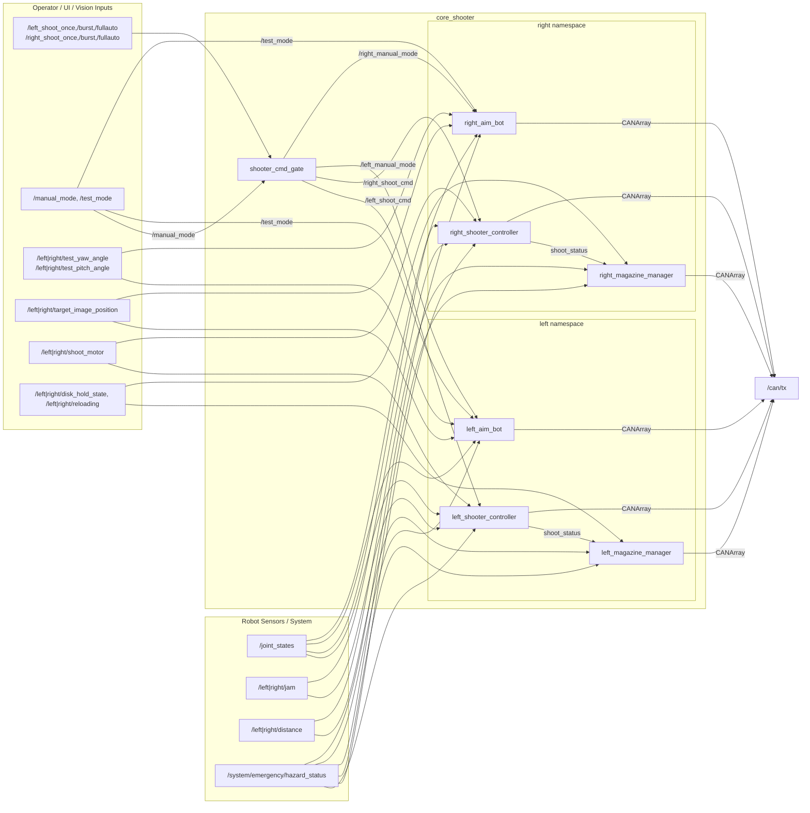
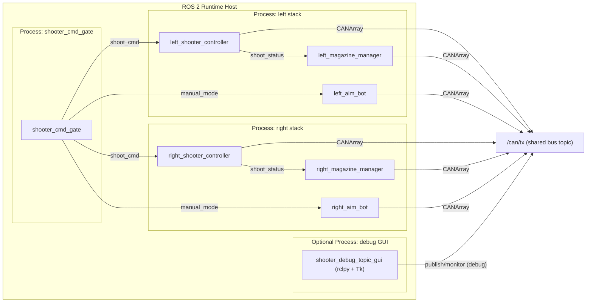

# core_shooter 設計書（現行実装ベース）

- 作成日: 2026-02-24
- 対象: `core_shooter` パッケージ
- 対象ファイル:
  - `core_shooter/launch/shooter.launch.py`
  - `core_shooter/config/shooter.params.yaml`
  - `core_shooter/src/shooter_cmd_gate.cpp`
  - `core_shooter/src/shooter_controller.cpp`
  - `core_shooter/src/magazine_manager.cpp`
  - `core_shooter/src/aim_bot.cpp`
  - `core_shooter/scripts/shooter_debug_topic_gui.py`（デバッグ用GUI）

## 1. 概要

`core_shooter` は、左右2系統の射撃機構を制御する ROS 2 パッケージである。主な役割は以下の通り。

- UI/操作入力を左右系統へ振り分ける（`shooter_cmd_gate`）
- 発射シーケンスと安全条件を満たした装填モータ制御（`shooter_controller`）
- 弾数推定と弾押さえ（ホールド）制御（`magazine_manager`）
- 砲塔の yaw/pitch 追尾・手動・テスト制御（`aim_bot`）
- デバッグ用の topic 発行/監視 GUI（`shooter_debug_topic_gui.py`、任意起動）

左右系統（`/left`, `/right`）は同一実装を `namespace` とパラメータ上書きで使い分ける。

## 2. パッケージ構成

### 2.1 実行可能ノード

| 実行ファイル | ノード名（launch時） | 数 | 主責務 |
|---|---|---:|---|
| `shooter_cmd_gate` | `shooter_cmd_gate` | 1 | UI射撃命令と manual_mode の左右振り分け |
| `shooter_controller` | `left_shooter_controller` / `right_shooter_controller` | 2 | 発射状態機械、装填/発射モータ制御、ジャム・安全判定 |
| `magazine_manager` | `left_magazine_manager` / `right_magazine_manager` | 2 | 残弾管理、ホールド制御、regrip |
| `aim_bot` | `left_aim_bot` / `right_aim_bot` | 2 | 砲塔姿勢制御（Emergency/Manual/Test/AutoTrack） |

### 2.2 補助ツール

| スクリプト | 用途 | 備考 |
|---|---|---|
| `scripts/shooter_debug_topic_gui.py` | topic 手動発行・監視 | launch には含まれない。単体でデバッグ用途 |

## 3. 起動構成（`shooter.launch.py`）

### 3.1 起動ノード一覧

- 単独起動
  - `shooter_cmd_gate`
- `left` namespace 配下
  - `shooter_controller`
  - `magazine_manager`
  - `aim_bot`
- `right` namespace 配下
  - `shooter_controller`
  - `magazine_manager`
  - `aim_bot`

### 3.2 主な remap / パラメータ上書き

- 共通 hazard remap
  - `hazard_status` -> `/system/emergency/hazard_status`
- `shooter_cmd_gate`
  - `manual_mode` -> `/manual_mode`
  - `left_manual_mode` -> `/left/manual_mode`
  - `right_manual_mode` -> `/right/manual_mode`
  - `left_shoot_cmd` -> `/left/shoot_cmd`
  - `right_shoot_cmd` -> `/right/shoot_cmd`
- `magazine_manager`（左右）
  - `disk_distance_sensor` -> `distance`（各namespace内）
- 左右差分（パラメータ上書き）
  - `shooter_controller`: `shoot_motor_id`, `loading_motor_id`
  - `magazine_manager`: `disk_hold_left_motor_id`, `disk_hold_right_motor_id`
  - `aim_bot`: `pitch_motor_id`, `yaw_motor_id`, 各角度制限

## 4. アーキテクチャ図



## 5. ROS2 ノード図（実行時トピック接続）

```mermaid
flowchart TB
  subgraph Top["Global namespace"]
    GATE["shooter_cmd_gate"]
    HZ["/system/emergency/hazard_status"]
    JS["/joint_states"]
    TM["/test_mode"]
    CAN["/can/tx"]
    MM["/manual_mode"]
    LSO["/left_shoot_once/burst/fullauto"]
    RSO["/right_shoot_once/burst/fullauto"]
  end

  subgraph Left["/left"]
    LSC["shooter_controller"]
    LMM["magazine_manager"]
    LAB["aim_bot"]
    LSCMD["shoot_cmd"]
    LMAN["manual_mode"]
    LSS["shoot_status"]
    LJAM["jam"]
    LSM["shoot_motor"]
    LDIS["distance"]
    LREL["reloading"]
    LHOLDREQ["disk_hold_state"]
    LREM["remaining_disk"]
    LTGT["target_image_position"]
    LTY["test_yaw_angle"]
    LTP["test_pitch_angle"]
  end

  subgraph Right["/right"]
    RSC["shooter_controller"]
    RMM["magazine_manager"]
    RAB["aim_bot"]
    RSCMD["shoot_cmd"]
    RMAN["manual_mode"]
    RSS["shoot_status"]
    RJAM["jam"]
    RSM["shoot_motor"]
    RDIS["distance"]
    RREL["reloading"]
    RHOLDREQ["disk_hold_state"]
    RREM["remaining_disk"]
    RTGT["target_image_position"]
    RTY["test_yaw_angle"]
    RTP["test_pitch_angle"]
  end

  LSO --> GATE
  RSO --> GATE
  MM --> GATE

  GATE --> LSCMD --> LSC
  GATE --> RSCMD --> RSC
  GATE --> LMAN --> LAB
  GATE --> RMAN --> RAB

  JS --> LSC
  JS --> RSC
  JS --> LAB
  JS --> RAB
  HZ --> LSC
  HZ --> RSC
  HZ --> LMM
  HZ --> RMM
  HZ --> LAB
  HZ --> RAB
  TM --> LAB
  TM --> RAB

  LJAM --> LSC
  RJAM --> RSC
  LSM --> LSC
  RSM --> RSC
  LSC --> LSS --> LMM
  RSC --> RSS --> RMM
  LREL --> LMM
  RREL --> RMM
  LDIS --> LMM
  RDIS --> RMM
  LHOLDREQ --> LMM
  RHOLDREQ --> RMM
  LMM --> LREM
  RMM --> RREM
  LTGT --> LAB
  RTGT --> RAB
  LTY --> LAB
  LTP --> LAB
  RTY --> RAB
  RTP --> RAB

  LSC --> CAN
  RSC --> CAN
  LMM --> CAN
  RMM --> CAN
  LAB --> CAN
  RAB --> CAN
```



## 6. アクティビティ図（射撃要求から発射完了まで）

以下は「単発/バースト/フルオート」の共通フロー（`shooter_cmd_gate` + `shooter_controller` + `magazine_manager`）を簡略化したアクティビティ図。

```mermaid
flowchart TD
  A["UI入力<br/>left/right shoot_once/burst/fullauto"] --> B["shooter_cmd_gate<br/>入力種別を判定"]
  B --> C{"入力種別"}
  C -->|once| D["shoot_cmd = 1 を発行"]
  C -->|burst| E["shoot_cmd = burst_count を発行"]
  C -->|fullauto ON edge| F["shoot_cmd = -1 を発行"]
  C -->|fullauto OFF edge| G["shoot_cmd = 0 を発行"]

  D --> H["対象 side の shooter_controller が shoot_repeat_count_ 更新"]
  E --> H
  F --> H
  G --> H

  H --> I["10ms timerCallback"]
  I --> J{"hazard_status=true ?"}
  J -->|Yes| K["EMERGENCY遷移<br/>発射停止 / shoot_repeat_count_=0"]
  J -->|No| L{"shoot_repeat_count_ != 0 ?"}
  L -->|No| I
  L -->|Yes| M["canShoot 判定"]

  M --> N{"条件OK?<br/>angle / interval / shoot motor active / jam"}
  N -->|No (single/burst)| O["要求を破棄(残回数を減算)"]
  N -->|No (fullauto)| P["次周期で再判定"]
  N -->|Yes| Q["装填モータ角度を +pi 進める<br/>state=SHOOT"]

  Q --> R["目標角度到達待ち"]
  R --> S{"95%到達?"}
  S -->|No| R
  S -->|Yes| T["shoot_status=true 発行<br/>必要なら残回数--<br/>state=CMD_WAIT"]
  T --> U["magazine_manager が立上り検出"]
  U --> V["remaining_disk を -1 推定"]
  V --> W{"hold中の射撃回数>=10 ?"}
  W -->|No| I
  W -->|Yes| X["REGRIP_RELEASINGへ遷移<br/>一定時間releaseし距離センサで再同期"]
  X --> I

  O --> I
  P --> I
  K --> I
```

## 7. コンポーネント設計

### 7.1 `shooter_cmd_gate`

#### 役割

- UI入力（左右の単発/バースト/フルオート）を `shoot_cmd`（`Int32`）へ変換
- `/manual_mode` を設定された片側 (`manual_mode_target_side`) にのみ転送
- フルオートは入力レベルではなく立上り/立下りで開始・停止コマンドを生成

#### `shoot_cmd` の意味（実装上）

- `> 0`: 指定回数の発射要求（単発/バースト）
- `0`: 停止/要求なし
- `-1`: フルオート継続要求（停止は `0` で指示）

#### 入出力

入力（購読）

- `left_shoot_once` / `left_shoot_burst` / `left_shoot_fullauto` (`std_msgs/Bool`)
- `right_shoot_once` / `right_shoot_burst` / `right_shoot_fullauto` (`std_msgs/Bool`)
- `manual_mode` (`std_msgs/Bool`, launch で `/manual_mode` に remap)

出力（発行）

- `left_shoot_cmd` / `right_shoot_cmd` (`std_msgs/Int32`, launch で各namespaceへ remap)
- `left_manual_mode` / `right_manual_mode` (`std_msgs/Bool`, launch で各namespaceへ remap)

#### 設計ポイント

- フルオート入力のチャタリング抑制として「前回値」を保持し、エッジでのみ publish
- manual_mode は非選択側を明示的に `false` publish（片側だけ有効化）

### 7.2 `shooter_controller`

#### 役割

- 射撃の状態機械を管理（`INIT` / `CMD_WAIT` / `SHOOT` / `EMERGENCY`）
- 装填モータ（角度制御）と発射モータ（速度制御）の CAN 指令生成
- 射撃可否判定（安全停止・パネル同期・射撃間隔・ジャム・発射モータ起動遅延）

#### 主な入力

- `/joint_states` (`sensor_msgs/JointState`)
  - `loading_motor_id` の角度を装填角として使用
  - `position[4]` をシャーシに対する砲塔角（panel synchronizer用）として使用
- `jam` (`std_msgs/Bool`)
  - フォトリフレクタ入力。継続時間でジャム判定（`jam_detect_time_sec`）
- `hazard_status` (`std_msgs/Bool`, launchで `/system/emergency/hazard_status`)
- `shoot_cmd` (`std_msgs/Int32`) from `shooter_cmd_gate`
- `shoot_motor` (`std_msgs/Float32`)
  - UI入力を閾値で3段速度にマッピングして発射モータへ送信

#### 主な出力

- `shoot_status` (`std_msgs/Bool`)
  - `SHOOT` 完了時に `true` を publish
- `jam_state` (`std_msgs/Bool`)
- `/can/tx` (`core_msgs/CANArray`)
  - 装填モータ角度指令
  - 発射モータ速度指令
- `loading_motor_error_state`, `shoot_motor_error_state`（publisher作成あり、現状未使用）

#### 状態機械（要約）

- `CMD_WAIT`
  - `shoot_repeat_count_ != 0` なら `canShoot()` 判定
  - 可なら装填角を `+π` 進めて `SHOOT`
- `SHOOT`
  - 目標角度の 95% 到達で `shoot_status=true`
  - 単発/バーストは残回数を減算して `CMD_WAIT`
- `EMERGENCY`
  - 発射停止、要求クリア
  - hazard解除で `INIT` へ
- `INIT`
  - 現在角を基準に装填目標角を初期化して `SHOOT` へ（初期同期）

#### `canShoot()` 条件

- `hazard_status == false`
- `isValidAngle() == true`
  - `enable_panel_synchronizer=false` の場合は常に true
  - true の場合、`limit_rad` で定義された禁止区間外のみ許可
- `isShootIntervalElapsed() == true`
  - 単発 / バースト / フルオートで interval を使い分け
- `isShootMotorRotationCommandActive() == true`
  - `shoot_motor > 0` を受けてから一定遅延後に有効化
- ジャム検出が無効 または ジャムなし

### 7.3 `magazine_manager`

#### 役割

- 残弾数の推定・公開（`remaining_disk`）
- 弾押さえ機構のホールド制御（左右2モータ）
- 一定射撃回数ごとの `regrip`（一時release + 距離センサ同期）

#### 主な入力

- `shoot_status` (`std_msgs/Bool`)
  - 立上りで「1発消費」とみなして減算
- `reloading` (`std_msgs/Int8`)
  - 手動/外部から補給数を加算
- `disk_distance_sensor` (`std_msgs/Int32`, launchで `distance`)
  - `REGRIP_RELEASING` 中のみ移動平均に取り込み
- `disk_hold_state` (`std_msgs/Bool`)
  - オペレータ要求（押下中は release 優先）
- `hazard_status` (`std_msgs/Bool`)

#### 主な出力

- `remaining_disk` (`std_msgs/Int8`, `transient_local`)
- `/can/tx` (`core_msgs/CANArray`)
  - 左右ホールドモータに同値 command を送信
  - 実装では `hold=true -> 0.0`, `hold=false -> 1.0`

#### ホールド制御の優先順位（`on_timer()`）

1. `hazard_active_ == true` なら強制 release
2. `remaining_disks_ <= 10` なら強制 release
3. `hold_request_on_ == true` なら release（ボタン優先）
4. それ以外は通常保持（`HOLDING`）

#### regrip 動作

- `HOLDING` 中の射撃回数が 10 回以上で `REGRIP_RELEASING` に遷移（`regrip_enabled=true` 時）
- release 期間中のみ距離センサ移動平均を更新
- 窓が揃ったら `remainingDiskEstimator(0)` でセンサ同期
- 時間経過後 `HOLDING` に復帰

### 7.4 `aim_bot`

#### 役割

- 砲塔 yaw/pitch の目標角を生成して CAN 出力
- `Emergency / Manual / Test / AutoTrack` の4制御モードを統合

#### 制御モード優先順位（timer毎）

1. `Emergency`（`hazard_status=true`）
2. `Manual`（`manual_mode=true`）
3. `Test`（`/test_mode=true` もしくはパラメータ既定値）
4. `AutoTrack`

#### 主な入力

- `/joint_states` (`sensor_msgs/JointState`) : 現在 yaw/pitch 角
- `hazard_status` (`std_msgs/Bool`)
- `manual_mode` (`std_msgs/Bool`) : `shooter_cmd_gate` から片側のみ有効化
- `/test_mode` (`std_msgs/Bool`) : グローバル
- `test_yaw_angle` / `test_pitch_angle` (`std_msgs/Float32`)
- `target_image_position` (`geometry_msgs/PointStamped`)
  - 実装想定: `z < 0.5` で検出あり、`x/y` は画像中心原点座標

#### 主な出力

- `/can/tx` (`core_msgs/CANArray`)
  - yaw/pitch モータへの角度コマンド

#### モード別挙動（要約）

- `Emergency`
  - モード遷移時に現在角をコマンド目標としてラッチし、その後保持
- `Manual`
  - ONエッジで `manual_mode_yaw_fixed_angle` と `manual_mode_pitch_initial_angle` を初期値に設定
  - 以後 yaw は固定、pitch は手動入力で相対更新
- `Test`
  - テスト入力を `[-1,1]` の正規化差分として積分
  - モード再突入時は古い入力を無効化して新規入力待ち
- `AutoTrack`
  - 目標画像が timeout 内にある時のみ追尾
  - 追尾方式は2種類
    - `use_fov_image_tracking=true`: 画角ベース（atan変換）
    - `false`: gain による角度加算
  - yaw/pitch 角度はパラメータ上限下限で clamp

## 8. 主要パラメータ（`shooter.params.yaml`）

### 8.1 全体・射撃系

- `burst_count`
- `manual_mode_target_side`
- `shoot_interval_ms`
- `burst_interval_ms`
- `fullauto_interval_ms`
- `shoot_motor_rotation_cmd_activation_delay_sec`
- `limit_rad`
- `enable_panel_synchronizer`
- `loading_motor_speed`
- `target_speed`
- `enable_jam_detection`
- `jam_detect_time_sec`

### 8.2 弾倉系

- `remaining_disks`
- `disk_thickness`
- `sensor_height`
- `window_size`
- `regrip_enabled`
- `regrip_release_ms`
- `hold_disable_height_margin_mm`

### 8.3 照準系

- `rate`
- `enable_test_mode`
- `test_yaw_gain`, `test_pitch_gain`
- `manual_mode_yaw_fixed_angle`, `manual_mode_pitch_initial_angle`
- `image_width`, `image_height`
- `use_fov_image_tracking`
- `horizontal_fov_deg`
- `image_tolerance_x`, `image_tolerance_y`
- `target_timeout_sec`
- `yaw_image_gain`, `pitch_image_gain`
- `yaw_direction`, `pitch_direction`
- `pitch_offset`

## 9. ノード間インタフェース一覧（主要 topic）

### 9.1 コマンド・制御

| Topic | Type | 発行 | 購読 | 用途 |
|---|---|---|---|---|
| `/left_shoot_once` ほか左右射撃UI | `std_msgs/Bool` | UI/GUI | `shooter_cmd_gate` | 単発/バースト/フルオート入力 |
| `/manual_mode` | `std_msgs/Bool` | UI/GUI | `shooter_cmd_gate` | manual有効化要求 |
| `/left/shoot_cmd`, `/right/shoot_cmd` | `std_msgs/Int32` | `shooter_cmd_gate` | 各 `shooter_controller` | 射撃回数/フルオート指令 |
| `/left/manual_mode`, `/right/manual_mode` | `std_msgs/Bool` | `shooter_cmd_gate` | 各 `aim_bot` | 片側 manual モード制御 |
| `/left/shoot_motor`, `/right/shoot_motor` | `std_msgs/Float32` | UI/GUI | 各 `shooter_controller` | 発射モータ速度段指令 |

### 9.2 センサ・状態

| Topic | Type | 発行 | 購読 | 用途 |
|---|---|---|---|---|
| `/joint_states` | `sensor_msgs/JointState` | 下位制御/統合 | `shooter_controller`, `aim_bot` | 角度取得 |
| `/system/emergency/hazard_status` | `std_msgs/Bool` | 安全系 | 各 side ノード | 緊急停止 |
| `/left/jam`, `/right/jam` | `std_msgs/Bool` | センサ | 各 `shooter_controller` | ジャム検出 |
| `/left/shoot_status`, `/right/shoot_status` | `std_msgs/Bool` | 各 `shooter_controller` | 各 `magazine_manager` | 発射完了通知 |
| `/left/distance`, `/right/distance` | `std_msgs/Int32` | 距離センサ | 各 `magazine_manager` | 残弾推定（regrip中のみ） |
| `/left/remaining_disk`, `/right/remaining_disk` | `std_msgs/Int8` | 各 `magazine_manager` | UI/監視 | 残弾数 |

### 9.3 照準関連

| Topic | Type | 発行 | 購読 | 用途 |
|---|---|---|---|---|
| `/test_mode` | `std_msgs/Bool` | UI/GUI | 各 `aim_bot` | テスト制御切替（global） |
| `/left/right/test_yaw_angle` | `std_msgs/Float32` | UI/GUI | 各 `aim_bot` | yaw 差分入力 |
| `/left/right/test_pitch_angle` | `std_msgs/Float32` | UI/GUI | 各 `aim_bot` | pitch 差分入力 |
| `/left/right/target_image_position` | `geometry_msgs/PointStamped` | 認識系/UI | 各 `aim_bot` | 自動追尾目標 |

### 9.4 下位制御出力

| Topic | Type | 発行 | 購読 | 用途 |
|---|---|---|---|---|
| `/can/tx` | `core_msgs/CANArray` | `shooter_controller`, `magazine_manager`, `aim_bot`, debug GUI | CAN送信側 | モータ指令フレーム送信 |

## 10. ノード図（配置/実行単位）

本パッケージは 7つの ROS2 ノード（+任意のデバッグGUIノード）として実行される。実行単位視点のノード図を以下に示す。



## 11. デバッグGUI（`shooter_debug_topic_gui.py`）

### 11.1 役割

- 実機無し/一部構成でも topic を手動発行して挙動確認可能
- 左右の `remaining_disk`, `shoot_status`, `shoot_cmd`, `distance` などを監視
- `/joint_states` と `/can/tx` をグリッド表示

### 11.2 主な発行topic

- グローバル:
  - `/test_mode`
  - `/manual_mode`
  - `/system/emergency/hazard_status`
  - `/left_shoot_*`, `/right_shoot_*`
- 左右 namespace:
  - `/left|right/test_yaw_angle`, `/left|right/test_pitch_angle`
  - `/left|right/shoot_motor`
  - `/left|right/reloading`
  - `/left|right/target_image_position`
  - `/left|right/disk_hold_state`
- 直接 CAN 注入:
  - `/can/tx`

## 12. 現行実装の注意点（設計との差分候補）

現行コードを読む限り、以下は「設計仕様として固定」ではなく、今後見直し候補となる実装上の特徴。

- `aim_bot` の manual pitch 入力はコメント上は `manual_pitch_angle` 想定だが、実装は `test_pitch_angle` を購読している
- `aim_bot` の `image_center_x`, `image_center_y` は宣言/取得されるが、追尾計算では未使用
- `shooter_controller` の `loading_motor_error_state`, `shoot_motor_error_state` publisher は生成されるが publish されていない
- `magazine_manager` の `hold_disable_height_margin_mm` は取得されるがロジックで未使用
- `shooter_controller` では `hazard_state_` 初期値が `true` のため、安全解除が来るまで実質 `EMERGENCY` 相当の挙動になる（安全側デフォルト）
- `magazine_manager` / `aim_bot` も hazard 初期値は `true`（安全側）

## 13. 改修時の確認観点

- `shoot_cmd` の符号付き意味（`-1/0/>0`）を維持できているか
- `shooter_controller` の `canShoot()` 条件変更時にフルオート再試行動作が壊れないか
- `magazine_manager` の regrip 中だけセンサ同期する前提を壊していないか
- `aim_bot` のモード優先順位（Emergency > Manual > Test > AutoTrack）を維持しているか
- `/can/tx` に複数ノードから publish される前提で、下位側が順序/競合に耐えられるか
