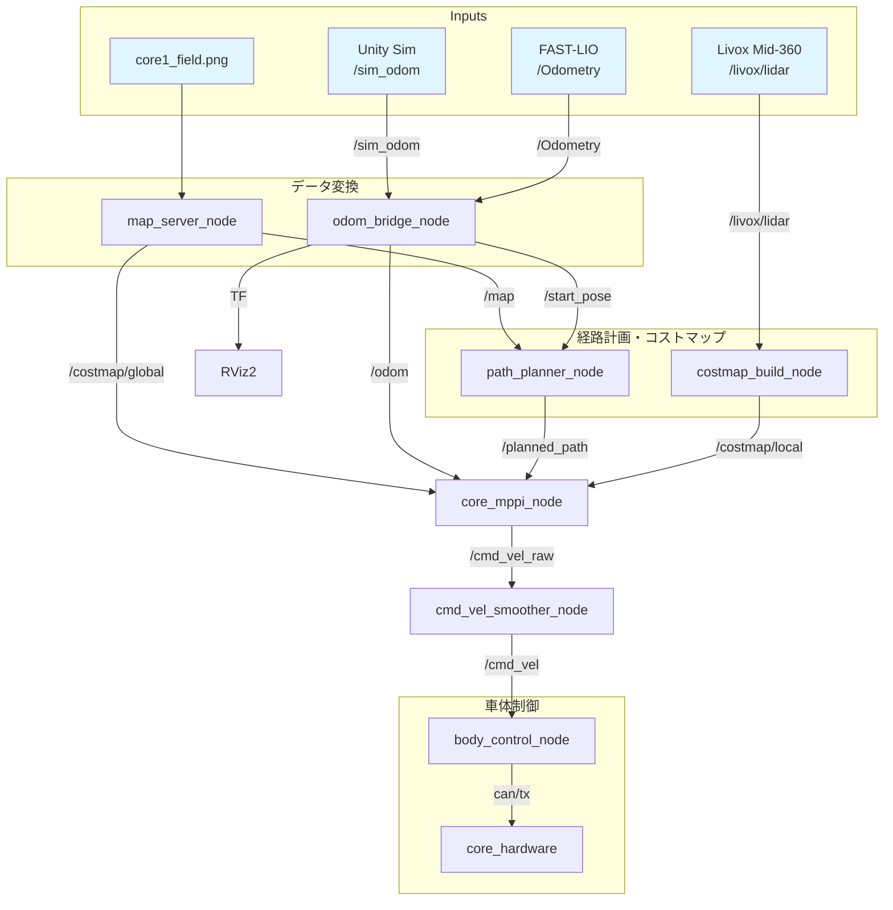

# システム概要

## ナビゲーションパイプライン



## ノード一覧

| ノード | パッケージ | 言語 | 役割 |
|--------|-----------|------|------|
| `odom_bridge_node` | core_launch | Python | オドメトリソース切替、座標変換、TFブロードキャスト |
| `map_server_node` | core_launch | Python | PNG画像をOccupancyGridに変換してパブリッシュ |
| `path_planner_node` | core_path_planner | C++ | A*アルゴリズムによるグローバル経路計画 |
| `core_mppi_node` | core_mppi | C++ | MPPI（Model Predictive Path Integral）ローカル制御 |
| `cmd_vel_smoother_node` | core_cmd_vel_smoother | C++ | cmd_vel EMA平滑化フィルタ |
| `costmap_build_node` | core_costmap_builder | C++ | LiDAR点群からローリングウィンドウ式ローカルコストマップ生成 |
| `body_control_node` | core_body_controller | C++ | cmd_vel→オムニホイールCAN指令変換、レートリミッタ |
| `core_hardware` | core_hardware | C++ | EtherCAT（SOEM）によるTeensy41スレーブ通信 |
| `ros_tcp_endpoint` | ROS-TCP-Endpoint | Python | Unity-ROS2 TCPブリッジ |

## 起動モード

| モード | コマンド | TCP EP | odom |
|--------|---------|--------|------|
| sim（デフォルト） | `navigation.launch.py` | o | sim |
| sim + FAST-LIO | `navigation.launch.py odom_source:=fastlio` | o | FAST-LIO |
| 実機 | `navigation.launch.py environment:=real` | x | FAST-LIO |

### シミュレータモード（デフォルト）

```bash
ros2 launch core_launch navigation.launch.py
```

起動ノード: ros_tcp_endpoint, odom_bridge, map_server, path_planner, mppi, cmd_vel_smoother, costmap_builder, rviz2

### 実機モード

```bash
ros2 launch core_launch navigation.launch.py environment:=real
```

シミュレータモードとの違い: TCP endpoint非起動、Livox driver起動、body_controller起動、odom_sourceはFAST-LIO固定。

## 静的TF

`navigation.launch.py` で以下の静的TFがブロードキャストされます:

| 親フレーム | 子フレーム | 変換 |
|-----------|-----------|------|
| `map` | `odom` | 恒等変換（x=0, y=0, yaw=0） |
| `base_link` | `livox_frame` | z=+0.5m, roll=π（上下反転） |

動的TFは[TFフレームと座標系](tf-tree.md)を参照してください。
