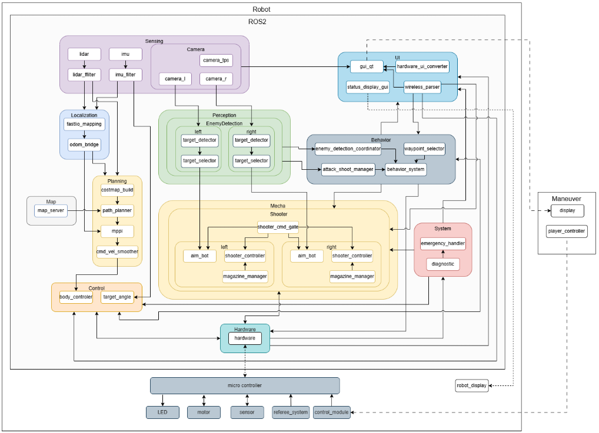
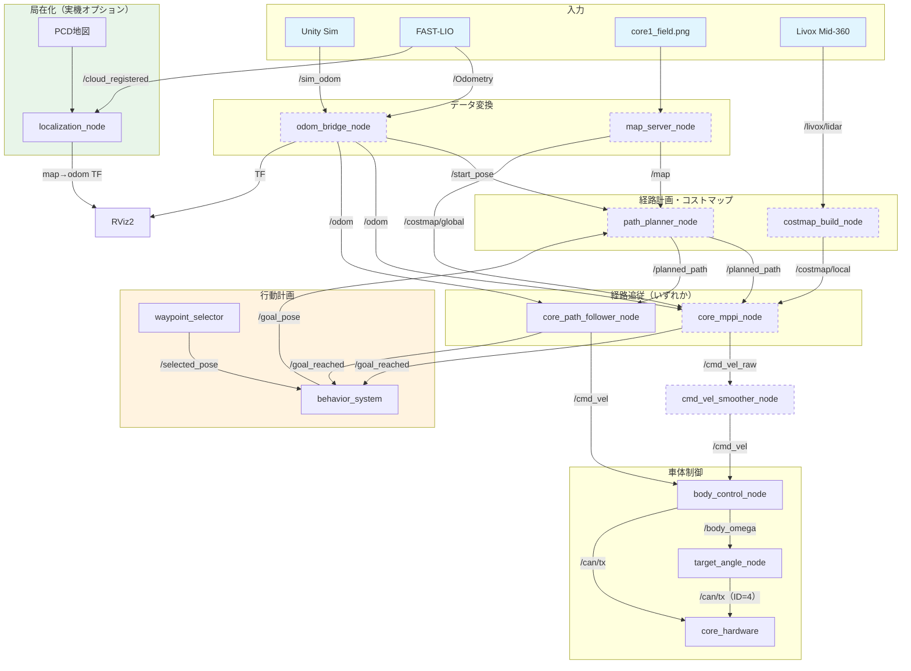
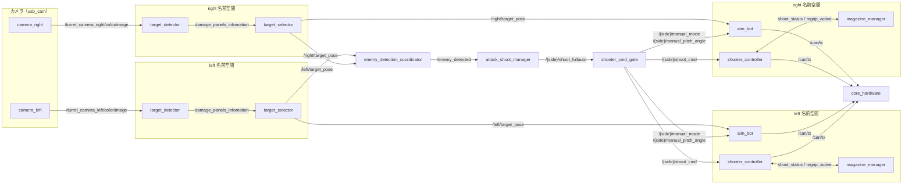
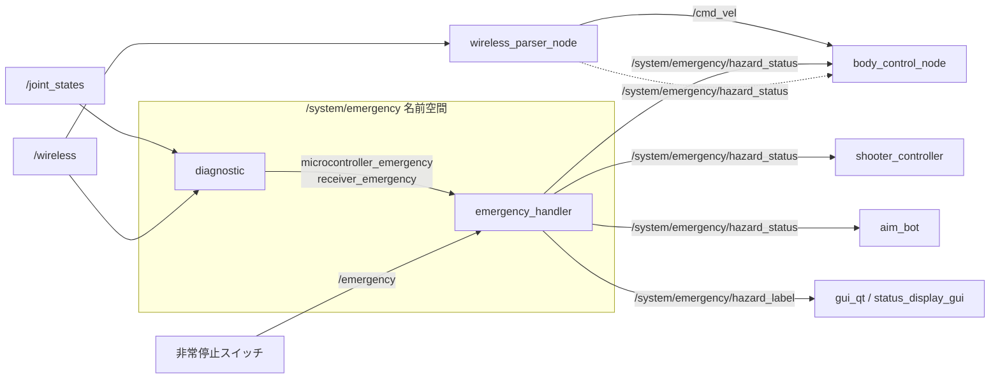

# システム概要

**このページは「どのノードが動き、どう繋がるか」を扱います。** 各トピックの型・Publisher / Subscriber・QoS・リマップの一覧は[トピック・メッセージ一覧](topics.md)を参照してください。図中のトピック名はデータの流れを示すラベルであり、仕様の正はそちらです。

## 全体構成図

{ loading=lazy }

機体全体のノード構成とデータの流れです。ROS2上のノードを役割ごとの層に分け、マイコン（micro controller）以下のハードウェアと、操縦側（Maneuver）までを含めて示しています。

| 層 | 含まれるもの |
|----|-------------|
| Sensing（LiDAR） | lidar → lidar_filter（Livox Mid-360の点群） |
| Sensing（IMU） | imu → imu_filter（`imu_filter_madgwick`） |
| Sensing（Camera） | camera_l, camera_r（左右砲塔）, camera_tps（TPS視点） |
| Localization | fastlio_mapping, odom_bridge |
| Perception（EnemyDetection） | target_detector, target_selector（left / right の2系統） |
| Planning | costmap_build, path_planner, mppi, cmd_vel_smoother |
| Behavior | enemy_detection_coordinator, waypoint_selector, attack_shoot_manager, behavior_system |
| Mecha（Shooter） | shooter_cmd_gate, aim_bot / shooter_controller / magazine_manager（left / right） |
| Control | body_controller, target_angle |
| System | emergency_handler, diagnostic |
| UI | gui_qt, hardware_ui_converter, status_display_gui, wireless_parser |
| Hardware | hardware（EtherCAT経由でマイコンへ） |

!!! note "図は設計上の全体像です"
    この図はパイプライン全体が接続された状態を示しています。現在の `navigation.launch.py` では Planning 層と Localization 層の一部が起動しない状態であるため、実際に動く構成は次節「起動構成の現状」を参照してください。各層の詳細なトピック接続は本ページ後半の個別の図に記載しています。

## 起動構成の現状

!!! warning "navigation.launch.py はパイプライン全体を起動しません"
    `core_launch/launch/navigation.launch.py` では、ナビゲーションパイプラインの主要ノードが**コメントアウトされており起動しません**。

    - 無効化中: `map_server_node` / `odom_bridge_node` / `path_planner_node` / `core_mppi_node` / `cmd_vel_smoother_node` / `costmap_build_node` / FAST-LIO
    - 実際に起動するもの: ROS-TCP-Endpoint（sim時）、Livoxドライバ（実機時）、静的TF 2本、`body_controller.launch.py`、RViz2、`localization_node`（`use_localization:=true` 時）

    現在は**パッケージごとのlaunchファイルを個別に起動する構成**に移行しています。以下の各launchファイルを必要に応じて組み合わせて使用してください。

## launchファイル一覧

| launchファイル | 起動するノード |
|---------------|---------------|
| `core_launch/navigation.launch.py` | ros_tcp_endpoint（sim）/ livox_ros_driver2（実機）/ 静的TF / body_controller / RViz2 / localization_node（オプション） |
| `core_launch/state_publisher.launch.py` | robot_state_publisher, joint_state_publisher（URDF: `core2025_attacker.urdf`） |
| `core_launch/imu_filter.launch.py` | imu_filter_madgwick（`imu` → `filtered_imu`） |
| `core_body_controller/body_controller.launch.py` | body_control_node, target_angle_node |
| `core_path_planner/path_planner.launch.py` | path_planner_node |
| `core_mppi/mppi.launch.py` | core_mppi_node |
| `core_path_follower/path_follower.launch.py` | core_path_follower_node |
| `core_costmap_builder/costmap_build.launch.py` | costmap_build_node（+ デバッグ用静的TF） |
| `core_behavior_system/behavior_system.launch.py` | behavior_system, waypoint_selector, enemy_detection_coordinator, attack_shoot_manager |
| `core_camera/camera.launch.py` | usb_cam × 3（left / right / tps） |
| `core_enemy_detection/detection.launch.py` | target_detector, target_selector（left / right の2組） |
| `core_shooter/shooter.launch.py` | shooter_cmd_gate, shooter_controller / magazine_manager / aim_bot（left・right 各1） |
| `core_mode/mode.launch.py` | emergency_handler, diagnostic（`/system/emergency` 名前空間） |
| `core_hardware/core_hardware.launch.py` | core_hardware |
| `core_ros_player_controller/wireless_parser_node.launch.py` | wireless_parser_node |
| `core_localization/localization.launch.py` | localization_node（単体テスト用） |
| `core_qt_gui/hud.launch.py` | gui_qt, hardware_ui_converter_node |
| `core_status_gui/status_display_gui.launch.py` | status_display_gui |

## ナビゲーションパイプライン

破線枠は現在 `navigation.launch.py` で無効化されているノードを示します。

```mermaid
graph TB
    subgraph Inputs["入力"]
        Unity["Unity Sim"]
        FASTLIO["FAST-LIO"]
        MapPNG["core1_field.png"]
        LiDAR["Livox Mid-360"]
    end

    subgraph Behavior["行動計画"]
        WaypointSelector["waypoint_selector"]
        BehaviorSystem["behavior_system"]
    end

    subgraph Bridge["データ変換"]
        OdomBridge["odom_bridge_node"]
        MapServer["map_server_node"]
    end

    subgraph Planning["経路計画・コストマップ"]
        PathPlanner["path_planner_node"]
        CostmapBuilder["costmap_build_node"]
    end

    subgraph Following["経路追従（いずれか）"]
        MPPI["core_mppi_node"]
        PathFollower["core_path_follower_node"]
    end

    Smoother["cmd_vel_smoother_node"]

    subgraph Control["車体制御"]
        BodyController["body_control_node"]
        TargetAngle["target_angle_node"]
        Hardware["core_hardware"]
    end

    RViz["RViz2"]

    Unity -->|/sim_odom| OdomBridge
    FASTLIO -->|/Odometry| OdomBridge
    MapPNG --> MapServer
    LiDAR -->|/livox/lidar| CostmapBuilder

    WaypointSelector -->|/selected_pose| BehaviorSystem
    BehaviorSystem -->|/goal_pose| PathPlanner

    OdomBridge -->|/start_pose| PathPlanner
    OdomBridge -->|/odom| MPPI
    OdomBridge -->|/odom| PathFollower
    OdomBridge -->|TF| RViz
    MapServer -->|/map| PathPlanner
    MapServer -->|/costmap/global| MPPI

    PathPlanner -->|/planned_path| MPPI
    PathPlanner -->|/planned_path| PathFollower
    CostmapBuilder -->|/costmap/local| MPPI

    MPPI -->|/cmd_vel_raw| Smoother
    Smoother -->|/cmd_vel| BodyController
    PathFollower -->|/cmd_vel| BodyController
    MPPI -->|/goal_reached| BehaviorSystem
    PathFollower -->|/goal_reached| BehaviorSystem
    BodyController -->|/body_omega| TargetAngle
    BodyController -->|/can/tx| Hardware
    TargetAngle -->|"/can/tx（ID=4）"| Hardware

    subgraph Localization["局在化（実機オプション）"]
        PCDMap["PCD地図"] --> LocalizationNode["localization_node"]
    end

    FASTLIO -->|/cloud_registered| LocalizationNode
    LocalizationNode -->|"map→odom TF"| RViz

    style MapPNG fill:#e1f5fe,color:#333
    style Unity fill:#e1f5fe,color:#333
    style FASTLIO fill:#e1f5fe,color:#333
    style LiDAR fill:#e1f5fe,color:#333
    style Localization fill:#e8f5e9,color:#333
    style Behavior fill:#fff3e0,color:#333

    style OdomBridge stroke-dasharray: 5 5
    style MapServer stroke-dasharray: 5 5
    style PathPlanner stroke-dasharray: 5 5
    style CostmapBuilder stroke-dasharray: 5 5
    style MPPI stroke-dasharray: 5 5
    style Smoother stroke-dasharray: 5 5
```

!!! note "経路追従ノードの使い分け"
    `core_mppi_node` と `core_path_follower_node` はどちらも `/planned_path` と `/odom` を購読する**排他的な選択肢**で、同時には起動しません。速度指令の出力先が異なり `cmd_vel_smoother_node` を経由するかどうかが変わるため、切り替える際は[トピック・メッセージ一覧](topics.md#ナビゲーションパイプライン)で経路を確認してください。

## 敵検出・射撃パイプライン

敵検出は砲塔ごと（`left` / `right`）に独立した `target_detector` + `target_selector` の組が動作します。

```mermaid
graph LR
    subgraph Camera["カメラ（usb_cam）"]
        CamLeft["camera_left"]
        CamRight["camera_right"]
    end

    subgraph DetectLeft["left 名前空間"]
        DetL["target_detector"] -->|damage_panels_infomation| SelL["target_selector"]
    end

    subgraph DetectRight["right 名前空間"]
        DetR["target_detector"] -->|damage_panels_infomation| SelR["target_selector"]
    end

    Coordinator["enemy_detection_coordinator"]
    ShootManager["attack_shoot_manager"]
    Gate["shooter_cmd_gate"]

    subgraph ShooterLeft["left 名前空間"]
        AimL["aim_bot"]
        CtrlL["shooter_controller"]
        MagL["magazine_manager"]
    end

    subgraph ShooterRight["right 名前空間"]
        AimR["aim_bot"]
        CtrlR["shooter_controller"]
        MagR["magazine_manager"]
    end

    Hardware["core_hardware"]

    CamLeft -->|/turret_camera_left/color/image| DetL
    CamRight -->|/turret_camera_right/color/image| DetR

    SelL -->|/left/target_pose| AimL
    SelR -->|/right/target_pose| AimR
    SelL -->|/left/target_pose| Coordinator
    SelR -->|/right/target_pose| Coordinator

    Coordinator -->|/enemy_detected| ShootManager
    ShootManager -->|"/{side}/shoot_fullauto"| Gate

    Gate -->|"/{side}/shoot_cmd"| CtrlL
    Gate -->|"/{side}/shoot_cmd"| CtrlR
    Gate -->|"/{side}/manual_mode<br>/{side}/manual_pitch_angle"| AimL
    Gate -->|"/{side}/manual_mode<br>/{side}/manual_pitch_angle"| AimR

    CtrlL <-->|"shoot_status / regrip_active"| MagL
    CtrlR <-->|"shoot_status / regrip_active"| MagR

    AimL -->|/can/tx| Hardware
    AimR -->|/can/tx| Hardware
    CtrlL -->|/can/tx| Hardware
    CtrlR -->|/can/tx| Hardware
```

!!! info "図中のトピック名はリマップ後の名前です"
    `/{side}/target_pose` は launch ファイルでのリマップ後の名前で、ノード内部の名前とは異なります。対応表は[トピック・メッセージ一覧](topics.md#敵検出)を参照してください。

## システム管理

```mermaid
graph LR
    subgraph SystemMode["/system/emergency 名前空間"]
        Diagnostic["diagnostic"]
        EmergencyHandler["emergency_handler"]
        Diagnostic -->|"microcontroller_emergency<br>receiver_emergency"| EmergencyHandler
    end

    HWSwitch["非常停止スイッチ"] -->|/emergency| EmergencyHandler
    JointStates["/joint_states"] --> Diagnostic
    Wireless["/wireless"] --> Diagnostic

    WirelessParser["wireless_parser_node"]
    BodyController["body_control_node"]
    ShooterCtrl["shooter_controller"]
    AimBot["aim_bot"]
    GUI["gui_qt / status_display_gui"]

    Wireless --> WirelessParser
    WirelessParser -->|/cmd_vel| BodyController
    EmergencyHandler -->|"/system/emergency/hazard_status"| BodyController
    EmergencyHandler -->|"/system/emergency/hazard_status"| ShooterCtrl
    EmergencyHandler -->|"/system/emergency/hazard_status"| AimBot
    EmergencyHandler -->|"/system/emergency/hazard_label"| GUI
    WirelessParser -.->|"/system/emergency/hazard_status"| BodyController
```

!!! warning "hazard_status の発行元が2系統ある"
    図の破線が示すとおり、`/system/emergency/hazard_status` は `emergency_handler` と `wireless_parser_node` の2箇所から発行されます。購読側の一覧と注意点は[トピック・メッセージ一覧](topics.md#システム管理)を参照してください。

## ノード一覧

### ナビゲーション

| ノード | パッケージ | 言語 | 役割 |
|--------|-----------|------|------|
| `odom_bridge_node` | core_launch | Python | オドメトリソース切替、座標変換、TFブロードキャスト |
| `map_server_node` | core_launch | Python | PNG画像をOccupancyGridに変換してパブリッシュ |
| `path_planner_node` | core_path_planner | C++ | A*アルゴリズムによるグローバル経路計画 |
| `costmap_publisher_node` | core_path_planner | C++ | テスト用コストマップ配信（`/map`, `/local_costmap`） |
| `core_mppi_node` | core_mppi | C++ | MPPIローカル制御、ゴール到達判定 |
| `core_path_follower_node` | core_path_follower | C++ | カスケードPID / Pure Pursuit による経路追従、ゴール到達判定 |
| `cmd_vel_smoother_node` | core_cmd_vel_smoother | C++ | cmd_vel EMA平滑化フィルタ |
| `costmap_build_node` | core_costmap_builder | C++ | LiDAR点群からローリングウィンドウ式ローカルコストマップ生成 |
| `localization_node` | core_localization | C++ | NDT/ICPによるPCDマップベースのグローバル局在化（`map→odom` 動的TF） |

### 行動計画

| ノード | パッケージ | 言語 | 役割 |
|--------|-----------|------|------|
| `behavior_system` | core_behavior_system | C++ | 状態遷移による行動管理、`/goal_pose` 発行 |
| `waypoint_selector` | core_behavior_system | C++ | ウェイポイント選択・可視化 |
| `enemy_detection_coordinator` | core_behavior_system | C++ | 左右砲塔の敵検出結果の統合 |
| `attack_shoot_manager` | core_behavior_system | C++ | 自動射撃指令（`/{side}/shoot_fullauto`）の管理 |

### 車体制御・ハードウェア

| ノード | パッケージ | 言語 | 役割 |
|--------|-----------|------|------|
| `body_control_node` | core_body_controller | C++ | cmd_vel→オムニホイールCAN指令変換、レートリミッタ |
| `target_angle_node` | core_body_controller | C++ | 車体回転角度PID制御（IMU+エンコーダ） |
| `core_hardware` | core_hardware | C++ | EtherCAT（SOEM）によるTeensy41スレーブ通信 |
| `core_hardware_usb` | core_hardware | C++ | USBシリアル経由のTeensy通信（launchでは未起動） |
| `robot_state_publisher` | （外部） | C++ | URDF（`core2025_attacker.urdf`）からのTF配信 |
| `imu_filter_madgwick` | （外部） | C++ | IMU姿勢推定フィルタ（`imu` → `filtered_imu`） |

### 操縦入力

| ノード | パッケージ | 言語 | 役割 |
|--------|-----------|------|------|
| `wireless_parser_node` | core_ros_player_controller | C++ | `/wireless` 7バイトを解析し、車体制御・射撃・非常停止・行動計画の各トピックへ展開 |

!!! note "`wireless_parser_node` は制御ノードではありません"
    パッケージ名に controller とありますが制御則は持たず、操縦者入力（キーボード＋マウス）をトピックに変換するパーサです。出力先は車体制御（`/cmd_vel`, `/rotation`, `/ads`）、射撃（`/manual_mode`, `/manual_pitch`, `/shoot_motor`, `/right/shoot_fullauto`, `/reloading`）、非常停止（`/system/emergency/hazard_status`）、行動計画（`/auto_point_select`, `/selected_pose`）の4サブシステムに跨ります。

    `/wireless` の `values[3]` bit1（自動フラグ）で出力が切り替わり、自動モード時は `/selected_pose` と `/auto_point_select` のみ、手動モード時は残りを発行します。`/manual_mode` / `/test_mode` / `/system/emergency/hazard_status` はモードに関わらず常時発行されます。

### 敵検出・射撃

| ノード | パッケージ | 言語 | 役割 |
|--------|-----------|------|------|
| `usb_cam` | core_camera | C++ | USBカメラドライバ（left / right / tps の3台） |
| `target_detector` | core_enemy_detection | C++ | カメラ画像からダメージパネル検出（砲塔ごとに1つ） |
| `target_selector` | core_enemy_detection | C++ | 最大面積パネルのターゲット選択（砲塔ごとに1つ） |
| `shooter_cmd_gate` | core_shooter | C++ | 射撃コマンドゲート（左右振り分け） |
| `shooter_controller` | core_shooter | C++ | 射撃モーター・ローディング制御（左右各1） |
| `magazine_manager` | core_shooter | C++ | ディスクマガジン管理（左右各1） |
| `aim_bot` | core_shooter | C++ | ビジョンベースターゲット追尾（左右各1） |

### システム管理・GUI

| ノード | パッケージ | 言語 | 役割 |
|--------|-----------|------|------|
| `emergency_handler` | core_mode | C++ | 緊急信号集約・ハザード状態管理 |
| `diagnostic` | core_mode | C++ | マイコン/受信機ハートビート監視 |
| `gui_qt` | core_qt_gui | C++ | 操縦者向けHUD |
| `hardware_ui_converter_node` | core_qt_gui | C++ | ハードウェア情報のUI向け変換 |
| `status_display_gui` | core_status_gui | Python | 行動状態・ハザード状態の表示 |
| `ros_tcp_endpoint` | ROS-TCP-Endpoint | Python | Unity-ROS2 TCPブリッジ |

!!! note "パッケージ名とディレクトリ名の不一致"
    `core_qt_gui` ディレクトリの ROS パッケージ名は **`gui_qt`** です。`ros2 launch` / `ros2 run` では `gui_qt` を指定してください。

## 起動モード

`navigation.launch.py` は以下の引数を受け付けますが、前述の通りパイプライン本体は無効化されているため、この表が示す構成をそのまま再現することはできません。起動モードの詳細は[ナビゲーション起動ガイド](../guides/navigation.md)を参照してください。

| モード | TCP EP | odom | localization |
|--------|--------|------|-------------|
| sim（デフォルト） | o | sim | x |
| sim + FAST-LIO | o | FAST-LIO | x |
| 実機 | x | FAST-LIO | x |
| 実機 + localization | x | FAST-LIO | o |

## 静的TF

`navigation.launch.py` で以下の静的TFがブロードキャストされます:

| 親フレーム | 子フレーム | 変換 |
|-----------|-----------|------|
| `map` | `odom` | 恒等変換（デフォルト）。`use_localization:=true` 時は `localization_node` が動的に更新 |
| `base_link` | `livox_frame` | z=+0.5m, roll=π（上下反転） |

動的TFは[TFフレームと座標系](tf-tree.md)を参照してください。

## 関連ページ

- [メカ構成](../mechanics/index.md) — 機体寸法、可動範囲、駆動系・砲塔・装填機構
- [回路構成](../circuit/index.md) — ピン配置、CANバス構成、モータID割り当て、EtherCAT PDO
- [トピック・メッセージ一覧](topics.md) — トピック名と型の一覧
