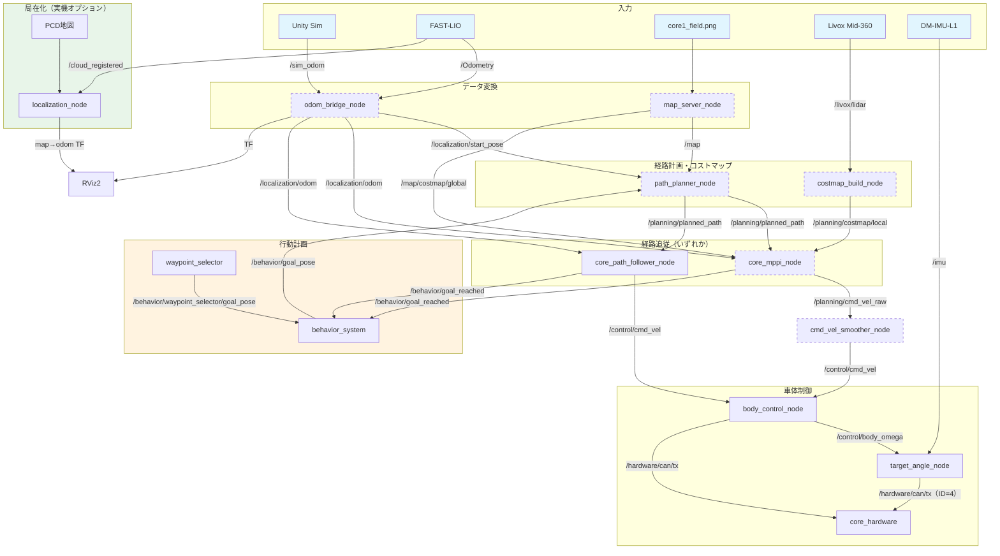
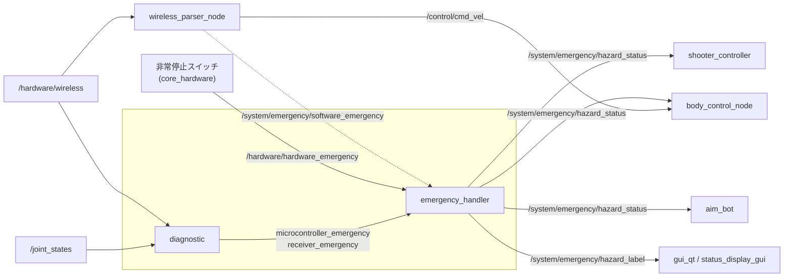

# システム概要

**このページは「どのノードが動き、どう繋がるか」を扱います。** 各トピックの型・Publisher / Subscriber・QoS・リマップの一覧は[トピック・メッセージ一覧](topics.md)を参照してください。図中のトピック名はデータの流れを示すラベルであり、仕様の正はそちらです。

## 全体構成図

機体全体のノード構成とデータの流れです。ROS2上のノードを役割ごとの層に分け、マイコン（micro controller）以下のハードウェアと、操縦側（Maneuver）までを含めて示しています。グループ名の後ろが対応する名前空間、破線枠のノードは現在launchで無効化中です。


```mermaid
graph LR
  subgraph ROBOT["Robot"]
    subgraph ROS2["ROS2"]

      subgraph SENSING["Sensing　/sensing"]
        LIDAR["livox_lidar_publisher"]
        IMU["damiao_imu_node"]
        IMUF["imu_filter_madgwick"]
        subgraph CAM["Camera　/sensing/camera/*"]
          CL["camera_left"]
          CR["camera_right"]
          CT["camera_tps"]
        end
      end

      subgraph LOC["Localization　/localization"]
        FL["fastlio_mapping"]
        OB["odom_bridge_node"]
        LN["localization_node"]
      end

      subgraph MAP["Map　/map"]
        MS["map_server_node"]
      end

      subgraph PERC["Perception　/perception/enemy_detection"]
        subgraph PL["left"]
          TDL["target_detector"] -->|"/perception/enemy_detection/left/damage_panels_infomation"| TSL["target_selector"]
        end
        subgraph PR["right"]
          TDR["target_detector"] -->|"/perception/enemy_detection/right/damage_panels_infomation"| TSR["target_selector"]
        end
      end

      subgraph BEH["Behavior　/behavior"]
        EDC["enemy_detection_coordinator"]
        WS["waypoint_selector"]
        BS["behavior_system"]
        ASM["attack_shoot_manager"]
      end

      subgraph PLAN["Planning　/planning"]
        CB["costmap_build_node"]
        PP["core_path_planner_node"]
        MP["core_mppi_node"]
        PF["core_path_follower"]
        SM["cmd_vel_smoother_node"]
      end

      subgraph MECHA["Mecha / Shooter　/mecha/shooter"]
        GATE["shooter_cmd_gate"]
        subgraph ML["left"]
          ABL["aim_bot"]
          SCL["shooter_controller"]
        MML["magazine_manager"]
        end
        subgraph MR["right"]
          ABR["aim_bot"]
          SCR["shooter_controller"]
        MMR["magazine_manager"]
        end
      end

      subgraph CTRL["Control　/control"]
        BC["body_control_node"]
        TA["target_angle_node"]
      end

      subgraph UINS["UI　/ui"]
        WP["wireless_parser_node"]
        HUC["hardware_ui_converter_node"]
        GQ["gui_qt_node"]
        SDG["status_display_gui"]
      end

      subgraph SYS["System　/system/emergency"]
        DG["diagnostic"]
        EH["emergency_handler"]
      end

      subgraph HWNS["Hardware　/hardware"]
        HW["core_hardware"]
      end

    end

    subgraph MCU["micro controller"]
      LED["LED"]
      MOT["motor"]
      SEN["sensor"]
      REF["referee_system"]
      CMOD["control_module"]
    end
  end

  subgraph MAN["Maneuver"]
    DISP["display"]
    PCTL["player_controller"]
  end

  %% ── Sensing ──
  LIDAR -->|"/livox/lidar"| CB
  LIDAR -.->|"/livox/lidar"| FL
  IMU -->|"/imu"| IMUF
  IMU -->|"/imu"| TA
  CL -->|"/turret_camera_left/color/image"| TDL
  CR -->|"/turret_camera_right/color/image"| TDR
  CT -->|"/turret_camera_tps/color/image"| GQ
  CR -->|"/turret_camera_right/color/image"| GQ

  %% ── Localization / Map ──
  FL -.->|"/Odometry"| OB
  FL -.->|"/cloud_registered"| LN
  OB -.->|"/localization/odom"| MP
  OB -.->|"/localization/odom"| PF
  OB -.->|"/localization/start_pose"| PP
  MS -.->|"/map"| PP
  MS -.->|"/map/costmap/global"| MP

  %% ── Perception ──
  HW -->|"/hardware/color"| TDL
  HW -->|"/hardware/color"| TDR
  TSL -->|"/perception/enemy_detection/left/target_pose"| ABL
  TSR -->|"/perception/enemy_detection/right/target_pose"| ABR
  TSL -->|"/perception/enemy_detection/left/target_pose"| EDC
  TSR -->|"/perception/enemy_detection/right/target_pose"| EDC
  TSL -->|"/perception/enemy_detection/left/target_pose"| ASM
  TSR -->|"/perception/enemy_detection/right/target_pose"| ASM

  %% ── Behavior ──
  EDC -.->|"/behavior/enemy_detected"| BS
  EDC -->|"/behavior/enemy_detected"| ASM
  WS -.->|"/behavior/waypoint_selector/goal_pose"| BS
  BS -.->|"/behavior/goal_pose"| PP
  BS -.->|"/control/rotation"| BC
  ASM -->|"/mecha/shooter/left/shoot_fullauto<br>/mecha/shooter/right/shoot_fullauto"| GATE

  %% ── Planning ──
  CB -->|"/planning/costmap/local"| PP
  CB -->|"/planning/costmap/local"| MP
  PP -->|"/planning/planned_path"| MP
  PP -->|"/planning/planned_path"| PF
  MP -.->|"/planning/cmd_vel_raw"| SM
  SM -.->|"/control/cmd_vel"| BC
  PF -->|"/control/cmd_vel"| BC
  MP -->|"/behavior/goal_reached"| BS
  PF -->|"/behavior/goal_reached"| BS

  %% ── Mecha ──
  GATE -->|"/mecha/shooter/left/shoot_cmd<br>/mecha/shooter/left/shoot_motor"| SCL
  GATE -->|"/mecha/shooter/right/shoot_cmd<br>/mecha/shooter/right/shoot_motor"| SCR
  GATE -->|"/mecha/shooter/left/manual_mode<br>/mecha/shooter/left/manual_pitch_angle"| ABL
  GATE -->|"/mecha/shooter/right/manual_mode<br>/mecha/shooter/right/manual_pitch_angle"| ABR
  SCL -->|"/mecha/shooter/left/shoot_status"| MML
  MML -->|"/mecha/shooter/left/regrip_active"| SCL
  SCR -->|"/mecha/shooter/right/shoot_status"| MMR
  MMR -->|"/mecha/shooter/right/regrip_active"| SCR
  ABL -->|"/hardware/can/tx"| HW
  SCL -->|"/hardware/can/tx"| HW
  MML -->|"/hardware/can/tx"| HW
  ABR -->|"/hardware/can/tx"| HW
  SCR -->|"/hardware/can/tx"| HW
  MMR -->|"/hardware/can/tx"| HW

  %% ── Control ──
  BC -->|"/control/body_omega"| TA
  BC -->|"/hardware/can/tx"| HW
  TA -->|"/hardware/can/tx"| HW
  HW -->|"/joint_states"| BC

  %% ── UI ──
  HW -->|"/hardware/wireless"| WP
  HW -->|"/hardware/hp"| GQ
  HW -->|"/hardware/destroy"| GQ
  WP -->|"/control/cmd_vel<br>/control/rotation"| BC
  WP -->|"/ui/manual_mode<br>/ui/manual_pitch<br>/ui/shoot_motor_state"| GATE
  WP -->|"/ui/left/turret_auto<br>/ui/right/turret_auto"| ASM
  WP -->|"/ui/ads"| GQ
  HUC -->|"/ui/yaw_degree<br>/ui/speed_mps<br>/ui/qe_degree"| GQ

  %% ── System ──
  HW -->|"/hardware/hardware_emergency<br>/hardware/destroy"| EH
  HW -->|"/joint_states<br>/hardware/wireless"| DG
  DG -->|"/system/emergency/microcontroller_emergency<br>/system/emergency/receiver_emergency"| EH
  WP -->|"/system/emergency/software_emergency"| EH
  EH -->|"/system/emergency/hazard_status"| BC
  EH -->|"/system/emergency/hazard_status"| SCL
  EH -->|"/system/emergency/hazard_status"| SCR
  EH -->|"/system/emergency/hazard_status<br>/system/emergency/hazard_label"| GQ
  EH -->|"/system/emergency/hazard_label"| SDG

  %% ── 機体外（ROSトピックではない） ──
  HW <-->|"EtherCAT"| MCU
  PCTL -.->|"無線"| CMOD
  GQ -.->|"映像出力"| DISP

  classDef sensing fill:#ede7f6,stroke:#7e57c2,color:#1b1f26
  classDef loc     fill:#e3f2fd,stroke:#42a5f5,color:#1b1f26
  classDef map     fill:#eceff1,stroke:#90a4ae,color:#1b1f26
  classDef perc    fill:#e8f5e9,stroke:#66bb6a,color:#1b1f26
  classDef plan    fill:#fff8e1,stroke:#ffb300,color:#1b1f26
  classDef beh     fill:#cfd8dc,stroke:#546e7a,color:#1b1f26
  classDef mecha   fill:#fff3e0,stroke:#fb8c00,color:#1b1f26
  classDef ctrl    fill:#ffe0b2,stroke:#ef6c00,color:#1b1f26
  classDef sys     fill:#ffcdd2,stroke:#e57373,color:#1b1f26
  classDef ui      fill:#b3e5fc,stroke:#29b6f6,color:#1b1f26
  classDef hw      fill:#b2dfdb,stroke:#26a69a,color:#1b1f26
  classDef mcu     fill:#cfd8dc,stroke:#546e7a,color:#1b1f26
  classDef ext     fill:#ffffff,stroke:#90a4ae,color:#1b1f26
  classDef shell   fill:none,stroke:#9e9e9e

  class SENSING,CAM sensing
  class LOC loc
  class MAP map
  class PERC,PL,PR perc
  class PLAN plan
  class BEH beh
  class MECHA,ML,MR mecha
  class CTRL ctrl
  class SYS sys
  class UINS ui
  class HWNS hw
  class MCU,LED,MOT,SEN,REF,CMOD mcu
  class MAN,DISP,PCTL ext
  class ROBOT,ROS2 shell

  style FL stroke-dasharray: 5 4
  style OB stroke-dasharray: 5 4
  style MS stroke-dasharray: 5 4
  style SM stroke-dasharray: 5 4
  style BS stroke-dasharray: 5 4
  style WS stroke-dasharray: 5 4
  style EDC stroke-dasharray: 5 4
```

| 層 | 名前空間 | 含まれるもの |
|----|---------|-------------|
| Sensing（LiDAR） | `/sensing` | lidar → lidar_filter（Livox Mid-360の点群） |
| Sensing（IMU） | `/sensing` | DM-IMU-L1 → core_damiao_imu（`/imu`）→ imu_filter_madgwick |
| Sensing（Camera） | `/sensing/camera/{camera_left,camera_right,camera_tps}` | camera_l, camera_r（左右砲塔）, camera_tps（TPS視点） |
| Localization | `/localization` | fastlio_mapping, odom_bridge, localization_node |
| Map | `/map` | map_server |
| Perception（EnemyDetection） | `/perception/enemy_detection/{left,right}` | target_detector, target_selector（left / right の2系統） |
| Planning | `/planning` | costmap_build, path_planner, mppi, cmd_vel_smoother, path_follower |
| Behavior | `/behavior` | enemy_detection_coordinator, waypoint_selector, attack_shoot_manager, behavior_system |
| Mecha（Shooter） | `/mecha/shooter` +`/{left,right}` | shooter_cmd_gate, aim_bot / shooter_controller / magazine_manager（left / right） |
| Control | `/control` | body_controller, target_angle |
| System | `/system/emergency` | emergency_handler, diagnostic |
| UI | `/ui` | gui_qt, hardware_ui_converter, status_display_gui, wireless_parser |
| Hardware | `/hardware` | hardware（EtherCAT経由でマイコンへ） |

## 名前空間

図のグループはそのままROS2の名前空間として実装されています。名前空間は各パッケージのlaunchファイルが `PushRosNamespace` で与えるため、**単体で `ros2 run` した場合は名前空間が付きません**。

```
/sensing
├── livox_lidar_publisher, damiao_imu_node, imu_filter_madgwick
└── /sensing/camera/{camera_left,camera_right,camera_tps}/usb_cam
/localization        localization_node（+ 無効化中の fastlio_mapping, odom_bridge）
/map                 無効化中の map_server_node
/perception/enemy_detection/{left,right}
                     target_detector, target_selector
/planning            costmap_build_node, core_path_planner_node, core_mppi_node,
                     core_path_follower, cmd_vel_smoother_node
/behavior            behavior_system, waypoint_selector,
                     enemy_detection_coordinator, attack_shoot_manager
/mecha/shooter       shooter_cmd_gate
└── /mecha/shooter/{left,right}
                     shooter_controller, magazine_manager, aim_bot
/control             body_control_node, target_angle_node
/system/emergency    emergency_handler, diagnostic
/ui                  gui_qt_node, hardware_ui_converter_node,
                     status_display_gui, wireless_parser_node
/hardware            core_hardware
```

### ノード一覧（名前空間別）

「状態」列の **無効** はlaunchファイル内でコメントアウトされ現在起動しないノードです。名前空間対応は済んでいるため、コメントを外せばそのまま下記の配置に入ります。

| 名前空間 | ノード | パッケージ | 状態 |
|---|---|---|---|
| `/sensing` | `livox_lidar_publisher` | livox_ros_driver2 | 実機のみ |
| `/sensing` | `damiao_imu_node` | core_damiao_imu | |
| `/sensing` | `imu_filter_madgwick` | imu_filter_madgwick | |
| `/sensing/camera/camera_{left,right,tps}` | `usb_cam` × 3 | usb_cam | |
| `/localization` | `localization_node` | core_localization | `use_localization:=true` 時 |
| `/localization` | `fastlio_mapping` | fast_lio | **無効** |
| `/localization` | `odom_bridge_node` | core_launch | **無効** |
| `/map` | `map_server_node` | core_launch | **無効** |
| `/perception/enemy_detection/{left,right}` | `target_detector` | core_enemy_detection | |
| `/perception/enemy_detection/{left,right}` | `target_selector` | core_enemy_detection | |
| `/planning` | `costmap_build_node` | core_costmap_builder | |
| `/planning` | `core_path_planner_node` | core_path_planner | |
| `/planning` | `core_mppi_node` | core_mppi | path_follower と排他 |
| `/planning` | `core_path_follower` | core_path_follower | mppi と排他 |
| `/planning` | `cmd_vel_smoother_node` | core_cmd_vel_smoother | **無効** |
| `/behavior` | `attack_shoot_manager` | core_behavior_system | |
| `/behavior` | `behavior_system` | core_behavior_system | **無効** |
| `/behavior` | `waypoint_selector` | core_behavior_system | **無効** |
| `/behavior` | `enemy_detection_coordinator` | core_behavior_system | **無効** |
| `/mecha/shooter` | `shooter_cmd_gate` | core_shooter | |
| `/mecha/shooter/{left,right}` | `shooter_controller` | core_shooter | |
| `/mecha/shooter/{left,right}` | `magazine_manager` | core_shooter | |
| `/mecha/shooter/{left,right}` | `aim_bot` | core_shooter | |
| `/control` | `body_control_node` | core_body_controller | |
| `/control` | `target_angle_node` | core_body_controller | |
| `/system/emergency` | `emergency_handler` | core_mode | |
| `/system/emergency` | `diagnostic` | core_mode | |
| `/ui` | `wireless_parser_node` | core_ros_player_controller | |
| `/ui` | `gui_qt_node` | core_qt_gui | |
| `/ui` | `hardware_ui_converter_node` | core_qt_gui | |
| `/ui` | `status_display_gui` | core_status_gui | |
| `/hardware` | `core_hardware` | core_hardware | |
| `/hardware` | `core_hardware_usb` | core_hardware | **無効**（socket版と排他） |

!!! note "砲塔ノードは左右で同名です"
    `shooter_controller` / `magazine_manager` / `aim_bot` は左右で同じノード名を使い、区別は名前空間（`/mecha/shooter/left` と `/mecha/shooter/right`）だけで行います。`target_detector` / `target_selector` も同様です。

トピック名も原則としてこのツリーの配下に置かれます。トピックがどの名前空間に属するかの規則、および名前空間を付けない外部境界トピック（`/imu`, `/turret_camera_*`, `/livox/lidar`, `/joint_states` など）の一覧は[トピック・メッセージ一覧](topics.md#名前空間とトピック名の決まり)を参照してください。

!!! note "パラメータYAMLのノード名キー"
    名前空間付きで起動するノードのパラメータファイルは、完全修飾ノード名で一致判定されます。そのため各YAMLのトップレベルキーは `/**/<node_name>:`（任意の名前空間に一致）または `/perception/enemy_detection/left/target_detector:` のような完全修飾名になっています。

!!! note "図は設計上の全体像です"
    この図はパイプライン全体が接続された状態を示しています。現在の `navigation.launch.py` では Planning 層と Localization 層の一部が起動しない状態であるため、実際に動く構成は次節「起動構成の現状」を参照してください。各層の詳細なトピック接続は本ページ後半の個別の図に記載しています。

## 起動構成の現状

!!! warning "navigation.launch.py はパイプライン全体を起動しません"
    `core_launch/launch/navigation.launch.py` では、ナビゲーションパイプラインの主要ノードが**コメントアウトされており起動しません**。

    - 無効化中: `map_server_node` / `odom_bridge_node` / `path_planner_node` / `core_mppi_node` / `cmd_vel_smoother_node` / `costmap_build_node` / FAST-LIO
    - 実際に起動するもの: ROS-TCP-Endpoint（sim時）、LivoxドライバとDM-IMU-L1ドライバ（実機時）、静的TF 2本、`body_controller.launch.py`、RViz2、`localization_node`（`use_localization:=true` 時）

    現在は**パッケージごとのlaunchファイルを個別に起動する構成**に移行しています。以下の各launchファイルを必要に応じて組み合わせて使用してください。

## launchファイル一覧

| launchファイル | 起動するノード |
|---------------|---------------|
| `core_launch/navigation.launch.py` | ros_tcp_endpoint（sim）/ livox_ros_driver2・damiao_imu_node（実機）/ 静的TF / body_controller / RViz2 / localization_node（オプション） |
| `core_launch/state_publisher.launch.py` | robot_state_publisher, joint_state_publisher（URDF: `core2025_attacker.urdf`） |
| `core_launch/imu_filter.launch.py` | imu_filter_madgwick（`/imu` → `/sensing/filtered_imu`）→ `/sensing` |
| `core_body_controller/body_controller.launch.py` | damiao_imu_node（既定、`/sensing`）、body_control_node, target_angle_node（`/control`） |
| `core_damiao_imu/damiao_imu.launch.py` | damiao_imu_node（`/sensing`） |
| `core_path_planner/path_planner.launch.py` | path_planner_node（`/planning`） |
| `core_mppi/mppi.launch.py` | core_mppi_node（`/planning`） |
| `core_path_follower/path_follower.launch.py` | core_path_follower_node（`/planning`） |
| `core_costmap_builder/costmap_build.launch.py` | costmap_build_node（`/planning`）+ デバッグ用静的TF |
| `core_behavior_system/behavior_system.launch.py` | attack_shoot_manager（`/behavior`）のみ |
| `core_camera/camera.launch.py` | usb_cam × 3（`/sensing/camera/camera_{left,right,tps}`） |
| `core_enemy_detection/detection.launch.py` | target_detector, target_selector（`/perception/enemy_detection/{left,right}`） |
| `core_shooter/shooter.launch.py` | shooter_cmd_gate（`/mecha/shooter`）, shooter_controller / magazine_manager / aim_bot（`/mecha/shooter/{left,right}`） |
| `core_mode/mode.launch.py` | emergency_handler, diagnostic（`/system/emergency` 名前空間） |
| `core_hardware/core_hardware.launch.py` | core_hardware（`/hardware`） |
| `core_ros_player_controller/wireless_parser_node.launch.py` | wireless_parser_node（`/ui`） |
| `core_localization/localization.launch.py` | localization_node（`/localization`、単体テスト用） |
| `core_qt_gui/hud.launch.py` | gui_qt, hardware_ui_converter_node（`/ui`） |
| `core_status_gui/status_display_gui.launch.py` | status_display_gui（`/ui`） |

## ナビゲーションパイプライン

破線枠は現在 `navigation.launch.py` で無効化されているノードを示します。


```mermaid
graph TB
    subgraph Inputs["入力"]
        Unity["Unity Sim"]
        FASTLIO["FAST-LIO"]
        MapPNG["core1_field.png"]
        LiDAR["Livox Mid-360"]
        DMIMU["DM-IMU-L1"]
    end

    subgraph Behavior["行動計画"]
        WaypointSelector["waypoint_selector"]
        BehaviorSystem["behavior_system"]
    end

    subgraph Bridge["データ変換"]
        OdomBridge["odom_bridge_node"]
        MapServer["map_server_node"]
    end

    subgraph Planning["経路計画・コストマップ"]
        PathPlanner["path_planner_node"]
        CostmapBuilder["costmap_build_node"]
    end

    subgraph Following["経路追従（いずれか）"]
        MPPI["core_mppi_node"]
        PathFollower["core_path_follower_node"]
    end

    Smoother["cmd_vel_smoother_node"]

    subgraph Control["車体制御"]
        BodyController["body_control_node"]
        TargetAngle["target_angle_node"]
        Hardware["core_hardware"]
    end

    RViz["RViz2"]

    Unity -->|/sim_odom| OdomBridge
    FASTLIO -->|/Odometry| OdomBridge
    MapPNG --> MapServer
    LiDAR -->|/livox/lidar| CostmapBuilder
    DMIMU -->|/imu| TargetAngle

    WaypointSelector -->|"/behavior/waypoint_selector/goal_pose"| BehaviorSystem
    BehaviorSystem -->|/behavior/goal_pose| PathPlanner

    OdomBridge -->|/localization/start_pose| PathPlanner
    OdomBridge -->|/localization/odom| MPPI
    OdomBridge -->|/localization/odom| PathFollower
    OdomBridge -->|TF| RViz
    MapServer -->|/map| PathPlanner
    MapServer -->|/map/costmap/global| MPPI

    PathPlanner -->|/planning/planned_path| MPPI
    PathPlanner -->|/planning/planned_path| PathFollower
    CostmapBuilder -->|/planning/costmap/local| MPPI

    MPPI -->|/planning/cmd_vel_raw| Smoother
    Smoother -->|/control/cmd_vel| BodyController
    PathFollower -->|/control/cmd_vel| BodyController
    MPPI -->|/behavior/goal_reached| BehaviorSystem
    PathFollower -->|/behavior/goal_reached| BehaviorSystem
    BodyController -->|/control/body_omega| TargetAngle
    BodyController -->|/hardware/can/tx| Hardware
    TargetAngle -->|"/hardware/can/tx（ID=4）"| Hardware

    subgraph Localization["局在化（実機オプション）"]
        PCDMap["PCD地図"] --> LocalizationNode["localization_node"]
    end

    FASTLIO -->|/cloud_registered| LocalizationNode
    LocalizationNode -->|"map→odom TF"| RViz

    style MapPNG fill:#e1f5fe,color:#333
    style Unity fill:#e1f5fe,color:#333
    style FASTLIO fill:#e1f5fe,color:#333
    style LiDAR fill:#e1f5fe,color:#333
    style DMIMU fill:#e1f5fe,color:#333
    style Localization fill:#e8f5e9,color:#333
    style Behavior fill:#fff3e0,color:#333

    style OdomBridge stroke-dasharray: 5 5
    style MapServer stroke-dasharray: 5 5
    style PathPlanner stroke-dasharray: 5 5
    style CostmapBuilder stroke-dasharray: 5 5
    style MPPI stroke-dasharray: 5 5
    style Smoother stroke-dasharray: 5 5
```

!!! note "経路追従ノードの使い分け"
    `core_mppi_node` と `core_path_follower_node` はどちらも `/planning/planned_path` と `/localization/odom` を購読する**排他的な選択肢**で、同時には起動しません。速度指令の出力先が異なり `cmd_vel_smoother_node` を経由するかどうかが変わるため、切り替える際は[トピック・メッセージ一覧](topics.md#ナビゲーションパイプライン)で経路を確認してください。

## 敵検出・射撃パイプライン

敵検出は砲塔ごと（`left` / `right`）に独立した `target_detector` + `target_selector` の組が動作します。


```mermaid
graph LR
    subgraph Camera["カメラ（usb_cam）"]
        CamLeft["camera_left"]
        CamRight["camera_right"]
    end

    subgraph DetectLeft["/perception/enemy_detection/left"]
        DetL["target_detector"] -->|damage_panels_infomation| SelL["target_selector"]
    end

    subgraph DetectRight["/perception/enemy_detection/right"]
        DetR["target_detector"] -->|damage_panels_infomation| SelR["target_selector"]
    end

    Coordinator["enemy_detection_coordinator"]
    ShootManager["attack_shoot_manager"]
    Gate["shooter_cmd_gate"]

    subgraph ShooterLeft["/mecha/shooter/left"]
        AimL["aim_bot"]
        CtrlL["shooter_controller"]
        MagL["magazine_manager"]
    end

    subgraph ShooterRight["/mecha/shooter/right"]
        AimR["aim_bot"]
        CtrlR["shooter_controller"]
        MagR["magazine_manager"]
    end

    Hardware["core_hardware"]

    CamLeft -->|/turret_camera_left/color/image| DetL
    CamRight -->|/turret_camera_right/color/image| DetR

    SelL -->|/perception/enemy_detection/left/target_pose| AimL
    SelR -->|/perception/enemy_detection/right/target_pose| AimR
    SelL -->|/perception/enemy_detection/left/target_pose| Coordinator
    SelR -->|/perception/enemy_detection/right/target_pose| Coordinator

    Coordinator -->|/behavior/enemy_detected| ShootManager
    ShootManager -->|"/mecha/shooter/{side}/shoot_fullauto"| Gate

    Gate -->|"/mecha/shooter/{side}/shoot_cmd"| CtrlL
    Gate -->|"/mecha/shooter/{side}/shoot_cmd"| CtrlR
    Gate -->|"/mecha/shooter/{side}/manual_mode<br>/mecha/shooter/{side}/manual_pitch_angle"| AimL
    Gate -->|"/mecha/shooter/{side}/manual_mode<br>/mecha/shooter/{side}/manual_pitch_angle"| AimR

    CtrlL <-->|"shoot_status / regrip_active"| MagL
    CtrlR <-->|"shoot_status / regrip_active"| MagR

    AimL -->|/hardware/can/tx| Hardware
    AimR -->|/hardware/can/tx| Hardware
    CtrlL -->|/hardware/can/tx| Hardware
    CtrlR -->|/hardware/can/tx| Hardware
```

!!! info "図中のトピック名はリマップ後の名前です"
    `/{side}/target_pose` は launch ファイルでのリマップ後の名前で、ノード内部の名前とは異なります。対応表は[トピック・メッセージ一覧](topics.md#敵検出)を参照してください。

## システム管理


```mermaid
graph LR
    subgraph SystemMode["/system/emergency"]
        Diagnostic["diagnostic"]
        EmergencyHandler["emergency_handler"]
        Diagnostic -->|"microcontroller_emergency<br>receiver_emergency"| EmergencyHandler
    end

    HWSwitch["非常停止スイッチ<br>(core_hardware)"] -->|"/hardware/hardware_emergency"| EmergencyHandler
    JointStates["/joint_states"] --> Diagnostic
    Wireless["/hardware/wireless"] --> Diagnostic

    WirelessParser["wireless_parser_node"]
    BodyController["body_control_node"]
    ShooterCtrl["shooter_controller"]
    AimBot["aim_bot"]
    GUI["gui_qt / status_display_gui"]

    Wireless --> WirelessParser
    WirelessParser -->|/control/cmd_vel| BodyController
    EmergencyHandler -->|"/system/emergency/hazard_status"| BodyController
    EmergencyHandler -->|"/system/emergency/hazard_status"| ShooterCtrl
    EmergencyHandler -->|"/system/emergency/hazard_status"| AimBot
    EmergencyHandler -->|"/system/emergency/hazard_label"| GUI
    WirelessParser -.->|"/system/emergency/software_emergency"| EmergencyHandler
```

!!! warning "hazard_status の発行元が2系統ある"
    図の破線が示すとおり、`emergency_handler` に加えて `wireless_parser_node` もハザード状態を発行します（launchで `/system/emergency/software_emergency` にリマップされ、`emergency_handler` 経由で `/system/emergency/hazard_status` になります）。購読側の一覧と注意点は[トピック・メッセージ一覧](topics.md#システム管理)を参照してください。

## ノード一覧

### ナビゲーション

| ノード | パッケージ | 言語 | 役割 |
|--------|-----------|------|------|
| `odom_bridge_node` | core_launch | Python | オドメトリソース切替、座標変換、TFブロードキャスト |
| `map_server_node` | core_launch | Python | PNG画像をOccupancyGridに変換してパブリッシュ |
| `path_planner_node` | core_path_planner | C++ | A*アルゴリズムによるグローバル経路計画 |
| `costmap_publisher_node` | core_path_planner | C++ | テスト用コストマップ配信（`/map`, `/local_costmap`） |
| `core_mppi_node` | core_mppi | C++ | MPPIローカル制御、ゴール到達判定 |
| `core_path_follower_node` | core_path_follower | C++ | カスケードPID / Pure Pursuit による経路追従、ゴール到達判定 |
| `cmd_vel_smoother_node` | core_cmd_vel_smoother | C++ | cmd_vel EMA平滑化フィルタ |
| `costmap_build_node` | core_costmap_builder | C++ | LiDAR点群からローリングウィンドウ式ローカルコストマップ生成 |
| `localization_node` | core_localization | C++ | NDT/ICPによるPCDマップベースのグローバル局在化（`map→odom` 動的TF） |

### 行動計画

| ノード | パッケージ | 言語 | 役割 |
|--------|-----------|------|------|
| `behavior_system` | core_behavior_system | C++ | 状態遷移による行動管理、`/behavior/goal_pose` 発行 |
| `waypoint_selector` | core_behavior_system | C++ | ウェイポイント選択・可視化 |
| `enemy_detection_coordinator` | core_behavior_system | C++ | 左右砲塔の敵検出結果の統合 |
| `attack_shoot_manager` | core_behavior_system | C++ | 自動射撃指令（`/{side}/shoot_fullauto`）の管理 |

### 車体制御・ハードウェア

| ノード | パッケージ | 言語 | 役割 |
|--------|-----------|------|------|
| `body_control_node` | core_body_controller | C++ | cmd_vel→オムニホイールCAN指令変換、レートリミッタ |
| `target_angle_node` | core_body_controller | C++ | 車体回転角度PID制御（IMU+エンコーダ） |
| `damiao_imu_node` | core_damiao_imu | Python | DM-IMU-L1 USB受信、内部EKF姿勢を`/imu`へ配信 |
| `core_hardware` | core_hardware | C++ | EtherCAT（SOEM）によるTeensy41スレーブ通信 |
| `core_hardware_usb` | core_hardware | C++ | USBシリアル経由のTeensy通信（launchでは未起動） |
| `robot_state_publisher` | （外部） | C++ | URDF（`core2025_attacker.urdf`）からのTF配信 |

### 操縦入力

| ノード | パッケージ | 言語 | 役割 |
|--------|-----------|------|------|
| `wireless_parser_node` | core_ros_player_controller | C++ | `/hardware/wireless` 7バイトを解析し、車体制御・射撃・非常停止・行動計画の各トピックへ展開 |

!!! note "`wireless_parser_node` は制御ノードではありません"
    パッケージ名に controller とありますが制御則は持たず、操縦者入力（キーボード＋マウス）をトピックに変換するパーサです。出力先は車体制御（`/control/cmd_vel`, `/control/rotation`, `/ui/ads`）、射撃（`/ui/manual_mode`, `/ui/manual_pitch`, `/ui/shoot_motor_state`, `/mecha/shooter/{side}/shoot_fullauto`, `/ui/reloading`, `/ui/test_mode`）、非常停止（`/system/emergency/software_emergency`）の3サブシステムに跨ります。

    7バイトパケットの `data[0]` が EStop / Roller / Reload / Shoot / ADS / LeftTurretAuto / RightTurretAuto のビットフラグ、`data[1]` `data[2]` がマウス移動量、`data[3]` が W / A / S / D と無限回転（bit4-5, 00=off / 01=R1 / 10=R2）です。パケットを受けるたびに全出力を発行しますが、`/ui/reloading` のみ Reload ビットの立ち上がりエッジで1回だけ発行します。`/ui/manual_mode` は `manual_mode_target_side` パラメータ（既定 `right`）で指定した側の TurretAuto ビットの否定、`/mecha/shooter/{side}/shoot_fullauto` も同じ側に振り分けられます。

### 敵検出・射撃

| ノード | パッケージ | 言語 | 役割 |
|--------|-----------|------|------|
| `usb_cam` | core_camera | C++ | USBカメラドライバ（left / right / tps の3台） |
| `target_detector` | core_enemy_detection | C++ | カメラ画像からダメージパネル検出（砲塔ごとに1つ） |
| `target_selector` | core_enemy_detection | C++ | 最大面積パネルのターゲット選択（砲塔ごとに1つ） |
| `shooter_cmd_gate` | core_shooter | C++ | 射撃コマンドゲート（左右振り分け） |
| `shooter_controller` | core_shooter | C++ | 射撃モーター・ローディング制御（左右各1） |
| `magazine_manager` | core_shooter | C++ | ディスクマガジン管理（左右各1） |
| `aim_bot` | core_shooter | C++ | ビジョンベースターゲット追尾（左右各1） |

### システム管理・GUI

| ノード | パッケージ | 言語 | 役割 |
|--------|-----------|------|------|
| `emergency_handler` | core_mode | C++ | 緊急信号集約・ハザード状態管理 |
| `diagnostic` | core_mode | C++ | マイコン/受信機ハートビート監視 |
| `gui_qt` | core_qt_gui | C++ | 操縦者向けHUD |
| `hardware_ui_converter_node` | core_qt_gui | C++ | ハードウェア情報のUI向け変換 |
| `status_display_gui` | core_status_gui | Python | 行動状態・ハザード状態の表示 |
| `ros_tcp_endpoint` | ROS-TCP-Endpoint | Python | Unity-ROS2 TCPブリッジ |

!!! note "パッケージ名とディレクトリ名の不一致"
    `core_qt_gui` ディレクトリの ROS パッケージ名は **`gui_qt`** です。`ros2 launch` / `ros2 run` では `gui_qt` を指定してください。

## 起動モード

`navigation.launch.py` は以下の引数を受け付けますが、前述の通りパイプライン本体は無効化されているため、この表が示す構成をそのまま再現することはできません。

| モード | TCP EP | odom | localization |
|--------|--------|------|-------------|
| sim（デフォルト） | o | sim | x |
| sim + FAST-LIO | o | FAST-LIO | x |
| 実機 | x | FAST-LIO | x |
| 実機 + localization | x | FAST-LIO | o |

## 静的TF

`navigation.launch.py` で以下の静的TFがブロードキャストされます:

| 親フレーム | 子フレーム | 変換 |
|-----------|-----------|------|
| `map` | `odom` | 恒等変換（デフォルト）。`use_localization:=true` 時は `localization_node` が動的に更新 |
| `base_link` | `livox_frame` | z=+0.5m, roll=π（上下反転） |

## 関連ページ

- [メカ構成](../mechanics/index.md) — 機体寸法、可動範囲、駆動系・砲塔・装填機構
- [回路構成](../circuit/index.md) — ピン配置、CANバス構成、モータID割り当て、EtherCAT PDO
- [トピック・メッセージ一覧](topics.md) — トピック名と型の一覧
