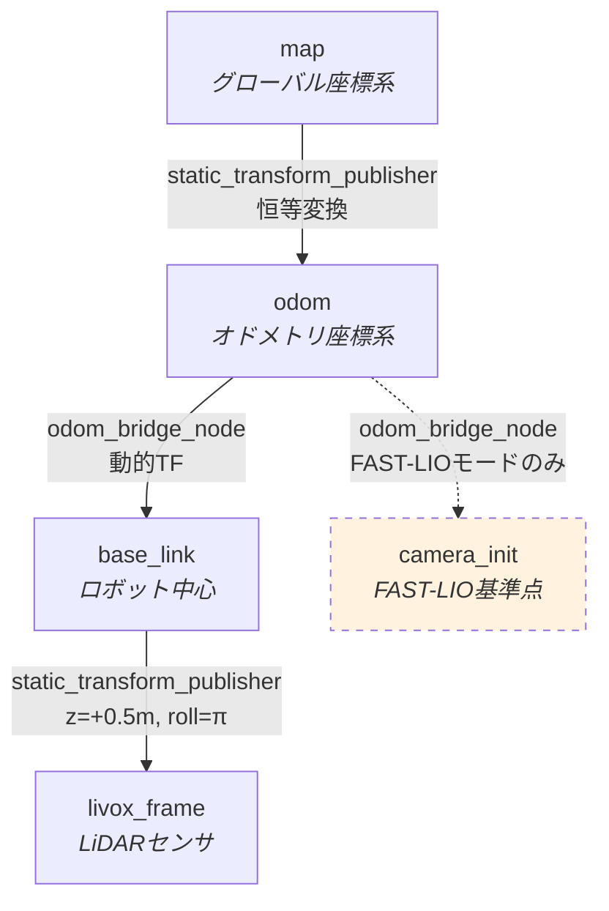

# TFフレームと座標系

## フレーム階層



## 各フレームの説明

### map

グローバル固定座標系。`core1_field.png` のOccupancyGridはこのフレームで配信されます。

- **原点**: マップ画像の左下隅（`map_name` プリセットにより異なる。core1_field: origin_x=-13.675, origin_y=-9.15）
- **向き**: ROS標準（X=前方, Y=左方）

### odom

オドメトリ座標系。`map` との間は恒等変換（静的TF）です。

### base_link

ロボット中心の座標系。`odom_bridge_node` が `odom → base_link` の動的TFをブロードキャストします。

### livox_frame

Livox Mid-360 LiDARの座標系。`base_link` から z=+0.5m の高さに設置され、roll=π（X軸周りに180度回転）されています。

### camera_init（FAST-LIOモードのみ）

FAST-LIOの基準フレーム。FAST-LIOモードでのみ `odom_bridge_node` が初回メッセージ受信時にTFをブロードキャストします（`StaticTransformBroadcaster` で一度だけ配信）。変換は `rot_z(init_yaw) * rot_x(π)` で、camera_init座標系（X=前方, Y=右方, Z=下方）をodom座標系に合わせます。

## 座標変換

### Unityシミュレータ → ROS2

odom_bridge_node がUnityの座標系をROS2に変換します。

| | Unity | ROS2 (odom) |
|---|-------|-------------|
| 前方 | Z | X |
| 左方 | -X | Y |
| 上方 | Y | Z |

変換式:

```
odom_x = -sim_y + offset_x
odom_y =  sim_x + offset_y
odom_yaw = sim_yaw + π/2
```

初回メッセージ受信時に `init_x`, `init_y` パラメータからオフセットを自動計算します。

### FAST-LIO → ROS2

FAST-LIOは `camera_init` フレーム（X=前方, Y=右方, Z=下方）で出力します。

| | camera_init | odom |
|---|-------------|------|
| 前方 | X | X |
| 左方 | -Y | Y |
| 上方 | -Z | Z |

変換式:

```
odom_x = init_x + cos(yaw_offset) * dx - sin(yaw_offset) * dy
odom_y = init_y + sin(yaw_offset) * dx + cos(yaw_offset) * dy
odom_yaw = -ci_yaw + yaw_offset
```

`dx`, `dy` は初回位置からの変位、`yaw_offset` は `init_yaw` パラメータから自動計算されます。
