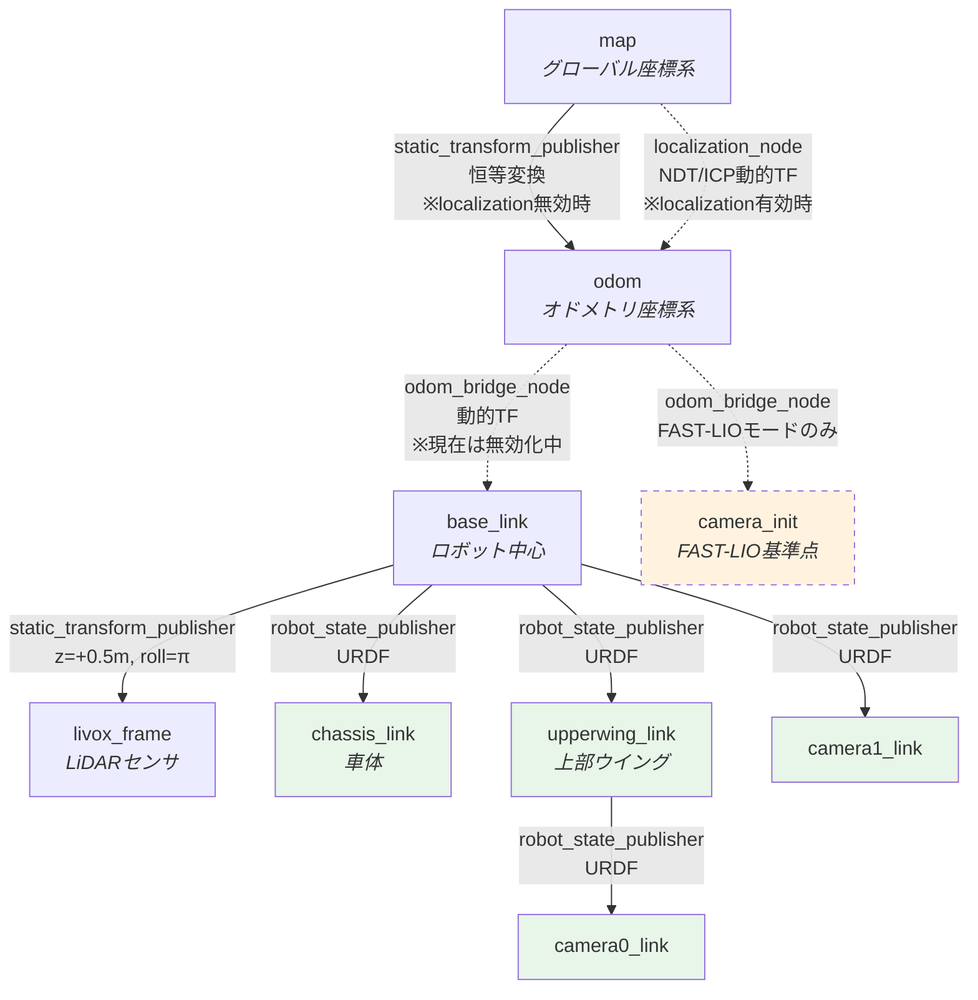

# TFフレームと座標系

## フレーム階層


```mermaid
graph TD
    map["map<br/><i>グローバル座標系</i>"]
    odom["odom<br/><i>オドメトリ座標系</i>"]
    base_link["base_link<br/><i>ロボット中心</i>"]
    livox_frame["livox_frame<br/><i>LiDARセンサ</i>"]
    camera_init["camera_init<br/><i>FAST-LIO基準点</i>"]
    chassis_link["chassis_link<br/><i>車体</i>"]
    upperwing_link["upperwing_link<br/><i>上部ウイング</i>"]
    camera0_link["camera0_link"]
    camera1_link["camera1_link"]

    map -->|"static_transform_publisher<br/>恒等変換<br/>※localization無効時"| odom
    map -.->|"localization_node<br/>NDT/ICP動的TF<br/>※localization有効時"| odom
    odom -.->|"odom_bridge_node<br/>動的TF<br/>※現在は無効化中"| base_link
    base_link -->|"static_transform_publisher<br/>z=+0.5m, roll=π"| livox_frame
    odom -.->|"odom_bridge_node<br/>FAST-LIOモードのみ"| camera_init

    base_link -->|"robot_state_publisher<br/>URDF"| chassis_link
    base_link -->|"robot_state_publisher<br/>URDF"| upperwing_link
    base_link -->|"robot_state_publisher<br/>URDF"| camera1_link
    upperwing_link -->|"robot_state_publisher<br/>URDF"| camera0_link

    style camera_init fill:#fff3e0,stroke-dasharray: 5 5
    style chassis_link fill:#e8f5e9,color:#333
    style upperwing_link fill:#e8f5e9,color:#333
    style camera0_link fill:#e8f5e9,color:#333
    style camera1_link fill:#e8f5e9,color:#333
```

!!! warning "odom→base_link は現在発行されません"
    `odom → base_link` を発行する `odom_bridge_node` は `navigation.launch.py` でコメントアウトされているため、現状このTFはブロードキャストされません。TFツリーが `odom` で分断されるため、TFに依存するノード（RViz2の表示、`costmap_build_node` など）はそのままでは動作しません。デバッグ時は `costmap_build.launch.py` が発行する恒等変換の静的TFで代用されます（後述）。

!!! info "localization有効時の動作"
    `use_localization:=true` で起動すると、`map→odom` は `localization_node`（core_localization パッケージ）がNDT/ICPマッチングの結果に基づいて動的に発行します。これにより、FAST-LIOのオドメトリドリフトがグローバル座標上で補正されます。詳細は[core_localization パッケージ](../packages/core_localization/index.md)を参照してください。

!!! danger "costmap_build.launch.py のデバッグ用静的TFと衝突する"
    `core_costmap_builder/launch/costmap_build.launch.py` は単体デバッグ用に以下の静的TFを発行します。`navigation.launch.py` と同時に起動すると `base_link→livox_frame` が二重発行され、値も異なるため注意してください。

    | 親 | 子 | 変換 | 備考 |
    |---|---|---|---|
    | `odom` | `base_link` | 恒等変換 | `odom_bridge_node` の代替 |
    | `base_link` | `livox_frame` | z=+0.6m, **pitch=π** | `navigation.launch.py` は z=+0.5m, **roll=π** |

## 各フレームの説明

### map

グローバル固定座標系。`core1_field.png` のOccupancyGridはこのフレームで配信されます。

- **原点**: マップ画像の左下隅（`map_name` プリセットにより異なる。core1_field: origin_x=-13.675, origin_y=-9.15）
- **向き**: ROS標準（X=前方, Y=左方）

### odom

オドメトリ座標系。デフォルトでは `map` との間は恒等変換（静的TF）です。`use_localization:=true` で起動した場合は、`localization_node` がNDT/ICPの結果に基づいて `map→odom` を動的に更新します。

### base_link

ロボット中心の座標系。`odom_bridge_node` が `odom → base_link` の動的TFをブロードキャストします（ただし現在は無効化中）。

### livox_frame

Livox Mid-360 LiDARの座標系。`base_link` から z=+0.5m の高さに設置され、roll=π（X軸周りに180度回転）されています。

### URDFフレーム（chassis_link / upperwing_link / camera0_link / camera1_link）

`core_launch/launch/state_publisher.launch.py` で起動する `robot_state_publisher` が、`core_launch/urdf/core2025_attacker.urdf` から以下の階層のTFを配信します。

```
base_link
├── chassis_link
├── upperwing_link
│   └── camera0_link
└── camera1_link
```

`core_path_follower` の `use_local_frame:=true` は、経路が `chassis_link` を基準とするロボットローカル座標系で与えられることを前提とします。

### camera_init（FAST-LIOモードのみ）

FAST-LIOの基準フレーム。FAST-LIOモードでのみ `odom_bridge_node` が初回メッセージ受信時にTFをブロードキャストします（`StaticTransformBroadcaster` で一度だけ配信）。変換は `rot_z(init_yaw) * rot_x(π)` で、camera_init座標系（X=前方, Y=右方, Z=下方）をodom座標系に合わせます。

## 座標変換

### Unityシミュレータ → ROS2

odom_bridge_node がUnityの座標系をROS2に変換します。

| | Unity | ROS2 (odom) |
|---|-------|-------------|
| 前方 | Z | X |
| 左方 | -X | Y |
| 上方 | Y | Z |

変換式:

```
odom_x = -sim_y + offset_x
odom_y =  sim_x + offset_y
odom_yaw = sim_yaw + π/2
```

初回メッセージ受信時に `init_x`, `init_y` パラメータからオフセットを自動計算します。

### FAST-LIO → ROS2

FAST-LIOは `camera_init` フレーム（X=前方, Y=右方, Z=下方）で出力します。

| | camera_init | odom |
|---|-------------|------|
| 前方 | X | X |
| 左方 | -Y | Y |
| 上方 | -Z | Z |

変換式:

```
odom_x = init_x + cos(yaw_offset) * dx - sin(yaw_offset) * dy
odom_y = init_y + sin(yaw_offset) * dx + cos(yaw_offset) * dy
odom_yaw = -ci_yaw + yaw_offset
```

`dx`, `dy` は初回位置からの変位、`yaw_offset` は `init_yaw` パラメータから自動計算されます。
