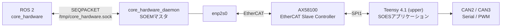

# EtherCATとPDO

制御PCはSOEMを使うEtherCATマスタ、upper TeensyはAX58100とSOESを使う唯一のEtherCATスレーブです。EtherCATは制御PCとupper間だけを担当し、upperから先のモータとbottomはCANまたはシリアルで接続されます。

## 接続構成



| 項目 | 現在値 | 主な定義元 |
|------|-------|-----------|
| マスタ | SOEM、`core_hardware_daemon` | `core_hardware/src/ecat.cpp` |
| ネットワークIF | `enp2s0`（デーモンのデフォルト） | `core_hardware_daemon.cpp` |
| スレーブ名 | `core2026_upper` | `esi.json` / upper `ecat.cpp` |
| EtherCAT Slave Controller | AX58100、SPI mode 0 | `esi.json` |
| Vendor ID / Product Code | `0x1120` / `0x1120` | `esi.json` |
| Revision / Serial | `0x002` / `0x001` | `esi.json` |
| EEPROMサイズ | 2048 B | `esi.json` |
| SOEMサイクル | 10 ms | `core_hardware_daemon.cpp` |
| process data受信タイムアウト | 3000 µs | `core_hardware_daemon.cpp` |
| IPCソケット | `/tmp/core_hardware.sock`、Unix `SEQPACKET` | `ipc_protocol.hpp` |

AX58100とTeensy間のSPI1ピンは [基板とピン配置](boards.md#ethercatスレーブコントローラax58100--spi1) を参照してください。

## 制御PC側のプロセス

`core_hardware_daemon` はsystemdサービスとして常駐し、raw Ethernetを扱うSOEMマスタとROS 2ノードを分離します。標準のインストール先と引数は次のとおりです。

```text
/etc/systemd/system/core_hardware_daemon.service
/opt/core_hardware/bin/core_hardware_daemon

--if-name enp2s0
--socket-path /tmp/core_hardware.sock
```

ROS 2側の `core_hardware` ノードも同じ `socket_path` を使用する必要があります。デーモンとノード間のIPCヘッダは、マジック `0x43483236`（`CH26`）、バージョン1、最大メッセージ8192 Bです。

| IPC type | 値 | 用途 |
|----------|---:|------|
| `kCommandSnapshot` | 1 | ROS 2ノードからデーモンへの一括指令 |
| `kStateSnapshot` | 2 | デーモンからROS 2ノードへの一括状態 |
| `kFloatPacket` | 3 | モータ状態パケット |
| `kUint8Packet` | 4 | damage、destroy、wireless、color、hardware_enable |
| `kHeartbeat` | 5 | ハートビート用に予約 |
| `kError` | 6 | エラー通知用に予約 |

!!! note "USB版はデフォルトlaunchで起動しません"
    `core_hardware.launch.py` は `/dev/teensy` を使う `core_hardware_usb` ノードも定義していますが、`LaunchDescription` ではコメントアウトされています。通常のlaunchで起動するのはEtherCATデーモンへ接続する `core_hardware` ノードです。

## PDOの方向

EtherCATのPDO名は**スレーブから見た方向**です。

| 名称 | このシステムでの方向 | 用途 |
|------|---------------------|------|
| RxPDO | 制御PC → upper | モータ指令、システム指令、LED指令 |
| TxPDO | upper → 制御PC | モータ状態、接続状態、競技状態 |

## RxPDO（制御PC → upper）

Sync Manager 2のPDO assign `0x1c12` に3個のマッピングがあります。現在のprocess data長は71 Bです。

| PDO mapping | Object | 型・要素数 | サイズ | 内容 |
|------------|--------|-----------|-------|------|
| `0x1600` | `0x7000 motor_ref` | REAL32 × 16 | 64 B | 論理ID 0–15のアクチュエータ指令 |
| `0x1601` | `0x7001 system_ref` | BOOLEAN × 1 | 1 bit | 論理ID 17相当のシステム指令 |
| `0x1602` | `0x7002 LED_TAPE` | UNSIGNED16 × 3 | 48 bit | upper / bottom用LED指令スロット |

### `motor_ref[0..15]`

`core_hardware_daemon` は16個のfloatをPDOへ書き込みます。upperは受信ごとに論理ID 0–15へ分配します。

| 論理ID | upperでの処理 |
|-------:|--------------|
| 0–4 | CAN3モータへ指令 |
| 5–6 | CAN2モータへ指令 |
| 7–14 | Feetechサーボへ位置指令 |
| 15 | 発射ESCへPWM指令 |

各IDの機器名とCANプロトコルIDは [CANバスとモータID](buses.md#アプリ側論理id) を参照してください。

### `system_ref[0]`

ホスト側の論理ID 17を1 bitに変換します。upperまでは届きますが、現在は `ecat_PacketCallBack()` 内のGPIO非常停止処理がコメントアウトされているため、ピン32の出力には反映されません。

### `LED_TAPE[0..2]`

ESI上のスロット名と現在のファームウェア動作には差があります。

| 要素 | ESI上の名前 | 現在の動作 |
|------|-------------|-----------|
| `[0]` | `led0_upper` | 下位8 bitをupper LEDモードに使用。同じ値をbottomの1バイト目にも転送 |
| `[1]` | `led1_bottom` | PDOでは受信するが、upperの転送処理では未使用 |
| `[2]` | `led2_bottom` | 下位8 bitをbottomの2バイト目へ転送するが、bottom側では未使用 |

したがって、現在実際に点灯制御されるのはupperの43灯とbottomの200灯で、どちらも `LED_TAPE[0]` のモード値を使用します。

## TxPDO（upper → 制御PC）

Sync Manager 3のPDO assign `0x1c13` に5個のマッピングがあります。現在のprocess data長は123 Bです。

| PDO mapping | Object | 型・要素数 | サイズ | 内容 |
|------------|--------|-----------|-------|------|
| `0x1a00` | `0x6000 motor_state_pos` | REAL32 × 15 | 60 B | 論理ID 0–14の位置 |
| `0x1a01` | `0x6001 motor_state_vel` | INTEGER16 × 15 | 30 B | 論理ID 0–14の速度 |
| `0x1a02` | `0x6002 motor_state_torque` | INTEGER16 × 15 | 30 B | トルク領域。先頭8 Bはwireless / colorと多重化 |
| `0x1a03` | `0x6003 system_state` | BOOLEAN × 2 | 2 bit | upper / bottom状態スロット |
| `0x1a04` | `0x6004 core_state` | UNSIGNED8 × 2 | 2 B | damage / destroy |

### モータ状態のROS 2パケットへの変換

ホストは論理ID 0–14について6要素のfloatパケットを生成します。

| 要素 | 内容 |
|------|------|
| `[0]` | 予約（0） |
| `[1]` | 実トルク / 電流。ID 0–3は多重化領域のため0として公開 |
| `[2]` | 目標速度。ID 0–4で使用 |
| `[3]` | 実速度 |
| `[4]` | 目標位置。ID 5–14で使用 |
| `[5]` | 実位置 |

`motor_state_vel` と `motor_state_torque` はTeensy側でfloatからint16へ丸め、範囲外を `-32768..32767` にクランプして格納します。

### uint8パケットへの変換

`core_hardware_daemon` はTxPDOから次のアプリケーションパケットを生成します。

| パケットID | 元データ | 内容 |
|-----------:|---------|------|
| 100 | `core_state[0]` | damage（HP） |
| 101 | `core_state[1]` | destroy（撃破フラグ） |
| 102 | `motor_state_torque` 先頭7 B | wireless |
| 103 | `motor_state_torque` 8バイト目 | color（チーム色） |
| 104 | `system_state[0]` | hardware_enable |

`system_state[0]` はupperへの指令またはbottom応答がタイムアウトすると0になります。`system_state[1]` はオブジェクト辞書に存在しますが、現在のupperファームウェアは値を設定していません。

## wireless / colorの多重化

現在の実機で動作しているPDOサイズを維持するため、`motor_state_torque[0..3]` の先頭8 Bを次のように利用しています。

```text
byte 0..6 : wireless 7 B
byte 7    : color 1 B
```

このため、論理ID 0–3のトルク値は通常用途では使用できず、ホストは0としてROS 2側へ公開します。論理ID 4–14のトルク領域は通常どおり使用します。

!!! warning "PDOレイアウトは複数ファイルで重複定義されています"
    要素数、型、並び順を変更するときは、Teensy、ESI、PC側の全定義を同時に更新してください。1か所だけ変更するとPDOサイズまたはオフセットがずれます。

## マスタの周期と切断処理

`core_hardware_daemon` はROS 2ノードからコマンドスナップショットを受け取っている間、10 ms周期でprocess dataを交換します。

| 条件 | 動作 |
|------|------|
| ROS 2ノードからのコマンドが1秒途絶 | EtherCATを閉じ、指令を無効化 |
| WKC不足または受信失敗が10周期連続 | EtherCATを閉じ、次周期以降に再接続 |
| 接続・交換処理で例外 | 指令をクリアし、空の状態をIPCへ通知して再接続 |
| upper側がRxPDOを500 ms受信できない | upperが `hardware_enable=0`、Feetech disableへ移行 |

SOEMは接続時にPDOをマッピングし、SAFE-OPを確認してからOPへ遷移します。現在はDistributed Clocksを設定していません。

## PDOを変更するとき

最低限、次のファイルを同じレイアウトへ揃えます。

| ファイル | 役割 |
|---------|------|
| `teensy41/upper/soes/soes-esi/utypes.h` | Teensy側オブジェクトのC構造体 |
| `teensy41/upper/soes/soes-esi/objectlist.c` | オブジェクト辞書とPDO mapping |
| `teensy41/upper/soes/soes-esi/esi.json` | ESI生成元のオブジェクト定義 |
| `teensy41/upper/src/ecat.cpp` | upper側のPDOと論理パケットの変換 |
| `core_hardware/src/ecat.cpp` | SOEM側のビット/バイトオフセットと変換 |
| `core_hardware/include/core_hardware/hardware_snapshot.hpp` | デーモンとROS 2ノード間のスナップショット |

変更後はRxPDOが71 B、TxPDOが123 Bという現在値も再計算し、PC側のサイズ検査を更新します。EEPROMへ書くESIバイナリも新しい定義から再生成してください。

## EEPROM書き込み

既存手順は次の形式です。`eepromtool` と生成済みの `eeprom.bin` はこのリポジトリに含まれないため、事前に用意します。

```bash
cd core_hardware
sudo ./vendor/soem/bin/eepromtool enp2s0 1 \
  -w ./teensy41/upper/soes/soes-esi/eeprom.bin
```

## 通信テスト

```bash
cd core_hardware/test
./build.sh
sudo ./build/ecat_zero_check enp2s0
```

## 関連ページ

- [回路・通信構成](index.md)
- [基板とピン配置](boards.md)
- [CANバスとモータID](buses.md)
- [core_hardware パッケージ](../packages/core_hardware/index.md)
