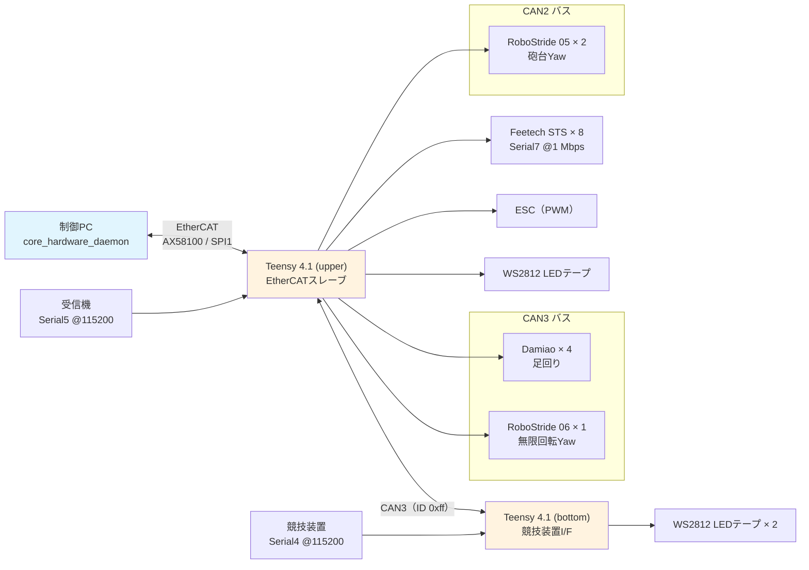

# 回路構成

制御PCからアクチュエータまでの電気的な接続とID割り当てをまとめます。値はすべて `core_hardware/` 配下のファームウェアとホスト側ソースに記載されているものです。

!!! info "この章の範囲"
    ここに記載するのは**ファームウェアが定義しているピン配置・バス構成・ID割り当て**です。基板の回路図・部品表はリポジトリに含まれていません。

## この章の構成

| ページ | 内容 |
|-------|------|
| [基板とピン配置](boards.md) | Teensy 4.1（upper / bottom）のピン割り当て、ファームウェアのビルド |
| [CANバスとモータID](buses.md) | CAN2 / CAN3 の構成、モータID一覧、EtherCAT PDO、死活監視 |

## 全体構成



制御PCは EtherCAT マスタ（SOEM）として動作し、Teensy 4.1（upper）を唯一のスレーブとして扱います。upper が全アクチュエータのバスマスタを兼ね、競技装置との接続だけを bottom が担当します。

## 制御PC側

| 項目 | 値 | 定義元 |
|------|-----|-------|
| EtherCATマスタ | SOEM | `core_hardware/src/ecat.cpp` |
| ネットワークIF | `enp2s0`（デーモン起動時の固定引数） | `core_hardware/README.md` |
| IPCソケット | `/tmp/core_hardware.sock`（SEQPACKET, Unixドメイン） | `ipc_protocol.hpp` |
| IPCマジック | `0x43483236`（"CH26"）、バージョン 1 | 同上 |
| USBシリアル版のポート | `/dev/teensy` | `core_hardware.launch.py` |

`core_hardware_daemon` は systemd サービスとして常駐させる運用です。導入手順は `core_hardware/README.md` を参照してください。

```
/etc/systemd/system/core_hardware_daemon.service
/opt/core_hardware/bin/core_hardware_daemon
```

`--socket-path` は `core_hardware.launch.py` の `socket_path` パラメータと同じ値にする必要があります。

### IPCメッセージ種別

`ipc_protocol.hpp` が定義するメッセージタイプです。

| 値 | 種別 |
|----|------|
| 1 | `kCommandSnapshot` |
| 2 | `kStateSnapshot` |
| 3 | `kFloatPacket` |
| 4 | `kUint8Packet` |
| 5 | `kHeartbeat` |
| 6 | `kError` |

最大メッセージサイズは 8192 バイトです。

!!! note "`core_hardware_usb` は launch から起動されません"
    `core_hardware/launch/core_hardware.launch.py` には `core_hardware_usb` ノードの定義がありますが、`LaunchDescription` に含まれておらず起動しません。USB経由で使う場合は `ros2 run` で個別に起動してください。

## 関連ページ

- [メカ構成](../mechanics/index.md) — 寸法と可動範囲
- [core_hardware パッケージ](../packages/core_hardware/index.md) — ROS2ノードの詳細
- [トピック・メッセージ一覧](../architecture/topics.md) — `/can/tx` と `core_msgs/CANArray` の定義
