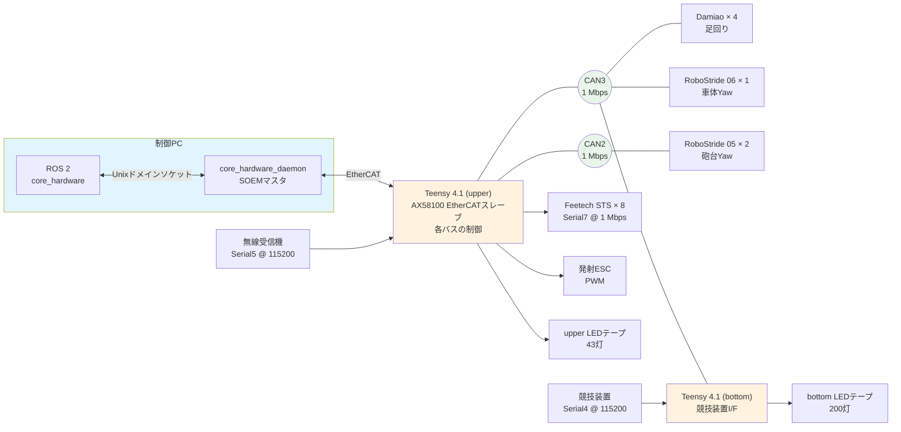

# 回路・通信構成

制御PCから各アクチュエータ、競技装置までの電気的な接続と通信経路をまとめます。値は `core_hardware/` 配下のホスト実装とファームウェアを基準にしています。

!!! info "この章の範囲"
    ここに記載するのは**ファームウェアが定義しているピン配置・バス構成・ID割り当て・EtherCAT PDO**です。基板の回路図、配線図、部品表はリポジトリに含まれていません。

## この章の構成

| ページ | 内容 |
|-------|------|
| [基板とピン配置](boards.md) | Teensy 4.1（upper / bottom）のピン割り当て、LED、ファームウェアのビルド |
| [CANバスとモータID](buses.md) | CAN2 / CAN3 の接続機器、CANプロトコルID、アプリ側論理ID、死活監視 |
| [EtherCATとPDO](ethercat.md) | 制御PCとupper間のEtherCAT構成、オブジェクト辞書、RxPDO / TxPDO、EEPROM |

## 全体構成

CAN3にはupper TeensyのCAN3コントローラ、Damiao 4台、RoboStride 06 1台、bottom Teensyが同じバスのノードとして接続されます。bottomはupperから独立したCAN3バスではありません。upperがモータ指令を送る一方、bottomへ50 ms周期で状態を問い合わせます。

CAN2にはupper TeensyとRoboStride 05 2台が接続されます。Feetechサーボ、無線受信機、競技装置はCANではなく、それぞれ専用のシリアル接続です。

## 通信区間

| 区間 | 通信 | 主な役割 |
|------|------|---------|
| ROS 2ノード ↔ `core_hardware_daemon` | Unixドメインソケット（`/tmp/core_hardware.sock`） | ROSメッセージとハードウェアスナップショットの受け渡し |
| 制御PC ↔ upper Teensy | EtherCAT（SOEM ↔ AX58100） | 全アクチュエータの指令と状態フィードバック |
| upper Teensy ↔ CANモータ | CAN2 / CAN3、1 Mbps | Damiao / RoboStrideの制御と状態取得 |
| upper Teensy ↔ bottom Teensy | CAN3、標準ID `0xff` / `0x00` | LED指令、HP・撃破状態・チーム色 |
| bottom Teensy ← 競技装置 | Serial4、115200 bps | 競技状態の受信 |

## 関連ページ

- [メカ構成](../mechanics/index.md) — 寸法と可動範囲
- [core_hardware パッケージ](../packages/core_hardware/index.md) — ROS 2ノードの詳細
- [ハードウェアセットアップ](../guides/hardware-setup.md) — 実機の配線・起動手順
- [トピック・メッセージ一覧](../architecture/topics.md) — `/can/tx` と `core_msgs/CANArray` の定義
