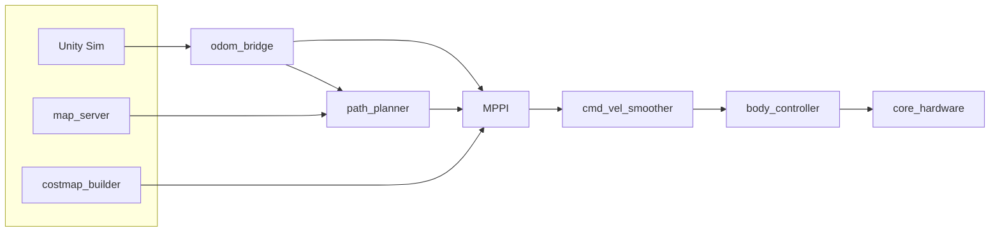

# core2026

CoRE2026用のメインROS2リポジトリです。ナビゲーション、経路計画、モーション制御、ハードウェアインターフェースを統合的に管理します。

## パッケージ一覧

| パッケージ | 概要 |
|-----------|------|
| [core_launch](packages/core_launch.md) | ランチファイル・ヘルパーノード（odom_bridge, map_server） |
| [core_msgs](packages/core_msgs.md) | カスタムメッセージ定義（CAN, Path, PoseWithWeight） |
| [core_path_planner](packages/core_path_planner.md) | A*グローバル経路計画 |
| [core_mppi](packages/core_mppi.md) | MPPIローカルコントローラ |
| [core_path_follower](packages/core_path_follower.md) | 経路追従コントローラ（PID/Pure Pursuit） |
| [core_costmap_builder](packages/core_costmap_builder.md) | LiDAR点群からローカルコストマップ生成 |
| [core_cmd_vel_smoother](packages/core_cmd_vel_smoother.md) | cmd_vel EMA平滑化フィルタ |
| [core_body_controller](packages/core_body_controller.md) | 車体モータ制御（オムニホイール逆運動学） |
| [core_enemy_detection](packages/core_enemy_detection.md) | カメラ画像からの敵ダメージパネル検出・ターゲット選択 |
| [core_mode](packages/core_mode.md) | 緊急停止・システムモード管理 |
| [core_ros_player_controller](packages/core_ros_player_controller.md) | ワイヤレスコントローラ入力パーサー |
| [core_shooter](packages/core_shooter.md) | デュアルタレット射撃・照準・マガジン管理 |
| [core_hardware](packages/core_hardware.md) | EtherCATハードウェアインターフェース |
| [core_tools](packages/core_tools.md) | デバッグ・診断ツール（motor_tool GUI） |
| [core_test](packages/core_test.md) | 共有GTestインフラ |
| [ROS-TCP-Endpoint](packages/ros_tcp_endpoint.md) | Unity-ROS2ブリッジ |

## クイックスタート

```bash
# ビルド
cd ~/ros2_ws
colcon build --symlink-install

# ナビゲーション起動（シミュレータモード）
ros2 launch core_launch navigation.launch.py
```

詳しい起動方法は[クイックスタート](getting-started/quick-start.md)を参照してください。

## アーキテクチャ

システム全体の構成は[アーキテクチャ概要](architecture/overview.md)を参照してください。


