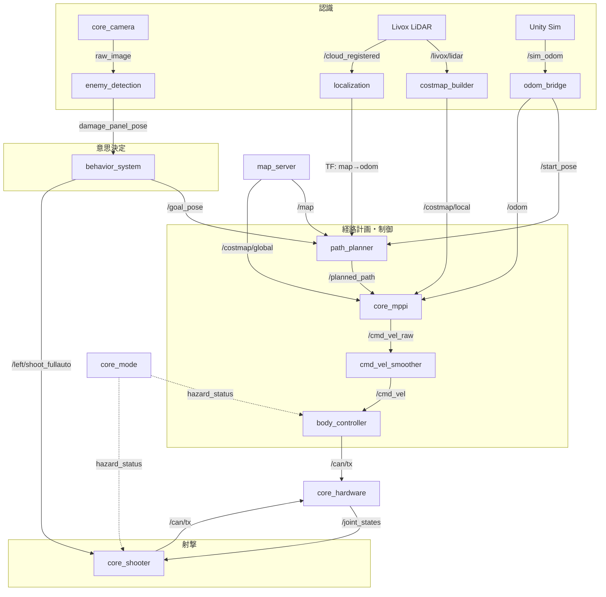

# core2026

CoRE2026用のメインROS2リポジトリです。ナビゲーション、経路計画、モーション制御、ハードウェアインターフェースを統合的に管理します。

## パッケージ一覧

役割ごとに層で分けています。各パッケージの概要ページには、構成図とノード間のデータフローを掲載しています。

### 意思決定

| パッケージ | 概要 |
|-----------|------|
| [core_behavior_system](packages/core_behavior_system/index.md) | 自律行動の状態機械・ウェイポイント巡回・自動射撃判断 |

### 認識・自己位置推定

| パッケージ | 概要 |
|-----------|------|
| [core_localization](packages/core_localization/index.md) | NDT/ICPによるPCDマップベースのグローバル局在化 |
| [core_costmap_builder](packages/core_costmap_builder/index.md) | LiDAR点群からローカルコストマップ生成 |
| [core_enemy_detection](packages/core_enemy_detection/index.md) | カメラ画像からの敵ダメージパネル検出・ターゲット選択 |
| [core_camera](packages/core_camera/index.md) | USBカメラ3台の起動設定（usb_camのランチ集約） |

### 経路計画・制御

| パッケージ | 概要 |
|-----------|------|
| [core_path_planner](packages/core_path_planner/index.md) | A*グローバル経路計画 |
| [core_mppi](packages/core_mppi/index.md) | MPPIローカルコントローラ |
| [core_path_follower](packages/core_path_follower/index.md) | 経路追従コントローラ（PID/Pure Pursuit） |
| [core_cmd_vel_smoother](packages/core_cmd_vel_smoother/index.md) | cmd_vel EMA平滑化フィルタ |
| [core_body_controller](packages/core_body_controller/index.md) | 車体モータ制御（オムニホイール逆運動学） |
| [core_damiao_imu](packages/core_damiao_imu/index.md) | DM-IMU-L1 USBドライバ・姿勢配信 |

### 射撃・機構

| パッケージ | 概要 |
|-----------|------|
| [core_shooter](packages/core_shooter/index.md) | デュアルタレット射撃・照準・マガジン管理 |

### ハードウェア・安全

| パッケージ | 概要 |
|-----------|------|
| [core_hardware](packages/core_hardware/index.md) | EtherCAT/USBハードウェアインターフェース |
| [core_mode](packages/core_mode/index.md) | 緊急停止・システムモード管理 |
| [core_ros_player_controller](packages/core_ros_player_controller/index.md) | ワイヤレスコントローラ入力パーサー |

### UI・可視化

| パッケージ | 概要 |
|-----------|------|
| [core_qt_gui](packages/core_qt_gui/index.md) | 操縦者向けHUD（パッケージ名は `gui_qt`） |
| [core_status_gui](packages/core_status_gui/index.md) | 行動状態・緊急状態の大画面ステータス表示 |
| [core_tools](packages/core_tools/index.md) | デバッグ・診断ツール（motor_tool GUI） |

### 基盤

| パッケージ | 概要 |
|-----------|------|
| [core_launch](packages/core_launch/index.md) | ランチファイル・ヘルパーノード（odom_bridge, map_server） |
| [core_msgs](packages/core_msgs/index.md) | カスタムメッセージ定義（CAN, Path, PoseWithWeight） |
| [core_test](packages/core_test/index.md) | 共有GTestインフラ |
| [ROS-TCP-Endpoint](packages/ros_tcp_endpoint/index.md) | Unity-ROS2ブリッジ |

## クイックスタート

```bash
# ビルド
cd ~/core_ws
colcon build --symlink-install

# ナビゲーション起動（シミュレータモード）
ros2 launch core_launch navigation.launch.py
```

詳しい起動方法は[クイックスタート](getting-started/quick-start.md)を参照してください。

## アーキテクチャ

システム全体の構成は[アーキテクチャ概要](architecture/overview.md)を参照してください。


```mermaid
graph TB
    subgraph Sense["認識"]
        Camera["core_camera"] -->|"raw_image"| EnemyDet["enemy_detection"]
        Lidar["Livox LiDAR"] -->|"/livox/lidar"| CostmapBuilder["costmap_builder"]
        Lidar -->|"/cloud_registered"| Localization["localization"]
        Unity["Unity Sim"] -->|"/sim_odom"| OdomBridge["odom_bridge"]
    end

    subgraph Decide["意思決定"]
        Behavior["behavior_system"]
    end

    subgraph Navigate["経路計画・制御"]
        PathPlanner["path_planner"] -->|"/planned_path"| MPPI["core_mppi"]
        MPPI -->|"/cmd_vel_raw"| Smoother["cmd_vel_smoother"]
        Smoother -->|"/cmd_vel"| BodyController["body_controller"]
    end

    subgraph Shoot["射撃"]
        Shooter["core_shooter"]
    end

    EnemyDet -->|"damage_panel_pose"| Behavior
    Behavior -->|"/goal_pose"| PathPlanner
    Behavior -->|"/left/shoot_fullauto"| Shooter
    MapServer["map_server"] -->|"/map"| PathPlanner
    MapServer -->|"/costmap/global"| MPPI
    OdomBridge -->|"/start_pose"| PathPlanner
    OdomBridge -->|"/odom"| MPPI
    Localization -->|"TF: map→odom"| PathPlanner
    CostmapBuilder -->|"/costmap/local"| MPPI
    BodyController -->|"/can/tx"| Hardware["core_hardware"]
    Shooter -->|"/can/tx"| Hardware
    Hardware -->|"/joint_states"| Shooter
    Emergency["core_mode"] -.->|"hazard_status"| BodyController
    Emergency -.->|"hazard_status"| Shooter
```
