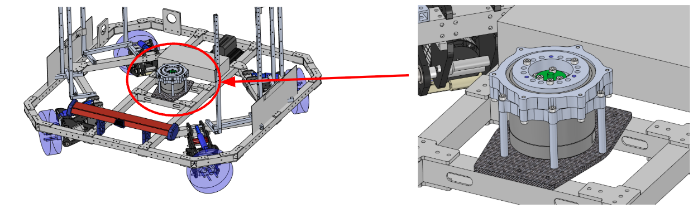
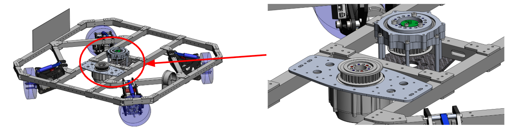
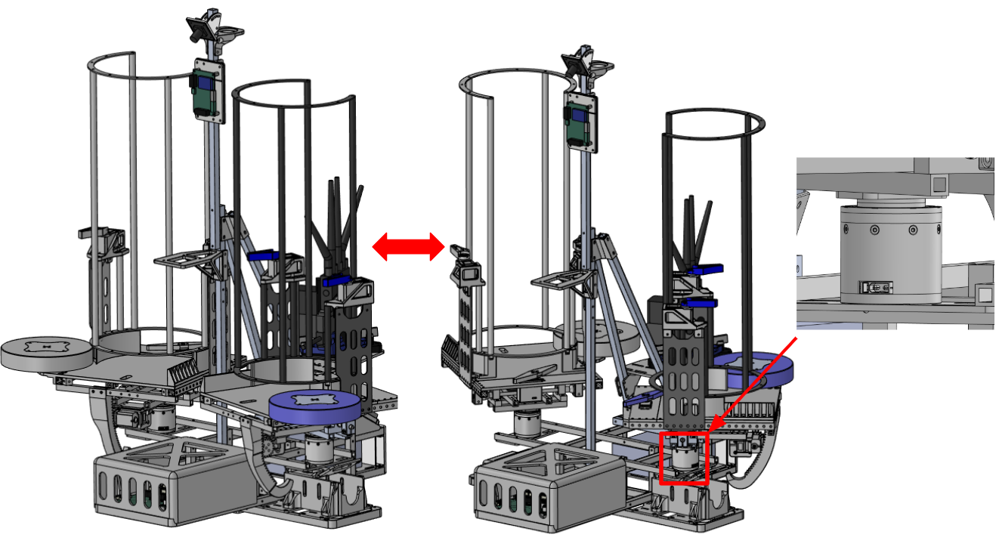
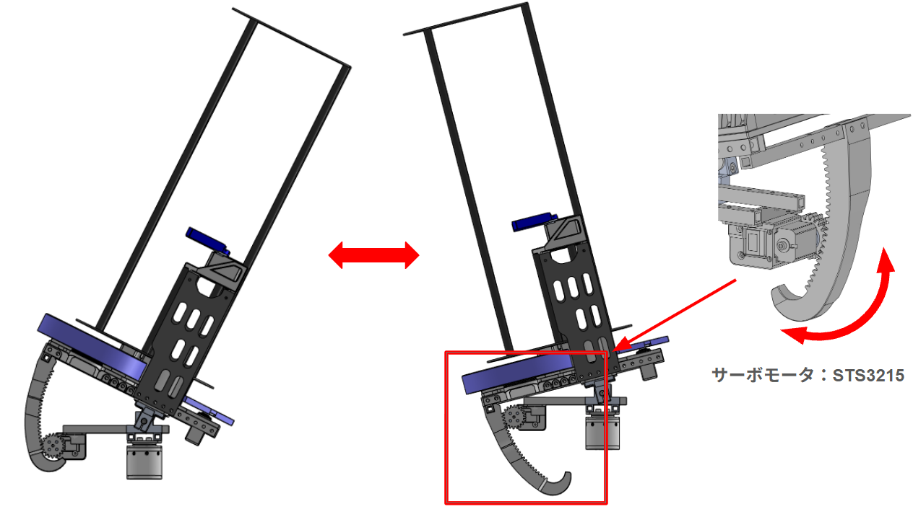

# 旋回機構・駆動系

## 無限回転Yaw 
機体上側と下側が回転する際に使用される機構です。<br>
2026年度はモータを変えたためベルト駆動となっており、2025年度との比較を画像1、画像2にそれぞれ示します。<br>
回転しても配線がねじれないようにするスリップリングが搭載されています。


<div style="text-align: center">画像1 ver.2025</div>


<div style="text-align: center">画像2 ver.2026</div>

## 砲台Yaw 
RoboStride 05を用いて発射機構を左右に動かす機構です。<br>
画像3に機構を示します。<br>
砲台Pitchと合わせることで発射機構を自由に動かします。<br>


<div style="text-align: center">画像3</div>

## 砲台Pitch
サーボモータを用いて発射機構を縦に動かす機構です。<br>
画像4に機構を示します。<br>
砲台Yaw と合わせることで発射機構を自由に動かします。<br>


<div style="text-align: center">画像4</div>

## ソフトウェアとメカ
以下からはソフトウェアから見た機体の機構構成を記載します。<br>

## 旋回機構

| 機構 | アクチュエータ | モータID | 備考 |
|------|--------------|---------|------|
| 車体無限回転Yaw | RoboStride 06（CAN3） | 4 | `base_to_chassis`（continuous）に対応 |
| 砲台Yaw（左） | RoboStride 05（CAN2） | 5 | 位置制御モード（PosPP） |
| 砲台Yaw（右） | RoboStride 05（CAN2） | 6 | 位置制御モード（PosPP） |

砲台Yawには初期位置オフセットがファームウェア側で設定されています（`core_hardware/teensy41/upper/src/can2.h`）。

| 定数 | 値 |
|------|-----|
| `CAN2_RS05_OFFSET_POSITION_1` | π + 1.25 rad |
| `CAN2_RS05_OFFSET_POSITION_2` | π + 0.1 rad |
| `CAN2_RS05_SPEED_LIMIT` | 1.0 rad/s |
| `CAN2_RS05_ACC_LIMIT` | 3.0 rad/s² |

車体角度のフィードバック制御は `target_angle_node` が担当し、DM-IMU-L1（`/imu`）内部EKFのYawから作った連続相対角をPID制御して、モータID 4の角速度指令を `/can/tx` へ生成します。ベースの回転中は `body_control_node` の `/body_omega` 指令値をフィードフォワードに使用します。

## 駆動系（4輪オムニ）

`core_body_controller/src/body_control_node.cpp` の逆運動学が前提とする寸法です。

| 項目 | 値 | 定義元 |
|------|-----|-------|
| ホイール直径 | 0.13 m（半径 0.065 m） | `WHEEL_RADIUS = 0.13 / 2` |
| トレッド（対角基準幅） | 0.5304 m | `BODY_WIDTH` |
| ホイール配置角 | 車体前後軸から ±45°（π/4） | 逆運動学式 |
| ホイール数 | 4 | `wheel_velocities(4)` |

上から見たホイール配置とインデックスは以下の通りです。

```
        x（前方）
   1 [/]   [\] 0
   2 [\]   [/] 3
```

各輪の角速度は次式で求まります（`vx_body` / `vy_body` は車体座標系に回転済みの並進速度、`omega` は旋回角速度）。

```
w[0] = -( vx·cos(π/4) - vy·sin(π/4) - √2·BODY_WIDTH/2·omega ) / WHEEL_RADIUS
w[1] = -( vx·cos(π/4) + vy·sin(π/4) - √2·BODY_WIDTH/2·omega ) / WHEEL_RADIUS
w[2] = -(-vx·cos(π/4) + vy·sin(π/4) - √2·BODY_WIDTH/2·omega ) / WHEEL_RADIUS
w[3] = -(-vx·cos(π/4) - vy·sin(π/4) - √2·BODY_WIDTH/2·omega ) / WHEEL_RADIUS
```

`cmd_vel` は `body_angle`（車体の現在角）で車体座標系へ回転させてから逆運動学に入力されます。算出した4輪の角速度は `core_msgs/CANArray` として `/can/tx` へ送出されます。

!!! warning "`WHEEL_RADIUS` と `BODY_WIDTH` はハードコードされています"
    この2つはROSパラメータではなく `body_control_node.cpp` 内の `constexpr` です。ホイールやフレームを変更した場合はソースの修正と再ビルドが必要です。

### 加減速リミット

`body_controller.launch.py` の引数で指定します。

| 引数 | デフォルト | 単位 |
|------|-----------|------|
| `acceleration` | 2.0 | m/s² |
| `rotation_acceleration` | π（3.14159…） | rad/s² |
| `auto_rotation_velocity` | -π | rad/s |
| `high_rotation_velocity` | -6.28 | rad/s |
| `yaw_rotation_velocity` | 6.28 | rad/s |
| `yaw_rotation_acceleration` | 3π（9.42477…） | rad/s² |
| `cmd_vel_timeout_sec` | 0.2 | s |
| `imu_timeout_sec` | 0.2 | s |
| `body_omega_timeout_sec` | 0.2 | s |


## 関連ページ

- [砲塔・装填・発射機構](turret.md)
- [回路構成：CANバスとモータID](../circuit/buses.md) — バス構成とID割り当て
- [core_body_controller パッケージ](../packages/core_body_controller/index.md)
