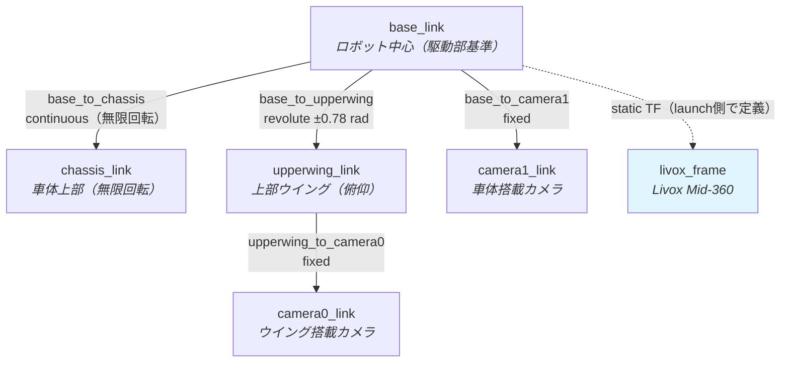

# メカ構成

## 機体要素
CoRE2026に出場した機体の概要を画像1、画像2に示します。 
本機体は 

・上側 
・下側 

の区分と 

・発射機構 
・砲台Yaw 
・砲台Pitch 
・無限回転Yaw 
・足回り：4輪オムニ 

の5要素で構成されています。 

画像1

画像2

## 構成
上記の要素を以下の区分に分けて記載します。

| ページ | 内容 |
|-------|------|
| [旋回機構・駆動系](drivetrain.md) | 無限回転Yaw、砲台Yaw・Pitchの機構構成 |
| [砲塔・装填・発射機構](turret.md) | 左右砲塔の可動範囲、ディスクマガジン、発射機構 |

## ソフトウェアとメカ
以下からはソフトウェアから見た機体の機構構成を記載します。 
値はすべてリポジトリ内のソース・URDF・パラメータファイルに記載されているものです。

!!! info "この章の範囲"
    ここに記載するのは**ソフトウェアが前提としている寸法・可動範囲**です。加工図面や材質などの設計情報はリポジトリに含まれていません。実機の値を変更した場合は、各ページに挙げた定義元ファイルを必ず同時に更新してください。

## リンク構成

`core_launch/urdf/core2025_attacker.urdf` が定義する機体のリンク階層です。`robot_state_publisher` がこのURDFからTFを配信します。

| ジョイント | 型 | 原点 `xyz` [m] | 可動範囲 |
|-----------|-----|---------------|---------|
| `base_to_chassis` | continuous | `0 0 0` | 無制限（無限回転Yaw） |
| `base_to_upperwing` | revolute | `0.1635 0.1761 0.226833` | `-0.78` ～ `0.78` rad（軸 `0 -1 0`、速度上限 0.1 rad/s） |
| `base_to_camera1` | fixed | `0.0824 -0.1713 0.6860` | — |
| `upperwing_to_camera0` | fixed | `0.0208 -0.0945 0.0262` | — |

メッシュは `core_launch/urdf/mesh/` に配置されています。

| ファイル | 対応リンク |
|---------|-----------|
| `attacker_chassis.dae` | chassis_link |
| `attacker_upperwing.dae` | upperwing_link |
| `attacker_shooter.dae` | 砲塔（表示用） |

## アクチュエータ一覧

制御PCから指令できるアクチュエータの全リストです。**論理ID**は `/hardware/can/tx`（`core_msgs/CANArray`）とEtherCATの `motor_ref[]` で共通して使う番号で、CANプロトコル上のIDとは別物です。

| 論理ID | 機種 | 接続 | デバイスID | 搭載箇所・用途 |
|-------:|------|------|-----------|---------------|
| 0 | Damiao DM-3519 | CAN3 | slave 1 | 足回りオムニホイール 0 |
| 1 | Damiao DM-3519 | CAN3 | slave 2 | 足回りオムニホイール 1 |
| 2 | Damiao DM-3519 | CAN3 | slave 3 | 足回りオムニホイール 2 |
| 3 | Damiao DM-3519 | CAN3 | slave 4 | 足回りオムニホイール 3 |
| 4 | RoboStride 06 | CAN3 | motor 1 | 車体無限回転Yaw |
| 5 | RoboStride 05 | CAN2 | motor 1 | 左砲台Yaw |
| 6 | RoboStride 05 | CAN2 | motor 2 | 右砲台Yaw |
| 7 | Feetech STS | Serial7 | servo 1 | 左砲塔 Pitch |
| 8 | Feetech STS | Serial7 | servo 2 | 右砲塔 装填（速度指令） |
| 9 | Feetech STS | Serial7 | servo 3 | 右砲塔 ディスク保持（右） |
| 10 | Feetech STS | Serial7 | servo 4 | 右砲塔 ディスク保持（左） |
| 11 | Feetech STS | Serial7 | servo 5 | 右砲塔 Pitch（回転方向反転） |
| 12 | Feetech STS | Serial7 | servo 6 | 左砲塔 装填（速度指令・回転方向反転） |
| 13 | Feetech STS | Serial7 | servo 7 | 左砲塔 ディスク保持（右） |
| 14 | Feetech STS | Serial7 | servo 8 | 左砲塔 ディスク保持（左） |
| 15 | ESC（PWM） | upper ピン24 | — | 左砲塔 発射モータ |
| 16 | ESC（PWM） | — | — | 右砲塔 発射モータ。ファームウェア未実装 |
| 17 | — | GPIO 32 | — | 非常停止出力。upper側の処理はコメントアウト |

左右の割り当てと角度パラメータは `core_shooter/config/shooter.params.yaml`、サーボの回転方向と指令方式は `core_hardware/teensy41/upper/src/feetech.h`、CAN側のIDは `upper/src/can2.h` / `can3.h` が定義元です。

| 系統 | 台数 | 指令方式 | 主な設定値 |
|------|-----:|---------|-----------|
| Damiao DM-3519（CAN3） | 4 | ホストが生成した指令フレームをそのまま転送 | 1 ms間隔で5台をラウンドロビン送信 |
| RoboStride 06（CAN3） | 1 | 速度制御（`Speed_control_mode`） | 1.0 rad/s、3.0 rad/s² |
| RoboStride 05（CAN2） | 2 | 位置制御（`PosPP_control_mode`） | 1.0 rad/s、3.0 rad/s²、位置オフセットあり |
| Feetech STS（Serial7 @1 Mbps） | 8 | 位置指令（装填の2台のみ速度指令） | 制御周期 10 ms、STS3215 67 rpm / STS3020 100 rpm |
| ESC（PWM） | 1（実装済み） | パルス幅 | 1000〜1400 µs、更新周期 10 ms |

!!! warning "論理ID 16と17はアクチュエータを動かしません"
    EtherCATの `motor_ref` は論理ID 0–15までです。右砲塔の発射モータ（ID 16）はPDOに枠が無く、upperの `case 16` もコメントアウトされています。ID 17は `system_ref` としてupperへ届きますが、非常停止GPIOの処理がコメントアウトされています。

## センサ一覧

| センサ | 個数 | 接続 | 取り付け | トピック | 定義元 |
|-------|-----:|------|---------|---------|-------|
| Livox Mid-360 LiDAR | 1 | Ethernet（`livox_ros_driver2`） | `base_link` から z=+0.5 m、roll=π（上下反転） | `/livox/lidar`（`PointCloud2`、10 Hz） | `navigation.launch.py` |
| Mid-360 内蔵IMU | 1 | 同上 | 同上 | `/livox/imu` | 同上（FAST-LIO無効中のため未使用） |
| DM-IMU-L1 | 1 | USB CDC、921600 bps | 回転上部車体へ+X前方・+Z上向きで固定 | `/imu`（200 Hz、`damiao_imu_link`） | `core_damiao_imu` / `body_controller.launch.py` |
| USBカメラ（左砲塔） | 1 | `/dev/camera_left` | 左砲塔 | `/turret_camera_left/color/image`（640×480 @30fps） | `core_camera/launch/camera.launch.py` |
| USBカメラ（右砲塔） | 1 | `/dev/camera_right` | 右砲塔 | `/turret_camera_right/color/image`（640×480 @30fps） | 同上 |
| USBカメラ（TPS視点） | 1 | `/dev/camera_tps` | 車体 | `/turret_camera_tps/color/image`（1280×720 @30fps） | 同上 |
| ディスク残量 距離センサ | 2（左右砲塔） | — | マガジン上部、高さ 500 mm（`sensor_height`） | `/mecha/shooter/{side}/distance`（`std_msgs/Int32`、mm） | `core_shooter/config/shooter.params.yaml` |

競技装置と操縦機からの入力はセンサではありませんが、同じ経路でROS 2へ入ります。

| 入力 | 接続 | トピック |
|------|------|---------|
| 競技装置（HP・撃破・チーム色） | 競技装置 → bottom Teensy Serial4（115200 bps） → CAN3 → upper → EtherCAT | `/hardware/hp`、`/hardware/destroy`、`/hardware/color` |
| 無線受信機 | upper Serial5（115200 bps） | `/hardware/wireless`（`UInt8MultiArray`、7 B） |

!!! note "LiDAR取り付け高さの記述が2箇所で異なります"
    `costmap_build.launch.py` のデバッグ用静的TFは z=+0.6 m / pitch=π で定義されており、`navigation.launch.py`（z=+0.5 m / roll=π）と一致しません。

!!! warning "ディスク距離センサのPublisherがリポジトリ内にありません"
    `magazine_manager` は `/mecha/shooter/{side}/distance` を購読しますが、これを発行するノードもファームウェア処理もリポジトリ内に見当たりません。距離センサの値が届かない間、残弾数は発射数カウントによる推定で動作します。

## 関連ページ

- [回路構成](../circuit/index.md) — モータID割り当てと通信経路
