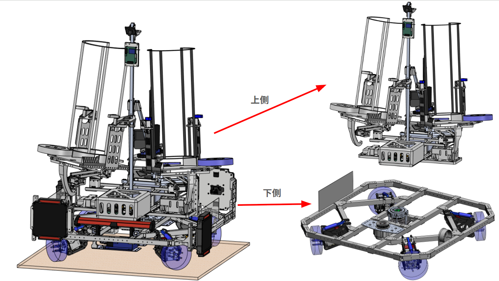
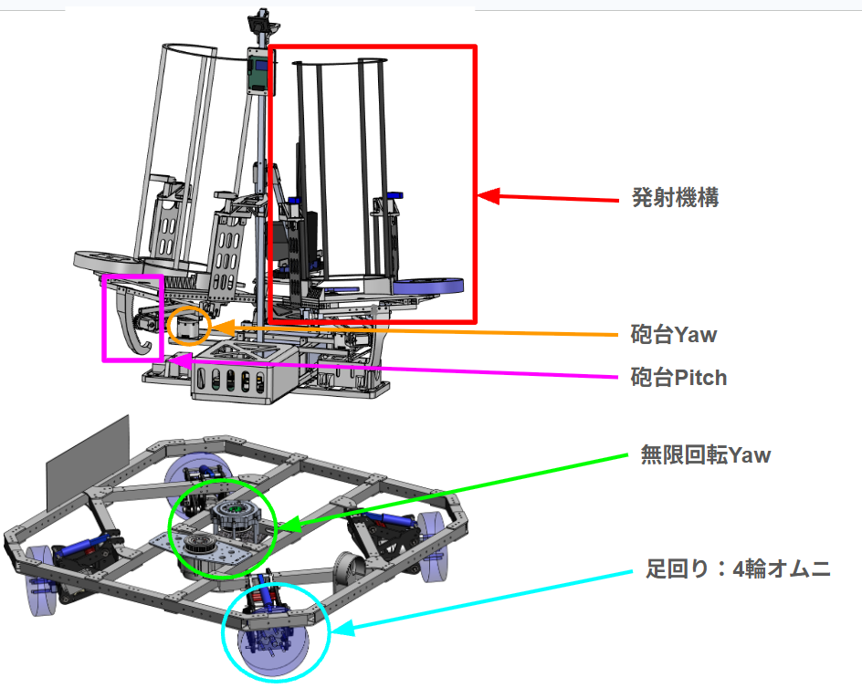
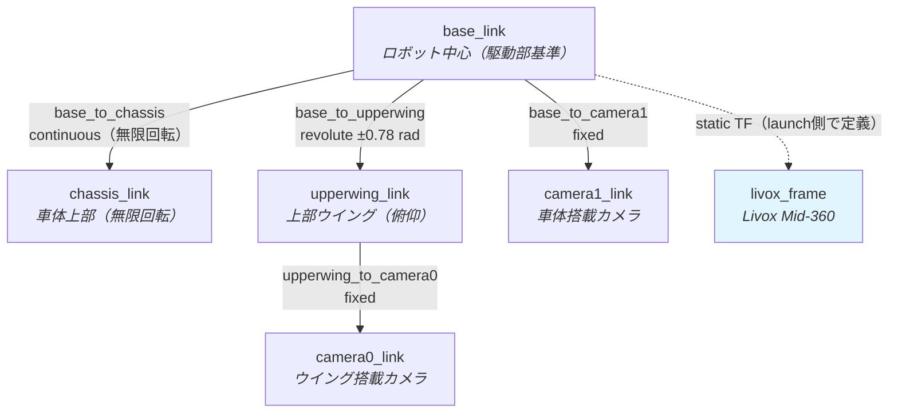

# メカ構成

## 機体要素
CoRE2026に出場した機体の概要を画像1、画像2に示します。 
本機体は 

・上側 
・下側 

の区分と 

・発射機構 
・砲台Yaw 
・砲台Pitch 
・無限回転Yaw 
・足回り：4輪オムニ 

の5要素で構成されています。 

画像1

画像2

## 構成
上記の要素を以下の区分に分けて記載します。

| ページ | 内容 |
|-------|------|
| [旋回機構・駆動系](drivetrain.md) | 無限回転Yaw・砲台Yaw、4輪オムニの寸法と逆運動学、加減速リミット|
| [砲塔・装填・発射機構](turret.md) | 左右砲塔の可動範囲、ディスクマガジン、発射機構 |

## ソフトウェアとメカ
以下からはソフトウェアから見た機体の機構構成を記載します。 
値はすべてリポジトリ内のソース・URDF・パラメータファイルに記載されているものです。

!!! info "この章の範囲"
    ここに記載するのは**ソフトウェアが前提としている寸法・可動範囲**です。加工図面や材質などの設計情報はリポジトリに含まれていません。実機の値を変更した場合は、各ページに挙げた定義元ファイルを必ず同時に更新してください。

## リンク構成

`core_launch/urdf/core2025_attacker.urdf` が定義する機体のリンク階層です。`robot_state_publisher` がこのURDFからTFを配信します。

| ジョイント | 型 | 原点 `xyz` [m] | 可動範囲 |
|-----------|-----|---------------|---------|
| `base_to_chassis` | continuous | `0 0 0` | 無制限（無限回転Yaw） |
| `base_to_upperwing` | revolute | `0.1635 0.1761 0.226833` | `-0.78` ～ `0.78` rad（軸 `0 -1 0`、速度上限 0.1 rad/s） |
| `base_to_camera1` | fixed | `0.0824 -0.1713 0.6860` | — |
| `upperwing_to_camera0` | fixed | `0.0208 -0.0945 0.0262` | — |

メッシュは `core_launch/urdf/mesh/` に配置されています。

| ファイル | 対応リンク |
|---------|-----------|
| `attacker_chassis.dae` | chassis_link |
| `attacker_upperwing.dae` | upperwing_link |
| `attacker_shooter.dae` | 砲塔（表示用） |

## センサ搭載位置

| センサ | 取り付け | 定義元 |
|-------|---------|-------|
| Livox Mid-360 LiDAR | `base_link` から z=+0.5 m、roll=π（上下反転） | `navigation.launch.py` の静的TF |
| カメラ（左砲塔） | `/dev/camera_left`、640×480 @30fps | `core_camera/launch/camera.launch.py` |
| カメラ（右砲塔） | `/dev/camera_right`、640×480 @30fps | 同上 |
| カメラ（TPS視点） | `/dev/camera_tps`、1280×720 @30fps | 同上 |
| DM-IMU-L1 | 回転上部車体へ+X前方・+Z上向きで固定（`/imu`） | `core_damiao_imu` / `body_controller.launch.py` |

!!! note "LiDAR取り付け高さの記述が2箇所で異なります"
    `costmap_build.launch.py` のデバッグ用静的TFは z=+0.6 m / pitch=π で定義されており、`navigation.launch.py`（z=+0.5 m / roll=π）と一致しません。詳細は [TFフレームと座標系](../architecture/tf-tree.md) を参照してください。

## 関連ページ

- [回路構成](../circuit/index.md) — モータID割り当てと通信経路
- [TFフレームと座標系](../architecture/tf-tree.md) — 座標系の定義
- [ハードウェアセットアップ](../guides/hardware-setup.md) — 実機の配線・起動手順
