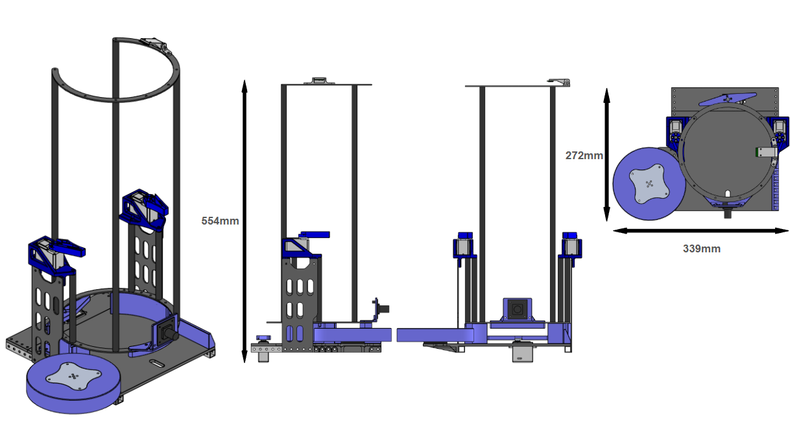
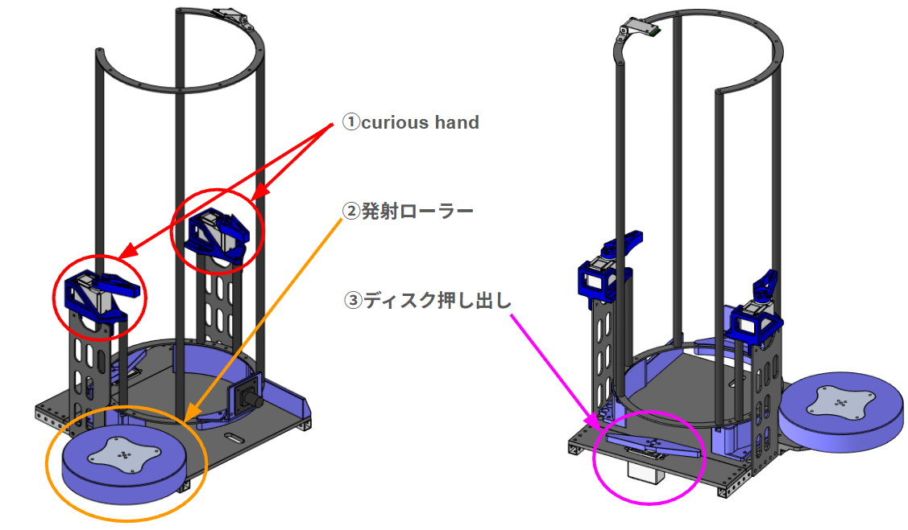
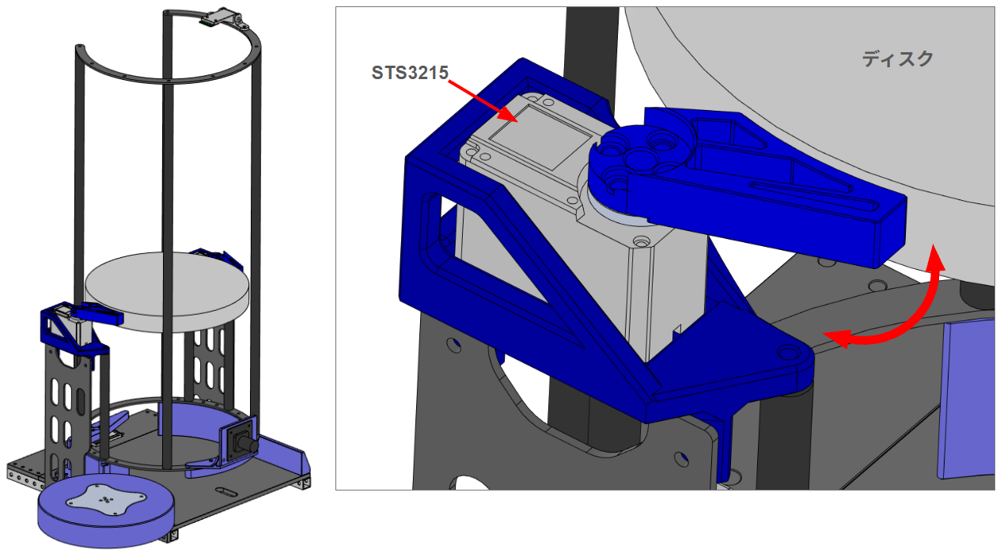
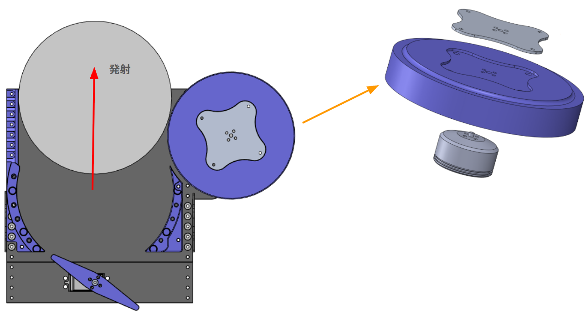
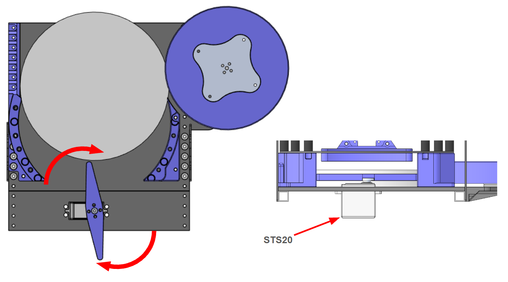

# 砲塔・装填・発射機構
この章では発射機構のメカ部分についてまとめます。

## 設計・開発の要素
機体を製作するにあたって重要となるチームの機体コンセプトは2025年度と同様に 
「高速回転しながらディスクを打つ攻守最強の機体」 
であることから発射機構には以下の要素が必要となりました。

・足回りが回転するため回転範囲以内に機構を収める 
・どこでも狙えるように弾道を変えられる（砲台Yaw） 
・チームメンバーで製作できる設計（学生の頃と異なり、加工方法や予算が限られているため）

また、今年度は更にかっこいい機体を目指すために砲塔が増えています。 
そのため可能な限り小さく、軽い砲塔を目指して製作を行いました。

## 今年度の設計制限
2026の機体は砲塔が2基になるため機体内部に収まるようにするためには、発射方向を正面として縦450mm×横345mm以内に設計する必要があります。 
しかし、昨年度の砲塔は縦368mm×横448mmであったため再設計が必要となりました。

## 設計・製作
要素と制限を考慮して以下の画像1の設計をしました。 
高さ554mm×縦272mm×横339mmになったため制限以内です。 
ディスクはカーボン製の円柱4本で24枚まで保持することができます。 

画像1

発射機構の構成要素を画像2に示す。 
構成要素は以下の3点である。 
①curious hand 
②発射ローラー 
③ディスク押し出し 
この3項目について説明する

画像2

## curious hand
curious handの詳細を画像3に示します。 
curious handは中段でディスクを2つのサーボモータで押さえるための機構です。 
途中でディスクを押さえることで発射されるディスクにかかる上のディスクの荷重が軽減されるため発射が安定します。 
名称のcurious handはこの機構が必要か人の手で押さえて検証しているときに押さえていた人物からとっています。

画像3

## 発射ローラー
発射ローラーの詳細を画像4に示します。 
構成は去年と同様にローラーは板金、3Dプリンター製ローラー、モータで構成されています。 
板金はディスクを押し出す際のトルクがモータに直接加わらないように取り付けています「。

押し出し機構で押し出されたディスクをローラーが巻き込んで発射します。

画像4

## ディスク押し出し
発射ローラーの詳細を画像5に示します。
サーボモータにひし形の3Dプリンターパーツを取り付けてディスクの押し出しを行っています。 
昨年度と比べサーボモータを1つに押し出し距離を伸ばすように設計変更しています。 
押し出し距離を伸ばしたことでジャム確率が減り発射の不安定さは軽減しました。 
しかし、連現状の設計だとまだジャムる場合があるため設計変更が必要です。 

画像5

## ソフトウェアとメカ
以下からはソフトウェアから見た機体の機構構成を記載します

## 砲塔（左右2基）

`core_shooter/launch/shooter.launch.py` で左右それぞれに設定される可動範囲です。

| 項目 | 左砲塔 | 右砲塔 |>>>>>>>>。。。>>>>>>>>>>>ます
|------|-------|-------|
| Pitch モータID | 11（Feetech） | 7（Feetech） |
| Yaw モータID | 5（RoboStride 05） | 6（RoboStride 05） |
| Pitch 可動範囲 | `-1.44` ～ `0.0` rad | `-3.0` ～ `0.0` rad |
| Yaw 反転 | あり（`zone.yaw_reversed: True`） | なし |
| 画像中心（正規化） | (0.40, 0.40) | (0.55, 0.50) |
| Yaw 画像ゲイン | 0.0005 | 0.0007 |
| Pitch 画像ゲイン | 0.008 | 0.01 |

Yaw角に応じてPitchの可動範囲を切り替える**ゾーン制限**（`zone.*`、`enable_zone_angle_limit: true`）が有効です。自機の構造物との干渉を避けるための機構的制約であり、値は左右で異なります。詳細は [aim_bot](../packages/core_shooter/aim_bot.md) を参照してください。

### 画像追尾の設定

| 項目 | 値 | 説明 |
|------|-----|------|
| `image_width` / `image_height` | 1280.0 / 720.0 | 追尾計算で前提とする画像サイズ |
| `image_tolerance_x` / `_y` | 20.0 / 20.0 | 目標到達とみなすピクセル許容誤差 |
| `horizontal_fov_deg` | 100.0 | 横画角。縦画角は画像比から導出 |
| `use_fov_image_tracking` | false | true で画角ベース、false でゲイン加算制御 |
| `max_yaw_rate` / `max_pitch_rate` | 3.0 / 5.0 rad/s | 段階移動時の最大角速度 |

## 装填機構（ディスクマガジン）

`core_shooter/config/shooter.params.yaml` の値です。

| 項目 | 値 | 説明 |

|------|-----|------|
| `max_disks` | 24 | 満タン時の装填数 |
| `disk_thickness` | 20.0 mm | ディスク1枚の厚み |
| `sensor_height` | 500.0 mm | 距離センサの取り付け高さ |
| `window_size` | 3 | 残弾推定の移動平均窓 |
| `regrip_enabled` | true | 再把持動作の有効化 |
| `regrip_trigger_shots` | 6 | この発数を撃つと再把持を実施 |
| `regrip_release_ms` | 1000 | 再把持時の解放時間 |
| `hold_disable_height_margin_mm` | 0.5 | 保持解除判定の高さマージン |

残弾数は距離センサの測定値と `sensor_height` / `disk_thickness` から推定します。

ディスク保持は左右2つのFeetechサーボで行います。

| 砲塔 | 保持サーボ（左） | 保持サーボ（右） | 保持角 左 / 右 [rad] | 装填モータID |
|------|----------------|----------------|--------------------|-------------|
| 左 | ID 14 | ID 13 | `[0.35, 0.0]` / `[-0.35, 0.0]` | 12 |
| 右 | ID 10 | ID 9 | `[-0.35, 0.0]` / `[0.35, 0.0]` | 8 |

## 発射機構

| 項目 | 値 | 定義元 |
|------|-----|-------|
| 発射モータ（左 / 右） | ESC ID 15 / 16 | `shooter.launch.py` |
| 目標回転数プリセット | `[1400.0, 1300.0, 1200.0]` | `shooter.params.yaml` |
| 装填モータ速度 | 6.5 | `loading_motor_speed` |
| 発射間隔（単発 / バースト / フルオート） | 各 500 ms | `shoot_interval_ms` ほか |
| バースト発射数 | 3 | `burst_count` |
| 回転指令から発射許可までの遅延 | 2.0 s | `shoot_motor_rotation_cmd_activation_delay_sec` |

!!! danger "右ESC（ID 16）はファームウェア側で無効です"
    `core_hardware/teensy41/upper/src/main.cpp` の EtherCAT パケットハンドラでは `case 16:` がコメントアウトされており、**ID 16 への指令は現在のファームウェアでは処理されません**。`shooter.launch.py` は右砲塔に `shoot_motor_id: 16` を設定しているため、右の発射モータを動かすにはファームウェアの修正が必要です。

## 関連ページ

- [駆動系・旋回機構](drivetrain.md)
- [回路構成：CANバスとモータID](../circuit/buses.md) — ID割り当ての全体像
- [core_shooter パッケージ](../packages/core_shooter/index.md)
