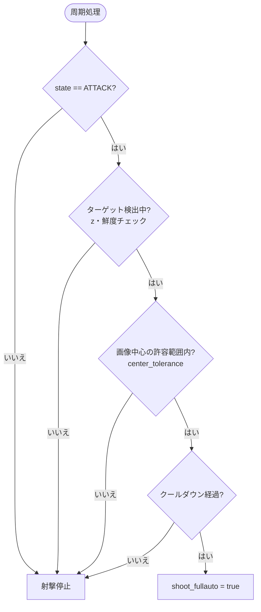

# attack_shoot_manager_node

## Purpose

敵を検出しただけで撃ち始めると弾を無駄にします。射撃すべきなのは「攻撃状態にあり」「かつ砲身が実際に敵を捉えている」ときだけです。このノードはその2条件を判定し、満たされたときに射撃指示を出す自動射撃の引き金役です。

## Inner-workings / Algorithms

`publish_rate_hz`（デフォルト20Hz）の周期で射撃可否を判定します。

### 照準判定

ターゲットの画像座標が、画像中心（`image_center_x` / `image_center_y`）から `center_tolerance_x_px` / `center_tolerance_y_px` の矩形内にあるかを判定します。この範囲内であれば砲身が敵を向いているとみなします。

判定は左右のタレットそれぞれについて独立に行い、条件を満たした側にのみ射撃指示を出します。

### 検出の有効性

[enemy_detection_coordinator_node](enemy_detection_coordinator_node.md) と同様に、`detected_z_threshold` による検出有無の判定と `stale_timeout_sec` による鮮度チェックを行います。

### クールダウン

`shoot_cooldown_sec` の間隔を空けて射撃指示を出します。照準が合った瞬間に連続で指示が飛ぶのを防ぎます。

## Inputs / Outputs

### Input

| トピック | 型 | 説明 |
|---------|------|------|
| `/behavior_system/state` | `std_msgs/Int32` | 行動状態（`behavior_system_node` から） |
| `/left/target_pose` | `geometry_msgs/PointStamped` | 左タレットの照準位置 |
| `/right/damage_panel_pose` | `geometry_msgs/PointStamped` | 右タレットの照準位置 |

### Output

| トピック | 型 | 説明 |
|---------|------|------|
| `/left/shoot_fullauto` | `std_msgs/Bool` | 左タレットのフルオート射撃指示 |
| `/right/shoot_fullauto` | `std_msgs/Bool` | 右タレットのフルオート射撃指示 |

出力は [core_shooter](../core_shooter/index.md) の [shooter_cmd_gate](../core_shooter/shooter_cmd_gate.md) が受け取り、発射数コマンドに変換します。

## Parameters

設定ファイル: `config/behavior_system.yaml`

| パラメータ | 型 | デフォルト | 説明 |
|-----------|------|-----------|------|
| `state_topic` | string | `/behavior_system/state` | 行動状態トピック名 |
| `left_target_topic` | string | `/left/target_pose` | 左タレットの照準位置トピック名 |
| `right_target_topic` | string | `/right/damage_panel_pose` | 右タレットの照準位置トピック名 |
| `left_shoot_once_topic` | string | `/left_shoot_once` | 左タレットの単発射撃トピック名 |
| `right_shoot_once_topic` | string | `/right_shoot_once` | 右タレットの単発射撃トピック名 |
| `attack_state_value` | int | `1` | 攻撃状態とみなす state の値 |
| `image_width` | double | `1280.0` | 画像幅 [px] |
| `image_height` | double | `720.0` | 画像高さ [px] |
| `image_center_x` | double | `0.5` | 照準中心X（正規化座標） |
| `image_center_y` | double | `0.5` | 照準中心Y（正規化座標） |
| `center_tolerance_x_px` | double | `20.0` | 照準判定の水平許容範囲 [px] |
| `center_tolerance_y_px` | double | `20.0` | 照準判定の垂直許容範囲 [px] |
| `detected_z_threshold` | double | `0.5` | 検出ありと判定する z 値の上限 |
| `stale_timeout_sec` | double | `0.2` | 検出結果を有効とみなす時間 [s] |
| `shoot_cooldown_sec` | double | `0.5` | 射撃指示の最小間隔 [s] |
| `publish_rate_hz` | double | `20.0` | 判定周期 [Hz] |

## Assumptions / Known limits

- 左右で購読するトピックのデフォルトが非対称です（左は `/left/target_pose`、右は `/right/damage_panel_pose`）。実際の構成に合わせてパラメータで揃えてください。
- 照準判定は画像座標のみで、距離や弾道の落下を考慮しません。遠距離のターゲットでは、画像中心に捉えていても着弾が下振れします。
- 残弾を確認しません。弾切れでも射撃指示を出し続けます。残弾管理は [magazine_manager](../core_shooter/magazine_manager.md) の責務です。
- 味方や障害物の識別は行いません。射線上の安全確認はしないため、`attack_state_value` で攻撃状態を厳密に限定することが安全上重要です。
- `left_shoot_once_topic` / `right_shoot_once_topic` パラメータは宣言されていますが、実際に発行しているのは `shoot_fullauto` の2トピックのみです。
