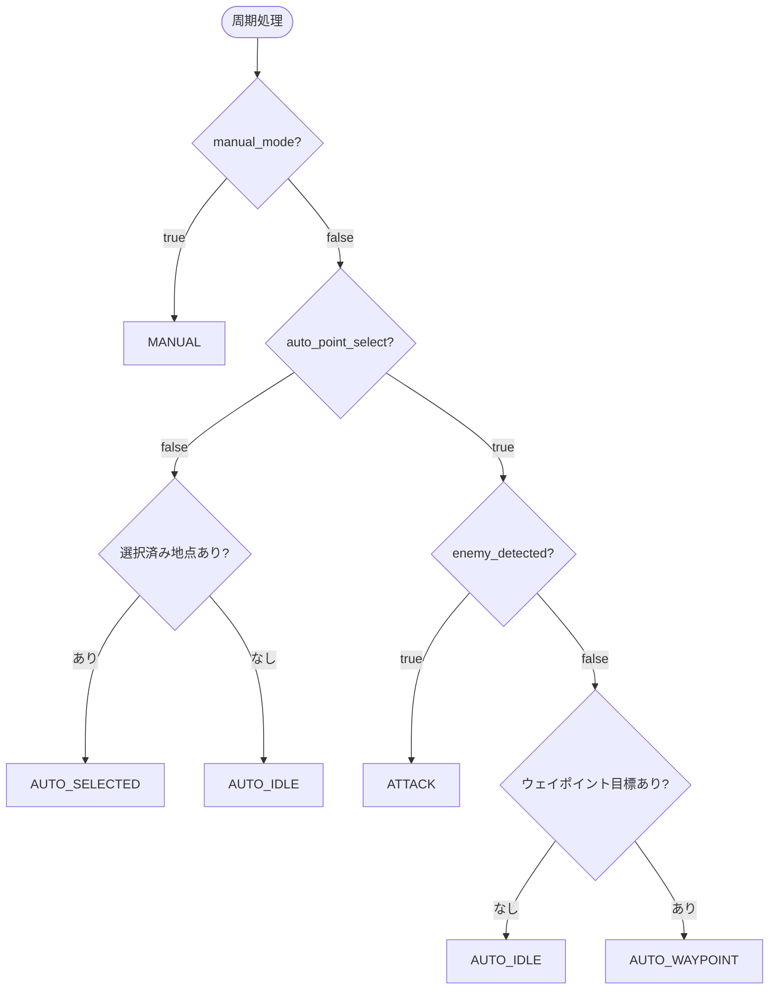

# behavior_system_node

## Purpose

自律走行中のロボットは、巡回・敵への対応・手動介入といった状況に応じて振る舞いを切り替える必要があります。このノードは各種の状況フラグから現在取るべき行動状態を判定し、その状態に対応するゴールと車体回転モードを下位に指示する状態機械です。

## Inner-workings / Algorithms

`publish_rate_hz`（デフォルト10Hz）の周期で、購読している状況フラグから次の状態を決定し、状態に応じた指令を発行します。

### 状態判定ロジック

判定は優先度順の早期リターンで、以下の順に評価されます。

`auto_point_select` が `false`（手動点選択モード）のときは敵検出を無視します。オペレータが指定した地点への移動を、敵の出現より優先させるためです。

### 状態ごとの動作

| 状態 | ゴール | `/rotation` | ウェイポイント巡回 | LED |
|------|-------|------------|-----------------|-----|
| `MANUAL` | 発行しない | false | 停止 | 2 |
| `ATTACK` | 停止ゴール | **true** | 停止 | 9 |
| `AUTO_SELECTED` | 選択された地点 | false | 停止 | 8 |
| `AUTO_WAYPOINT` | ウェイポイント目標 | false | **実行** | 7 |
| `AUTO_IDLE` | 発行しない | false | 停止 | 6 |

`ATTACK` 状態でのみ `/rotation` を `true` にします。敵を検出したらその場に留まり、車体を回して砲身を向けやすくするためです。同時に停止ゴールを発行して走行を止めます。

`AUTO_WAYPOINT` 以外の状態では `pause` を `true` にして [waypoint_selector_node](waypoint_selector_node.md) の巡回を止めます。巡回とその他の目標指定が同時に `/goal_pose` を書き換えて競合するのを防ぐ排他制御です。

### ゴール発行の重複抑制

同一のゴールを毎周期発行し続けると下流のプランナが不要な再計画を繰り返すため、`pose_equal_eps` の範囲で前回ゴールと一致する場合は再発行しません。またゴール到達後（`goal_reached`）は、新しい目標が来るまで再発行を抑制します。

## Inputs / Outputs

### Input

| トピック | 型 | 説明 |
|---------|------|------|
| `/manual_mode` | `std_msgs/Bool` | 手動操縦モード |
| `/auto_point_select` | `std_msgs/Bool` | 自動地点選択の有効/無効 |
| `/selected_pose` | `geometry_msgs/PoseStamped` | 手動で選択された移動先 |
| `/enemy_detected` | `std_msgs/Bool` | 敵検出フラグ（`enemy_detection_coordinator_node` から） |
| `/goal_reached` | `std_msgs/Bool` | ゴール到達通知（コントローラから） |
| `/waypoint_selector/goal_pose` | `geometry_msgs/PoseStamped` | 巡回目標（`waypoint_selector_node` から） |
| `/odom` | `nav_msgs/Odometry` | 現在位置 |
| `/system/emergency/hazard_status` | `std_msgs/Bool` | 緊急停止状態（LED表示に反映） |

### Output

| トピック | 型 | 説明 |
|---------|------|------|
| `/goal_pose` | `geometry_msgs/PoseStamped` | ナビゲーションへのゴール指示 |
| `/rotation` | `std_msgs/Int32` | 車体回転モード指示 |
| `/behavior_system/state` | `std_msgs/Int32` | 現在の行動状態（数値） |
| `/behavior_system/state_name` | `std_msgs/String` | 現在の行動状態（文字列） |
| `/waypoint_selector/pause` | `std_msgs/Bool` | 巡回の一時停止指示 |
| `/led/upper` | `std_msgs/UInt8` | 状態に対応するLED表示パターン |

## Parameters

設定ファイル: `config/behavior_system.yaml`

トピック名はすべてパラメータ化されており、リマップなしで接続先を変更できます。

| パラメータ | 型 | デフォルト | 説明 |
|-----------|------|-----------|------|
| `publish_rate_hz` | double | `10.0` | 状態判定・指令発行の周期 [Hz] |
| `pose_equal_eps` | double | `1e-3` | 同一ゴールとみなす位置の許容差 [m] |
| `manual_mode_topic` | string | `/manual_mode` | 手動モードトピック名 |
| `auto_point_select_topic` | string | `/auto_point_select` | 自動地点選択トピック名 |
| `selected_pose_topic` | string | `/selected_pose` | 選択地点トピック名 |
| `enemy_detected_topic` | string | `/enemy_detected` | 敵検出トピック名 |
| `goal_reached_topic` | string | `/goal_reached` | ゴール到達トピック名 |
| `waypoint_goal_topic` | string | `/waypoint_selector/goal_pose` | 巡回目標トピック名 |
| `goal_pose_topic` | string | `/goal_pose` | ゴール発行先トピック名 |
| `rotation_topic` | string | `/rotation` | 回転モードトピック名 |
| `state_topic` | string | `/behavior_system/state` | 状態（数値）発行先 |
| `state_name_topic` | string | `/behavior_system/state_name` | 状態（文字列）発行先 |
| `pause_topic` | string | `/waypoint_selector/pause` | 巡回停止指示の発行先 |
| `odom_topic` | string | `/odom` | オドメトリトピック名 |

## Assumptions / Known limits

- 状態判定は現在のフラグのみに基づき、遷移の履歴やヒステリシスを持ちません。`enemy_detected` が短時間で切り替わると `ATTACK` と `AUTO_WAYPOINT` を往復し、走行が断続的になる可能性があります。ロスト判定の平滑化は [enemy_detection_coordinator_node](enemy_detection_coordinator_node.md) の `stale_timeout_sec` に依存します。
- 緊急停止（`hazard_status`）はLED表示にのみ反映され、状態判定には影響しません。実際のモータ停止は各制御ノードが個別に `hazard_status` を見て行います。
- `/rotation` は `std_msgs/Int32` で発行され、[body_control_node](../core_body_controller/body_control_node.md) が回転モードとして受け取ります。[target_angle_node](../core_body_controller/target_angle_node.md) 側の `/rotation` 購読は現在コメントアウトされているため、このノードからの回転指示は目標角度制御には直接反映されません。
- `ATTACK` 状態では停止ゴールを出すのみで、敵から距離を取る・遮蔽物に隠れるといった戦術的な移動は行いません。
