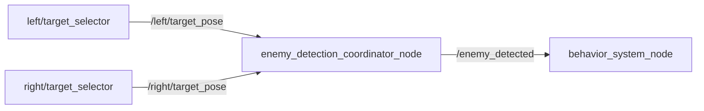

# enemy_detection_coordinator_node

## Purpose

敵の検出は左右2つのタレットが独立して行うため、検出結果も2系統に分かれています。状態機械が必要としているのは「敵がいるかどうか」という単一の判断だけなので、このノードが両系統を統合し、1つのBoolフラグに落とし込みます。

## Inner-workings / Algorithms

左右の `target_pose` を購読し、それぞれについて「有効な検出か」を判定します。

判定条件は2つです。

| 条件 | 内容 |
|------|------|
| z値 | `z` が `detected_z_threshold` 未満であること。[target_selector](../core_enemy_detection/target_selector.md) は未検出時に `z = 1.0` を設定するため、これが検出の有無を表す |
| 鮮度 | 最終受信からの経過時間が `stale_timeout_sec` 以内であること |

左右いずれかが条件を満たせば `/enemy_detected` を `true` にします（論理和）。どちらのタレットが捉えたかは区別しません。

鮮度チェックを設けているのは、検出パイプラインが停止した場合に最後の検出結果が残り続け、敵がいないのに `ATTACK` 状態に留まることを防ぐためです。

## Inputs / Outputs

### Input

| トピック | 型 | 説明 |
|---------|------|------|
| `/left/target_pose` | `geometry_msgs/PointStamped` | 左タレットの検出結果 |
| `/right/target_pose` | `geometry_msgs/PointStamped` | 右タレットの検出結果 |

### Output

| トピック | 型 | 説明 |
|---------|------|------|
| `/enemy_detected` | `std_msgs/Bool` | 敵検出フラグ（左右の論理和） |

## Parameters

設定ファイル: `config/behavior_system.yaml`

| パラメータ | 型 | デフォルト | 説明 |
|-----------|------|-----------|------|
| `left_target_topic` | string | `/left/target_pose` | 左タレットの検出トピック名 |
| `right_target_topic` | string | `/right/target_pose` | 右タレットの検出トピック名 |
| `enemy_detected_topic` | string | `/enemy_detected` | 出力トピック名 |
| `stale_timeout_sec` | double | `0.5` | 検出結果を有効とみなす時間 [s] |
| `detected_z_threshold` | double | `0.5` | 検出ありと判定する z 値の上限 |

## Assumptions / Known limits

- 「未検出を `z = 1.0` で表す」という [target_selector](../core_enemy_detection/target_selector.md) の規約に依存しています。検出側の仕様を変更する場合は `detected_z_threshold` の調整が必要です。
- 検出のちらつきに対する平滑化は `stale_timeout_sec` のみです。断続的に検出が入る状況では `/enemy_detected` も断続的に切り替わり、状態機械が `ATTACK` と巡回を往復する可能性があります。
- 左右どちらのタレットが検出したかの情報は失われます。狙う側の選択は [attack_shoot_manager_node](attack_shoot_manager_node.md) が独自に判断します。
- 敵の数や距離は扱いません。有無のみを出力します。
