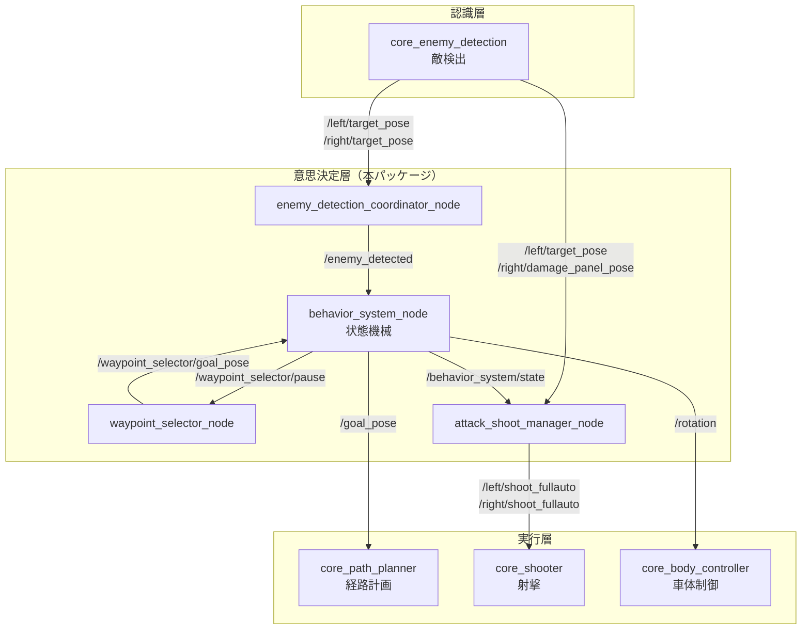
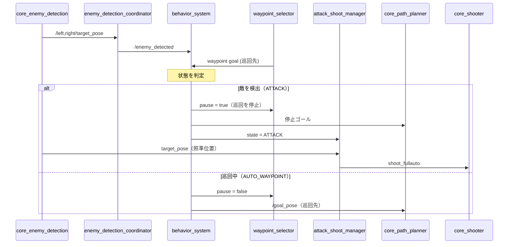
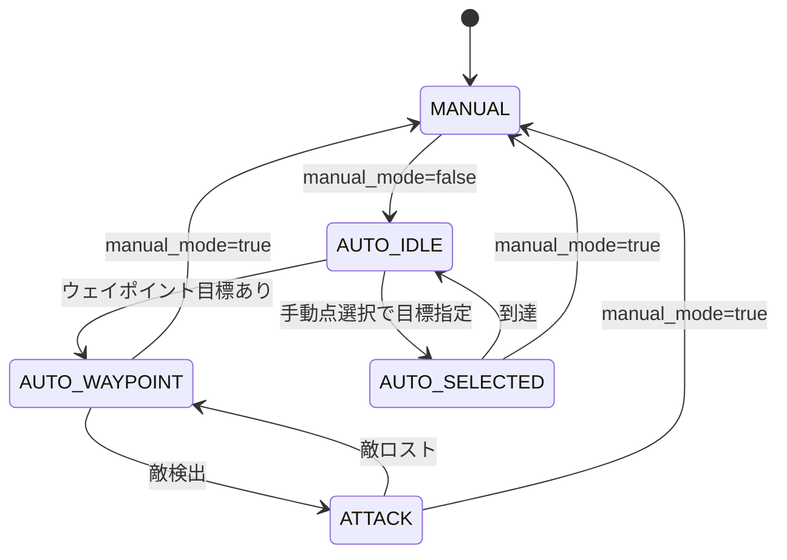

# core_behavior_system

自律行動の意思決定を担うパッケージです。「今どのモードで動くべきか」を判断し、走行のゴールと射撃の指示をナビゲーション層・シューター層に振り分けます。

## 位置づけ

このパッケージはシステムの最上位に位置し、下位のナビゲーション・シューターに対して「何をするか」だけを指示します。「どう動くか」は下位パッケージが決めるという責務分担になっています。



## ノード一覧

| ノード | 実行ファイル | 役割 |
|-------|------------|------|
| [`behavior_system_node`](behavior_system_node.md) | `behavior_system_node` | 状態機械。5つの行動状態を判定しゴールと回転モードを指示 |
| [`waypoint_selector_node`](waypoint_selector_node.md) | `waypoint_selector_node` | 巡回ウェイポイントをスコアリングして次の目標を選択 |
| [`enemy_detection_coordinator_node`](enemy_detection_coordinator_node.md) | `enemy_detection_coordinator_node` | 左右タレットの検出結果を統合し、敵の有無を1つのフラグにまとめる |
| [`attack_shoot_manager_node`](attack_shoot_manager_node.md) | `attack_shoot_manager_node` | 攻撃状態かつ照準が合ったときに射撃を指示 |

## 制御フロー

意思決定は「敵の有無の判定 → 状態決定 → 状態に応じた指令の発行」という一方向の流れで構成されます。



## 行動状態

`behavior_system_node` が管理する5つの状態です。詳細は[ノードページ](behavior_system_node.md)を参照してください。



| 状態 | 値 | 意味 | LED |
|------|---|------|-----|
| `MANUAL` | 0 | 手動操縦中。自律指令を出さない | 2 |
| `ATTACK` | 1 | 敵を検出。その場で車体回転しつつ射撃 | 9 |
| `AUTO_SELECTED` | 2 | 手動で選択された地点へ移動 | 8 |
| `AUTO_WAYPOINT` | 3 | ウェイポイント巡回中 | 7 |
| `AUTO_IDLE` | 4 | 自律だが目標なし。待機 | 6 |

緊急停止中は状態に関わらずLEDが `4` になります。

## 起動

```bash
ros2 launch core_behavior_system behavior_system.launch.py
```

設定ファイル: `config/behavior_system.yaml`（全4ノード共通）
