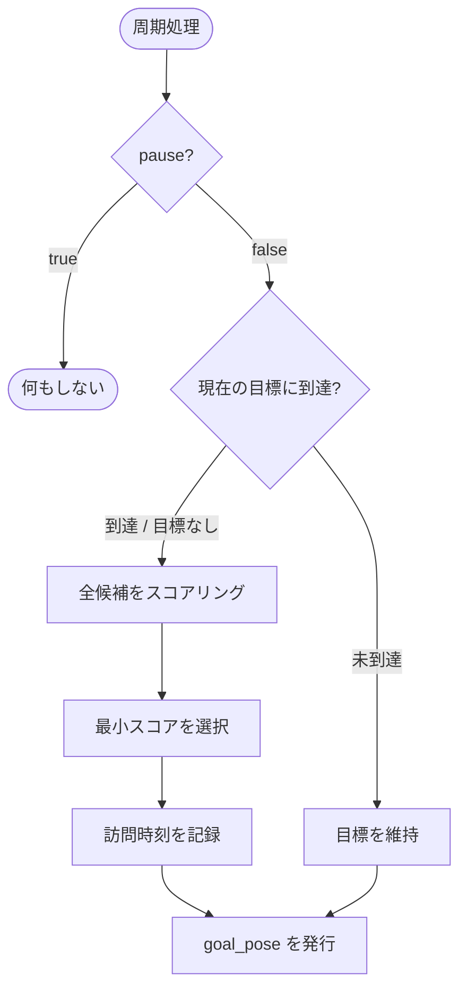

# waypoint_selector_node

## Purpose

敵が見つからない間、ロボットはフィールドを巡回して索敵する必要があります。単純に決められた順序で巡回すると動きが読まれやすく、また現在位置から遠い地点へ無駄に移動することもあります。このノードは候補ウェイポイントを距離・方位・訪問履歴でスコアリングし、その時々で最も合理的な次の目標を選びます。

## Inner-workings / Algorithms

`update_rate_hz`（デフォルト10Hz）の周期で動作します。`pause` が `true` の間は何もしません。



### スコアリング

各候補について以下のスコアを計算し、**最小のもの**を選びます。

```
score = 距離 × w_distance
      + (1 - 進行方向との内積) × w_angle
      + 時間ペナルティ × w_time
      + ランダムジッタ
```

| 項 | 意図 |
|----|------|
| 距離 | 近い地点を優先し、移動時間を短縮する |
| 角度コスト | 進行方向に近い地点を優先し、その場での反転を避ける |
| 時間ペナルティ | 直前に訪れた地点を避け、フィールド全体を巡回させる |
| ランダムジッタ | 選択に揺らぎを与え、巡回パターンを読まれにくくする |

現在の目標と同じIDは候補から除外されるため、到達判定が済むまで目標が変わることはありません。`forward_only` が有効な場合、進行方向との内積が負（=後方）の候補は除外されます。

### 時間ペナルティ

最後に訪問してからの経過時間に応じて減衰します。訪問直後は1に近く、`revisit_cooldown` 秒経過するとほぼ0になります。

| `use_exponential_decay` | 計算式 |
|------------------------|-------|
| `true`（デフォルト） | `exp(-経過時間 / revisit_cooldown)` |
| `false` | `clamp(1 - 経過時間 / revisit_cooldown, 0, 1)` |

指数減衰は「訪問直後は強く避けるが、時間が経てば緩やかに戻る」という挙動になります。

### 到達判定と可視化

現在位置と目標の距離が `arrival_radius` 以内になると到達とみなし、次の選択を行います。全ウェイポイントは `visualization_msgs/Marker` としても発行され、RViz上で確認できます。

## Inputs / Outputs

### Input

| トピック | 型 | 説明 |
|---------|------|------|
| `/odom` | `nav_msgs/Odometry` | 現在位置・姿勢（スコアリングの基準） |
| `/waypoint_selector/pause` | `std_msgs/Bool` | 巡回の一時停止（`behavior_system_node` から） |

### Output

| トピック | 型 | 説明 |
|---------|------|------|
| `/goal_pose` | `geometry_msgs/PoseStamped` | 選択したウェイポイント（トピック名は `goal_pose_topic` で変更可） |
| `waypoints` | `visualization_msgs/Marker` | RViz可視化用のウェイポイント点群（`map` フレーム） |

## Parameters

設定ファイル: `config/behavior_system.yaml`

### ウェイポイント定義

| パラメータ | 型 | デフォルト | 説明 |
|-----------|------|-----------|------|
| `waypoints` | double[] | `[]` | ウェイポイント座標を `[x1, y1, x2, y2, ...]` の平坦な配列で指定 |
| `arrival_radius` | double | `0.5` | 到達判定の半径 [m] |

### スコアリング重み

| パラメータ | 型 | デフォルト | 説明 |
|-----------|------|-----------|------|
| `w_distance` | double | `1.0` | 距離コストの重み |
| `w_angle` | double | `3.0` | 角度コストの重み |
| `w_time` | double | `5.0` | 時間ペナルティの重み |
| `revisit_cooldown` | double | `15.0` | 再訪問ペナルティの減衰時定数 [s] |
| `use_exponential_decay` | bool | `true` | 指数減衰を使う（falseで線形減衰） |
| `forward_only` | bool | `false` | 後方のウェイポイントを候補から除外 |
| `random_jitter` | double | `0.01` | スコアに加えるランダムノイズの大きさ |

### 動作設定

| パラメータ | 型 | デフォルト | 説明 |
|-----------|------|-----------|------|
| `update_rate_hz` | int | `10` | 更新周期 [Hz] |
| `mode` | string | `idle` | 動作モード |
| `risk_threshold` | double | `0.5` | リスク判定しきい値 |
| `odom_topic` | string | `/odom` | オドメトリトピック名 |
| `goal_pose_topic` | string | `/goal_pose` | ゴール発行先トピック名 |
| `pause_topic` | string | `/waypoint_selector/pause` | 一時停止トピック名 |
| `current_x` / `current_y` / `current_yaw` | double | `0.0` | オドメトリ未受信時の初期位置 |

## Assumptions / Known limits

- `waypoints` は平坦な配列で、2要素ずつが1点として解釈されます。奇数個の要素を与えると末尾の1要素は無視されます。
- スコアリングは直線距離のみを使い、実際の経路長や障害物を考慮しません。壁を挟んで近い地点が「近い」と評価される可能性があります。
- ウェイポイントは `map` フレームの座標として扱われます。オドメトリが `odom` フレームで届く構成では、[core_localization](../core_localization/index.md) による `map → odom` の補正が前提になります。
- 到達判定は位置のみで、姿勢（ヨー角）は問いません。
- 目標に到達できず立ち往生した場合の復帰処理はありません。到達判定が成立するまで同じ目標を出し続けます。
