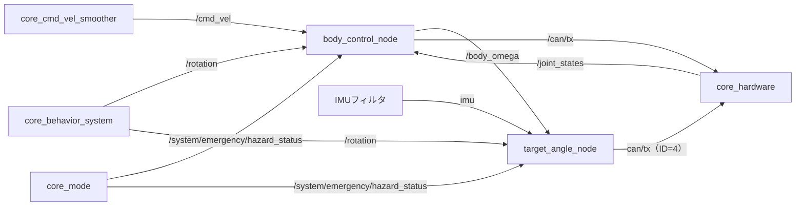

# core_body_controller

車体モータ制御パッケージです。速度指令（`geometry_msgs/Twist`）をオムニホイールのCAN指令に変換し、車体の向きを制御します。

## ノード一覧

| ノード | 役割 |
|-------|------|
| [`body_control_node`](body_control_node.md) | `/cmd_vel` を逆運動学でホイール指令に変換。加速度制限と緊急停止を担当 |
| [`target_angle_node`](target_angle_node.md) | IMU推定角から車体YawをPID制御し、回転中のベース角速度を補償 |
| [`temp_joy_parser`](temp_joy_parser.md) | 開発用のゲームパッド入力パーサー |

## データフロー



並進（`body_control_node`）と車体の向き（`target_angle_node`）を別ノードに分けているのは、両者が異なる入力系統と制御則を持つためです。並進は上流の速度指令をそのまま逆運動学に通すのに対し、向きの制御は目標角度に対するPID追従になります。

出力される `/can/tx` は [core_hardware](../core_hardware/index.md) がEtherCAT経由でモータに送出します。

## 起動

```bash
ros2 launch core_body_controller body_controller.launch.py
```
