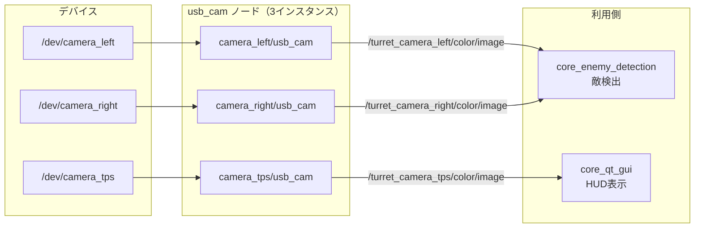

# core_camera

USBカメラの起動設定を集約したランチ専用パッケージです。独自のノードは持たず、外部パッケージ `usb_cam` のノードを3台分のカメラ設定で起動します。

## 構成

このロボットは3台のUSBカメラを搭載します。左右タレットの照準用カメラと、操縦者視点（TPS: Third Person Shooter）用のカメラです。



## カメラ設定

| カメラ | デバイス | 解像度 | FPS | 画像トピック | 主な用途 |
|-------|---------|-------|-----|------------|---------|
| `camera_left` | `/dev/camera_left` | 640x480 | 30 | `/turret_camera_left/color/image` | 左タレットの敵検出 |
| `camera_right` | `/dev/camera_right` | 640x480 | 30 | `/turret_camera_right/color/image` | 右タレットの敵検出 |
| `camera_tps` | `/dev/camera_tps` | 1280x720 | 30 | `/turret_camera_tps/color/image` | 操縦者視点のHUD表示 |

各カメラは `camera_info` も併せて発行します（例: `/turret_camera_left/color/camera_info`）。

## 共通設定

3台とも以下の設定で起動されます。

| 設定 | 値 | 意図 |
|------|---|------|
| `pixel_format` | `mjpeg2rgb` | MJPEGで受信しRGBに変換。USB帯域を節約する |
| `io_method` | `mmap` | メモリマップI/Oでコピーを削減 |
| `autofocus` | `false` | オートフォーカスを無効化 |
| `focus` | `-1` | フォーカス制御を行わない |
| `frame_id` | `<カメラ名>_frame` | TFフレーム名 |

オートフォーカスを切っているのは、試合中に対象までの距離が変わるたびにピントが動き、検出が不安定になるのを避けるためです。

## Assumptions / Known limits

- デバイスパス（`/dev/camera_left` など）は udev ルールによる固定名を前提としています。`/dev/video*` は接続順で変動するため、udevルールが設定されていないとカメラの割り当てが入れ替わります。設定手順は[ハードウェアセットアップガイド](../../guides/hardware-setup.md)を参照してください。
- 外部パッケージ `usb_cam` に依存します。未インストールの場合は起動に失敗します。
- 3台すべてを同一のUSBコントローラに接続すると帯域が不足し、フレーム落ちや起動失敗が起こる場合があります。
- カメラキャリブレーションのパラメータは設定していません。発行される `camera_info` に正確な内部パラメータは含まれません。

## 起動

```bash
ros2 launch core_camera camera.launch.py
```

このランチファイルには引数がありません。解像度やデバイスパスを変更する場合は `launch/camera.launch.py` を直接編集してください。
