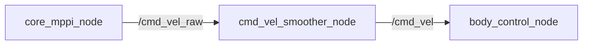

# core_cmd_vel_smoother

EMA（指数移動平均）ベースの速度指令スムーザーパッケージです。

## 概要

MPPIコントローラの確率的サンプリングによる速度指令のフレーム間振動を平滑化し、滑らかなロボット動作を実現します。



## アルゴリズム

指数移動平均（EMA）フィルタを各速度軸（linear.x, linear.y, angular.z）に独立適用:

```
smoothed = α × raw + (1 - α) × prev_smoothed
```

- α が小さいほど滑らか（遅延増加）
- α = 1.0 でパススルー（無効化）

## 入力

| トピック | 型 | 説明 |
|---------|------|------|
| `/cmd_vel_raw` | `geometry_msgs/Twist` | MPPIからの生の速度指令 |

## 出力

| トピック | 型 | 説明 |
|---------|------|------|
| `/cmd_vel` | `geometry_msgs/Twist` | 平滑化された速度指令 |

## パラメータ

| パラメータ | デフォルト | 説明 |
|-----------|-----------|------|
| `alpha` | `0.3` | EMAフィルタ係数（0〜1） |
| `input_topic` | `/cmd_vel_raw` | 入力トピック名 |
| `output_topic` | `/cmd_vel` | 出力トピック名 |
| `timeout_sec` | `0.2` | 入力タイムアウト [s]（超過でゼロ発行） |

## チューニングガイド

| alpha | 効果 | ユースケース |
|-------|------|-------------|
| 0.15-0.2 | 非常に滑らか、遅延大 | 低速・精密動作 |
| **0.3** | **バランス（デフォルト）** | **一般的な自律移動** |
| 0.5-0.7 | 応答性重視、軽いスムージング | 高速移動・素早い応答が必要 |
| 1.0 | パススルー | デバッグ・無効化 |

チューニング手順は[パラメータチューニングガイド](../guides/tuning.md#cmd_vel-スムーザー)を参照してください。

## 起動

`navigation.launch.py` から自動起動（デフォルト有効）:

```bash
# スムーザー有効（デフォルト）
ros2 launch core_launch navigation.launch.py

# スムーザー無効
ros2 launch core_launch navigation.launch.py use_smoother:=false
```

## 安全機能

入力が `timeout_sec`（デフォルト200ms）以上途絶えた場合、自動的にゼロ速度を発行してロボットを停止させます。
