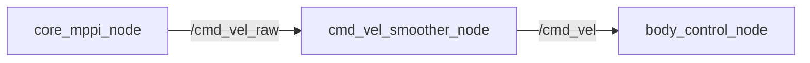

# cmd_vel_smoother_node

## Purpose

MPPIコントローラは確率的サンプリングで指令を生成するため、フレームごとに速度指令が細かく振動します。この振動をそのままモータに流すと車体のガタつきと機構への負担を招くため、車体制御の直前で平滑化する段を設けています。

## Inner-workings / Algorithms

指数移動平均（EMA）フィルタを各速度軸（linear.x, linear.y, angular.z）に独立適用します。

```
smoothed = α × raw + (1 - α) × prev_smoothed
```

- α が小さいほど滑らか（そのぶん応答遅延が増加）
- α = 1.0 でパススルー（実質無効化）

加えて、入力が `timeout_sec` 以上途絶えた場合はゼロ速度を発行して車体を停止させます。上流ノードのクラッシュや通信断でロボットが最後の指令のまま走り続けることを防ぐための安全機構です。



## Inputs / Outputs

### Input

| トピック | 型 | 説明 |
|---------|------|------|
| `/cmd_vel_raw` | `geometry_msgs/Twist` | MPPIからの生の速度指令 |

### Output

| トピック | 型 | 説明 |
|---------|------|------|
| `/cmd_vel` | `geometry_msgs/Twist` | 平滑化された速度指令 |

## Parameters

| パラメータ | デフォルト | 説明 |
|-----------|-----------|------|
| `alpha` | `0.3` | EMAフィルタ係数（0〜1） |
| `input_topic` | `/cmd_vel_raw` | 入力トピック名 |
| `output_topic` | `/cmd_vel` | 出力トピック名 |
| `timeout_sec` | `0.2` | 入力タイムアウト [s]（超過でゼロ発行） |

### alpha のチューニング目安

| alpha | 効果 | ユースケース |
|-------|------|-------------|
| 0.15-0.2 | 非常に滑らか、遅延大 | 低速・精密動作 |
| **0.3** | **バランス（デフォルト）** | **一般的な自律移動** |
| 0.5-0.7 | 応答性重視、軽いスムージング | 高速移動・素早い応答が必要 |
| 1.0 | パススルー | デバッグ・無効化 |

## Assumptions / Known limits

- EMAは位相遅れを伴います。α を下げるほど、障害物が急に現れた際の停止・回避の反応が遅れます。
- 平滑化は各軸に独立適用されるため、車体の運動学的な制約（最大加速度など）は考慮しません。加速度制限は下流の [body_control_node](../core_body_controller/body_control_node.md) のレートリミッタが担当します。
- タイムアウト時のゼロ発行は「指令が来ない」ケースのみを検知します。上流が誤った値を出し続けている場合は検知できません。

## 起動

`navigation.launch.py` から自動起動されます（デフォルト有効）。

```bash
# スムーザー有効（デフォルト）
ros2 launch core_launch navigation.launch.py

# スムーザー無効
ros2 launch core_launch navigation.launch.py use_smoother:=false
```
