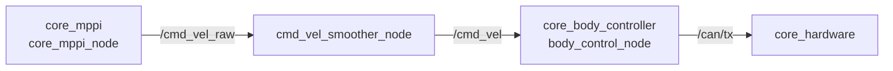
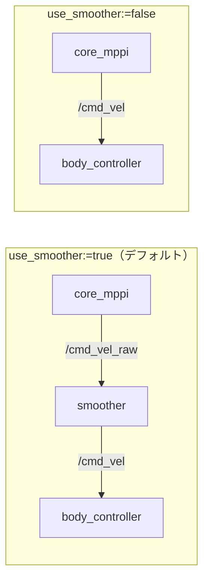
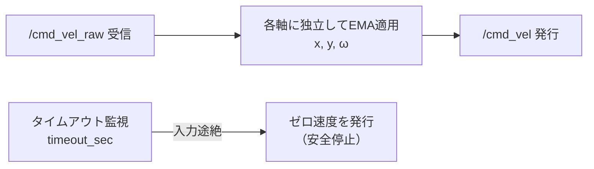

# core_cmd_vel_smoother

MPPIコントローラが出力する速度指令のフレーム間振動を平滑化し、車体に滑らかな動きをさせるためのパッケージです。

## 位置づけ

コントローラと車体制御の間に挟まる薄い中継層です。MPPIは確率的サンプリングで指令を生成するため出力に細かな揺らぎが出ます。それをそのままモータに流すと車体がガタつき機構にも負担がかかるため、最終段で均します。



`use_smoother:=false` で無効化した場合、MPPIが直接 `/cmd_vel` に発行する構成に切り替わります。



## ノード一覧

| ノード | 実行ファイル | 役割 |
|-------|------------|------|
| [`cmd_vel_smoother_node`](cmd_vel_smoother_node.md) | `cmd_vel_smoother_node` | EMAフィルタによる速度指令の平滑化とタイムアウト停止 |

## 処理の流れ



指数移動平均（EMA）を各速度軸に独立適用します。

```
smoothed = α × raw + (1 - α) × prev_smoothed
```

平滑化と併せて、入力が途絶えた際にゼロ速度を出す安全機構も担います。上流ノードのクラッシュや通信断でロボットが最後の指令のまま走り続けるのを防ぐためです。

## alpha による特性の違い

| alpha | 効果 | ユースケース |
|-------|------|-------------|
| 0.15-0.2 | 非常に滑らか、遅延大 | 低速・精密動作 |
| **0.3** | **バランス（デフォルト）** | **一般的な自律移動** |
| 0.5-0.7 | 応答性重視、軽いスムージング | 高速移動・素早い応答が必要 |
| 1.0 | パススルー | デバッグ・無効化 |

## 起動

このパッケージ単体のランチファイルはありません。`navigation.launch.py` から自動起動されます（デフォルト有効）。

```bash
# スムーザー有効（デフォルト）
ros2 launch core_launch navigation.launch.py

# スムーザー無効
ros2 launch core_launch navigation.launch.py use_smoother:=false
```

単体で起動する場合:

```bash
ros2 run core_cmd_vel_smoother cmd_vel_smoother_node
```
