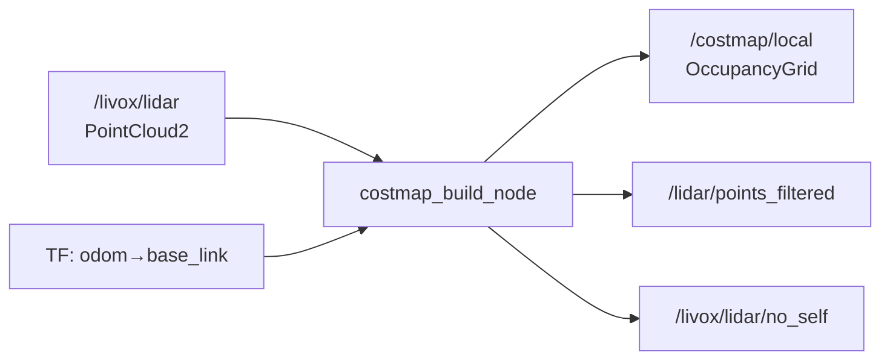

# core_costmap_builder

LiDAR点群からローリングウィンドウ式ローカルコストマップを生成するパッケージです。

## 概要

## 処理フロー

1. **自己除去**: ロボット自身のポイントを除去（`self_crop_min_range_m`）
2. **フィルタリング**: 高さ・距離・範囲でフィルタ
3. **ボクセル化**: ダウンサンプリング（`voxel_leaf_m`）
4. **グリッド化**: フィルタ済み点群をOccupancyGridに投影
5. **膨張**: 障害物セルから `inflation_radius_m` で膨張、`decay_margin_m` で減衰

## 入力

| トピック | 型 | 説明 |
|---------|------|------|
| `/livox/lidar` | `sensor_msgs/PointCloud2` | LiDAR点群（パラメータで変更可） |

## 出力

| トピック | 型 | 説明 |
|---------|------|------|
| `/costmap/local` | `nav_msgs/OccupancyGrid` | ローカルコストマップ |
| `/lidar/points_filtered` | `sensor_msgs/PointCloud2` | デバッグ: フィルタ済み点群 |
| `/livox/lidar/no_self` | `sensor_msgs/PointCloud2` | デバッグ: 自己除去済み点群 |

## TF依存

| 参照TF | 用途 |
|--------|------|
| `odom → base_link` | ローリングウィンドウの中心位置 |
| `odom → livox_frame` | センサ位置 |

## パラメータ

設定ファイル: `config/costmap_build_node.yaml`

### ローカルウィンドウ

| パラメータ | デフォルト | 説明 |
|-----------|-----------|------|
| `local_width_m` | `10.0` | ウィンドウ幅 [m] |
| `local_height_m` | `10.0` | ウィンドウ高さ [m] |
| `resolution_m` | `0.05` | 解像度 [m/cell]（5cm） |
| `update_hz` | `10.0` | 更新周波数 [Hz] |

### 点群フィルタリング

| パラメータ | デフォルト | 説明 |
|-----------|-----------|------|
| `crop_xy_m` | `6.0` | XY範囲フィルタ [m] |
| `min_z_m` | `0.25` | 最小高さ [m] |
| `max_z_m` | `1.60` | 最大高さ [m] |
| `voxel_leaf_m` | `0.05` | ボクセルサイズ [m] |
| `self_crop_min_range_m` | `0.6` | 自己除去最小距離 [m] |
| `max_range_m` | `6.0` | 最大検出距離 [m] |

### 膨張

| パラメータ | デフォルト | 説明 |
|-----------|-----------|------|
| `inflation_radius_m` | `0.50` | 障害物膨張半径（LETHALゾーン） [m] |
| `decay_margin_m` | `0.30` | LETHALゾーン外側の線形減衰幅 [m] |

### タイムアウト

| パラメータ | デフォルト | 説明 |
|-----------|-----------|------|
| `points_timeout_sec` | `0.2` | 点群停止判定時間 [s] |
| `tf_timeout_ms` | `50` | TFルックアップタイムアウト [ms] |

チューニングのポイントは[パラメータチューニングガイド](../guides/tuning.md#ローカルコストマップ)を参照してください。
