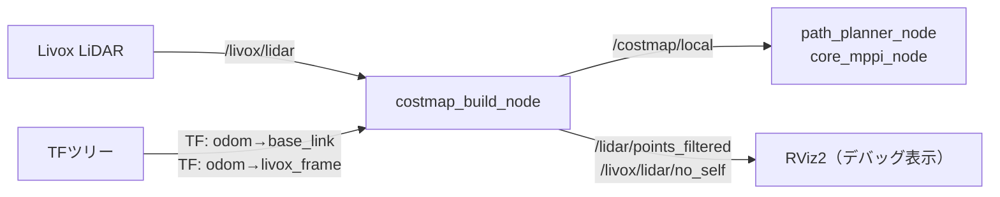

# costmap_build_node

## Purpose

事前に用意したグローバル地図には、試合中に現れる相手ロボットや動く障害物は含まれていません。LiDAR点群からロボット周辺のローリングウィンドウ式ローカルコストマップを生成し、プランナとコントローラに動的障害物を伝えるためのパッケージです。

## Inner-workings / Algorithms

`update_hz` の周期で、直近のLiDAR点群を以下のパイプラインで処理し `nav_msgs/OccupancyGrid` に変換します。

1. **自己除去**: `self_crop_min_range_m` より近い点をロボット自身の反射として除去
2. **フィルタリング**: 高さ（`min_z_m` 〜 `max_z_m`）・距離（`max_range_m`）・XY範囲（`crop_xy_m`）でフィルタ
3. **ボクセル化**: `voxel_leaf_m` でダウンサンプリングし、後段の計算量を削減
4. **グリッド化**: フィルタ済み点群をOccupancyGridのセルに投影
5. **膨張**: 障害物セルから `inflation_radius_m` の範囲をLETHAL（コスト100）とし、その外側 `decay_margin_m` の範囲を線形に減衰させる

膨張後のdecayゾーン（コスト1〜49）は、[core_path_planner](../core_path_planner/index.md) のコスト考慮型A*や [core_mppi](../core_mppi/index.md) の障害物コストで「通れるが避けたい領域」として扱われ、通路の中央寄りを走る挙動を生みます。

ウィンドウはロボットに追従して移動するため、TFで `odom → base_link` を参照して毎周期の中心位置を決定します。

## Inputs / Outputs

### Input

| トピック | 型 | 説明 |
|---------|------|------|
| `/livox/lidar` | `sensor_msgs/PointCloud2` | LiDAR点群（パラメータで変更可） |

### Output

| トピック | 型 | 説明 |
|---------|------|------|
| `/costmap/local` | `nav_msgs/OccupancyGrid` | ローカルコストマップ |
| `/lidar/points_filtered` | `sensor_msgs/PointCloud2` | デバッグ: フィルタ済み点群 |
| `/livox/lidar/no_self` | `sensor_msgs/PointCloud2` | デバッグ: 自己除去済み点群 |

### 参照TF

| 参照TF | 用途 |
|--------|------|
| `odom → base_link` | ローリングウィンドウの中心位置 |
| `odom → livox_frame` | センサ位置 |

## Parameters

設定ファイル: `config/costmap_build_node.yaml`

### ローカルウィンドウ

| パラメータ | デフォルト | 説明 |
|-----------|-----------|------|
| `local_width_m` | `10.0` | ウィンドウ幅 [m] |
| `local_height_m` | `10.0` | ウィンドウ高さ [m] |
| `resolution_m` | `0.05` | 解像度 [m/cell]（5cm） |
| `update_hz` | `10.0` | 更新周波数 [Hz] |

### 点群フィルタリング

| パラメータ | デフォルト | 説明 |
|-----------|-----------|------|
| `crop_xy_m` | `6.0` | XY範囲フィルタ [m] |
| `min_z_m` | `0.25` | 最小高さ [m] |
| `max_z_m` | `1.60` | 最大高さ [m] |
| `voxel_leaf_m` | `0.05` | ボクセルサイズ [m] |
| `self_crop_min_range_m` | `0.6` | 自己除去最小距離 [m] |
| `max_range_m` | `6.0` | 最大検出距離 [m] |

### 膨張

| パラメータ | デフォルト | 説明 |
|-----------|-----------|------|
| `inflation_radius_m` | `0.50` | 障害物膨張半径（LETHALゾーン） [m] |
| `decay_margin_m` | `0.30` | LETHALゾーン外側の線形減衰幅 [m] |

### タイムアウト

| パラメータ | デフォルト | 説明 |
|-----------|-----------|------|
| `points_timeout_sec` | `0.2` | 点群停止判定時間 [s] |
| `tf_timeout_ms` | `50` | TFルックアップタイムアウト [ms] |

## Assumptions / Known limits

- `min_z_m` / `max_z_m` の高さ帯にある点のみを障害物として扱います。この帯より低い段差やスロープ、高い位置の張り出しは検出されません。
- `odom → base_link` のTFが `tf_timeout_ms` 以内に引けないと、その周期のコストマップ更新はスキップされます。
- 点群が `points_timeout_sec` 以上途絶えた場合、直前のコストマップが残り続けるのではなく停止判定として扱われます。LiDAR断線時に古い障害物情報で走り続けることはありません。
- 障害物の時系列的な蓄積（レイキャストによるクリア処理）は行わず、毎周期の点群のみでマップを構築します。センサの死角に入った障害物は即座に消えます。
