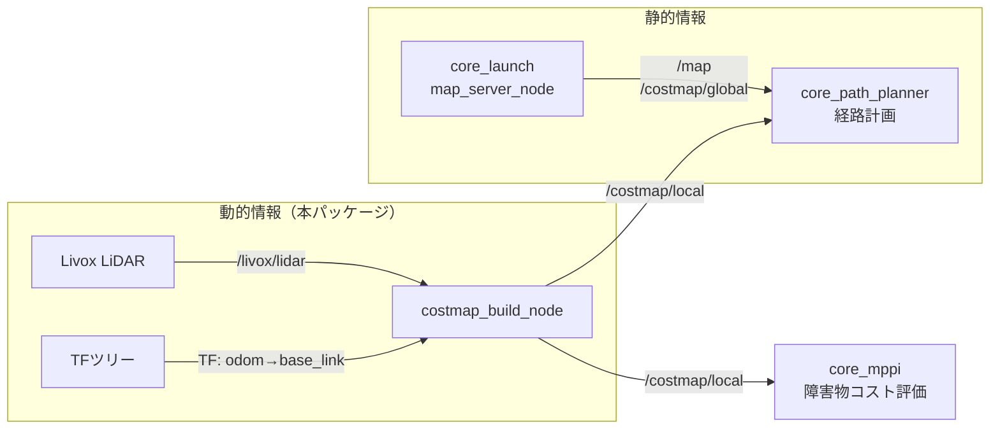
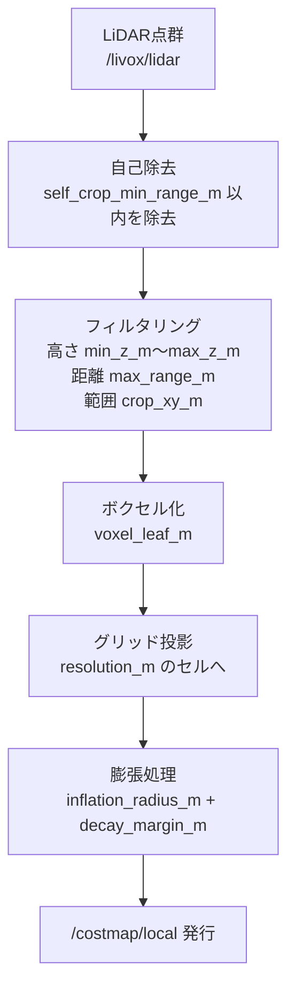
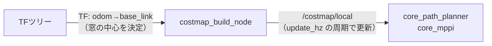

# core_costmap_builder

LiDAR点群から、ロボット周辺のローリングウィンドウ式ローカルコストマップを生成するパッケージです。

## 位置づけ

事前に用意したフィールド地図には、試合中に現れる相手ロボットや動く障害物は含まれていません。このパッケージが動的障害物をリアルタイムに検出し、プランナとコントローラに伝える役割を担います。



静的地図と動的コストマップの2層構成にすることで、フィールドの壁は事前情報として持ちつつ、移動する障害物にはセンサで反応できます。

## ノード一覧

| ノード | 実行ファイル | 役割 |
|-------|------------|------|
| [`costmap_build_node`](costmap_build_node.md) | `costmap_build_node` | 点群のフィルタリングとOccupancyGridへの変換 |

## 処理パイプライン



## コストの構造

膨張処理により、障害物の周囲に2段階のゾーンを作ります。

```
     障害物セル
         │
    ┌────┴────┐
    │ LETHAL  │  コスト100 : 進入不可
    │ (半径 inflation_radius_m)
    └────┬────┘
    ┌────┴────┐
    │  decay  │  コスト1〜49 : 通れるが避けたい
    │ (幅 decay_margin_m、外側ほど低コスト)
    └─────────┘
         │
      自由空間     コスト0
```

decayゾーンは [core_path_planner](../core_path_planner/index.md) のコスト考慮型A*（`cost_weight`）や [core_mppi](../core_mppi/index.md) の障害物コストで「通れるが避けたい領域」として評価され、壁ぎりぎりではなく通路の中央寄りを走る挙動を生みます。

## ローリングウィンドウ

コストマップはロボットに追従して移動する固定サイズの窓です。フィールド全体を保持しないことで計算量とメモリを一定に保ちます。



## 起動

```bash
ros2 launch core_costmap_builder costmap_build.launch.py
```

設定ファイル: `config/costmap_build_node.yaml`

チューニングのポイントは[パラメータチューニングガイド](../../guides/tuning.md#ローカルコストマップ)を参照してください。
