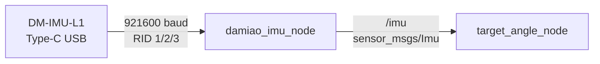

# core_damiao_imu

Damiao DM-IMU-L1をUSB仮想シリアルで読み取り、内部EKFのEuler角を
`sensor_msgs/Imu`へ変換するROS 2ドライバです。公式リポジトリにはROS 2の
サンプルがありますが、このパッケージではCoRE2026向けに設定、ストリーム再同期、
切断時の再接続、古いデータの破棄を実装しています。

## データフロー



受信したRID 1（加速度）、RID 2（角速度）、RID 3（Euler角）をまとめ、Euler角を
ZYX順のQuaternionへ変換します。加速度はm/s²、角速度はrad/s、Euler入力はdegreeです。
メッセージ時刻にはPCでの受信時刻を使用します。

## 接続時の動作

ドライバは接続するたびに次の揮発設定を送ります。

- 加速度・角速度・Euler出力を有効化
- Quaternion出力を無効化
- `output_rate_hz`（既定200 Hz）を設定

IMUのフラッシュ寿命を不要に消費しないよう、設定保存命令は送りません。USBが抜けた場合は
発行を停止し、1秒ごとに再接続します。再接続時は受信バッファとRID 1/2のキャッシュを破棄するため、
切断前のデータを再発行しません。

## トピック

| 方向 | トピック | 型 | 説明 |
|------|---------|----|------|
| 出力 | `/imu` | `sensor_msgs/Imu` | 内部EKF姿勢、角速度、加速度 |

## パラメータ

| パラメータ | 既定値 | 説明 |
|-----------|--------|------|
| `port` | `/dev/serial/by-id/usb-DM-IMU_DM-IMU_USB_CDC_2025021200-if00` | 本番機のUSBシリアルデバイス |
| `baudrate` | `921600` | シリアルbaud rate |
| `frame_id` | `damiao_imu_link` | `/imu.header.frame_id` |
| `output_rate_hz` | `200` | 出力周期。100/125/200/250/500/1000 Hzに対応 |
| `reconnect_interval_sec` | `1.0` | 切断後の再接続間隔 [s] |

## 起動

単体起動:

```bash
ros2 launch core_damiao_imu damiao_imu.launch.py
```

`body_controller.launch.py`からも既定で起動します。既定値は本番機のby-idに固定しています。
別のIMUを使う場合は`imu_port:=/dev/serial/by-id/...`で上書きできます。

## 取り付けと校正

- 無限回転する上部車体へ、DM-IMU-L1の+Xを機体前方、+Zを上向きにして剛体固定します。
- 初回使用時や取り付け変更後は、Windowsの公式`DM-IMU-Upper`を使い、IMUを完全に静止させた状態で
  マニュアル記載のジャイロ校正を実行します。校正中は振動を与えず、完了後に公式ツール側で保存します。
- ROSドライバは起動時校正やフラッシュ保存を行いません。
- 6軸IMUなのでYawは絶対方位ではなく、校正後も公称12.686°/hでドリフトします。長時間の絶対方位が
  必要なら、LiDAR localizationなど外部基準による別の補正が必要です。

公式資料: [DM-IMUリポジトリ](https://github.com/dmBots/DM-IMU)、
[DM-IMU-L1 V1.2マニュアル](https://github.com/dmBots/DM-IMU/blob/main/manual/%E8%BE%BE%E5%A6%99%E7%A7%91%E6%8A%80DM-IMU-L1%E5%85%AD%E8%BD%B4IMU%E6%A8%A1%E5%9D%97%E4%BD%BF%E7%94%A8%E8%AF%B4%E6%98%8E%E4%B9%A6V1.2.pdf)
