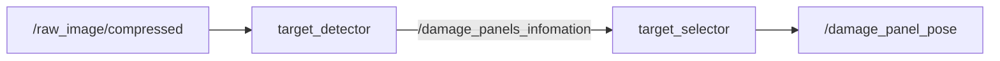

# core_enemy_detection

カメラ画像から敵ダメージパネルを検出・選択するパッケージです。

## 概要

HSV/LABカラーフィルタと連結成分分析により、赤/青LEDと黄色ダメージパネルを検出し、最大面積のパネルをターゲットとして出力します。



## ノード

### target_detector

カメラ画像を受信し、カラーフィルタリング→モルフォロジー処理→連結成分分析でダメージパネルを検出します。

### target_selector

検出されたパネル群から最大面積のものを選択し、カメラ座標系でのターゲット位置を出力します。

## 入力

| トピック | 型 | 説明 |
|---------|------|------|
| `raw_image/compressed` | `sensor_msgs/Image` | カメラ画像（ランチファイルでリマップ） |

## 出力

| トピック | 型 | 説明 |
|---------|------|------|
| `damage_panels_infomation` | `core_msgs/DamagePanelInfoArray` | 検出されたダメージパネル情報 |
| `damage_panel_pose` | `geometry_msgs/PointStamped` | ターゲット位置（カメラ中心原点）。z=1.0で未検出 |
| `result` | `sensor_msgs/Image` | デバッグ: 検出結果画像 |

## パラメータ

設定ファイル: `config/sim_param.yaml`

### カラーフィルタ

| パラメータ | デフォルト | 説明 |
|-----------|-----------|------|
| `enemy` | `[0]` | 検出モード（0=赤、1=青） |
| `red_range_lower1` | `[0, 100, 125]` | 赤色HSV下限1 [H, S, V] |
| `red_range_upper1` | `[10, 255, 255]` | 赤色HSV上限1 [H, S, V] |
| `red_range_lower2` | `[175, 125, 125]` | 赤色HSV下限2 [H, S, V] |
| `red_range_upper2` | `[180, 255, 255]` | 赤色HSV上限2 [H, S, V] |
| `blue_range_lower` | `[105, 64, 125]` | 青色HSV下限 [H, S, V] |
| `blue_range_upper` | `[135, 255, 255]` | 青色HSV上限 [H, S, V] |
| `panel_lab_range_lower` | `[0, 130, 95]` | パネルLAB下限 [L, A, B] |
| `panel_lab_range_upper` | `[100, 175, 150]` | パネルLAB上限 [L, A, B] |

### 画像処理

| パラメータ | デフォルト | 説明 |
|-----------|-----------|------|
| `image_size` | `[1280, 720]` | 入力画像サイズ [幅, 高さ] |
| `led_kernel_matrix_size` | `[5, 5]` | LEDモルフォロジーカーネルサイズ |
| `panel_kernel_matrix_size` | `[9, 9]` | パネルモルフォロジーカーネルサイズ |

## 起動

```bash
# 左右タレット両方の検出パイプラインを起動
ros2 launch core_enemy_detection detection.launch.py
```
