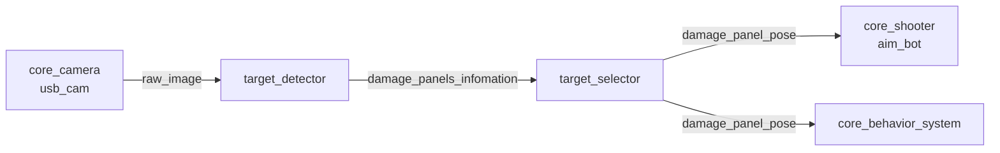

# core_enemy_detection

カメラ画像から敵ダメージパネルを検出し、狙うべきターゲットを選択するパッケージです。HSV/LABカラーフィルタと連結成分分析により、赤/青LEDと黄色ダメージパネルを検出します。

## ノード一覧

| ノード | 役割 |
|-------|------|
| [`target_detector`](target_detector.md) | カメラ画像からダメージパネル候補を検出し、その情報を配列で出力 |
| [`target_selector`](target_selector.md) | 検出候補から狙うべき1つを選択し、画像座標として出力 |

## データフロー



検出（どこにパネルがあるか）と選択（どれを狙うか）を分離しているため、狙い方のポリシー変更を `target_selector` の差し替えだけで行えます。出力は [core_shooter](../core_shooter/index.md) の `aim_bot` が照準に使用します。

## ノード構成と名前空間

左右タレットそれぞれに独立した検出パイプラインが起動されます。ランチ引数 `turret_name` が名前空間になります。

```
/left/target_detector  → /left/target_selector  → /left/damage_panel_pose
/right/target_detector → /right/target_selector → /right/damage_panel_pose
```

## 起動

```bash
# 左右タレット両方の検出パイプラインを起動
ros2 launch core_enemy_detection detection.launch.py
```

設定ファイル: `config/sim_param.yaml`
