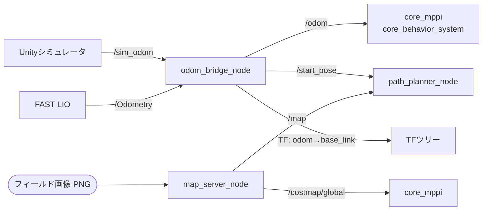

# core_launch

システム全体のランチファイルと、ナビゲーションに必要なヘルパーノードを提供するメタパッケージです。

## ランチファイル

| ファイル | 用途 |
|---------|------|
| `navigation.launch.py` | ナビゲーションパイプライン全体を起動 |
| `imu_filter.launch.py` | IMUフィルタリング |
| `state_publisher.launch.py` | ロボットステートパブリッシャ（URDF/JointState） |

## ノード一覧

| ノード | 役割 |
|-------|------|
| [`odom_bridge_node`](odom_bridge_node.md) | オドメトリソースを `/odom` に統一し、TFと開始位置を発行 |
| [`map_server_node`](map_server_node.md) | PNG画像をOccupancyGridに変換して地図として提供 |

## データフロー



`odom_bridge_node` はシミュレータとFAST-LIOという2つのオドメトリ源を吸収し、下流のノードが常に `/odom` だけを見ればよいようにします。`map_server_node` は画像ファイルからフィールド地図を供給し、[core_path_planner](../core_path_planner/index.md) と [core_mppi](../core_mppi/index.md) が参照します。

## 起動

```bash
ros2 launch core_launch navigation.launch.py
```

実機システムの起動順は[クイックスタート](../../getting-started/quick-start.md)を参照してください。
