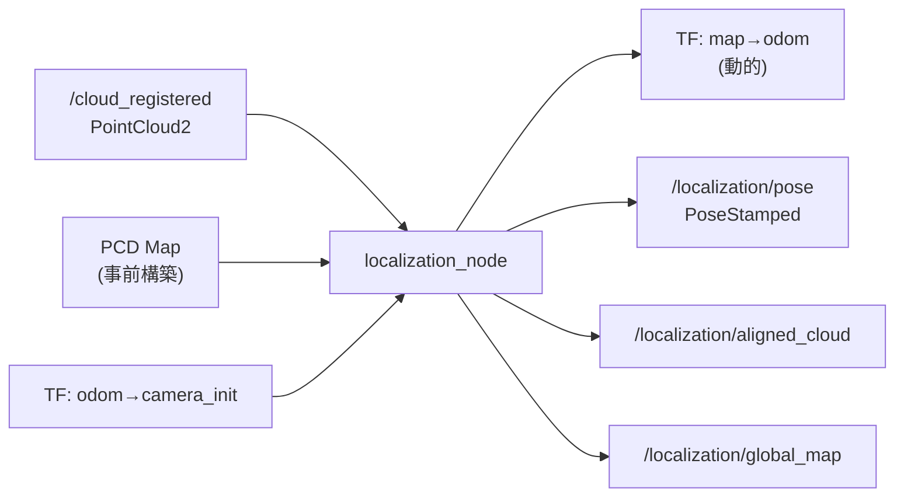

# core_localization

事前構築したPCD点群マップに対してNDT/ICPマッチングを行い、グローバル局在化（`map→odom` TF補正）を提供するパッケージです。

## 概要



FAST-LIOが提供するローカルオドメトリ（`odom→base_link`）に対して、このノードはグローバル補正層（`map→odom`）を追加します。これにより、LIOドリフトが蓄積してもマップ上の位置が正しく保たれます。

## 入力

| トピック | 型 | 説明 |
|---------|------|------|
| `/cloud_registered` | `sensor_msgs/PointCloud2` | FAST-LIOの登録済み点群（camera_initフレーム） |
| `/initialpose` | `geometry_msgs/PoseWithCovarianceStamped` | RVizからの初期位置設定（オプション） |

## 出力

| トピック | 型 | 説明 |
|---------|------|------|
| `/localization/pose` | `geometry_msgs/PoseStamped` | mapフレームでのロボット位置 |
| `/localization/aligned_cloud` | `sensor_msgs/PointCloud2` | デバッグ: NDT整列済み点群 |
| `/localization/global_map` | `sensor_msgs/PointCloud2` | デバッグ: ダウンサンプリング済みPCD地図（transient_local） |

## TF

| TF | 種類 | 説明 |
|----|------|------|
| `map → odom` | 動的（発行） | NDT/ICPマッチングによるグローバル補正 |
| `odom → camera_init` | 静的（参照） | odom_bridgeが発行するFAST-LIOフレーム変換 |
| `odom → base_link` | 動的（参照） | odom_bridgeが発行するローカルオドメトリ |

## サービス

| サービス | 型 | 説明 |
|---------|------|------|
| `~/relocalize` | `std_srvs/Trigger` | 即時再局在化をトリガー |

## パラメータ

設定ファイル: `config/localization_params.yaml`

### PCD地図

| パラメータ | デフォルト | 説明 |
|-----------|----------|------|
| `global_map_path` | `""` | PCD地図ファイルパス（必須） |
| `map_voxel_size` | `0.4` | 地図ダウンサンプリング [m] |
| `scan_voxel_size` | `0.3` | 入力スキャンダウンサンプリング [m] |

### レジストレーション

| パラメータ | デフォルト | 説明 |
|-----------|----------|------|
| `registration_method` | `"ndt"` | `"ndt"` または `"icp"` |
| `ndt_resolution` | `1.0` | NDTグリッドセルサイズ [m] |
| `ndt_step_size` | `0.1` | NDTニュートンステップサイズ |
| `max_iterations` | `30` | 最大反復回数 |
| `transformation_epsilon` | `0.01` | 収束閾値 |
| `fitness_score_threshold` | `1.0` | フィットネススコア上限（超過時リジェクト） |

### タイミング・その他

| パラメータ | デフォルト | 説明 |
|-----------|----------|------|
| `relocalize_rate` | `1.0` | 再局在化頻度 [Hz] |
| `min_scan_points` | `100` | マッチング試行の最小点数 |
| `smooth_alpha` | `0.3` | 指数平滑係数（0=更新なし, 1=平滑なし） |

## 使い方

### navigation.launch.py から起動（推奨）

```bash
ros2 launch core_launch navigation.launch.py \
  environment:=real \
  use_localization:=true \
  pcd_map_path:=/path/to/field.pcd
```

### 単体起動（テスト・開発用）

```bash
ros2 launch core_localization localization.launch.py \
  pcd_map_path:=/path/to/field.pcd
```

## TFツリー変更

`use_localization:=false`（デフォルト）では `map→odom` は静的な恒等変換です。
`use_localization:=true` にすると、このノードがNDT/ICPの結果に基づいて動的にTFを更新します。

```
use_localization:=false              use_localization:=true
map --[static identity]--> odom      map --[dynamic NDT]--> odom
```
