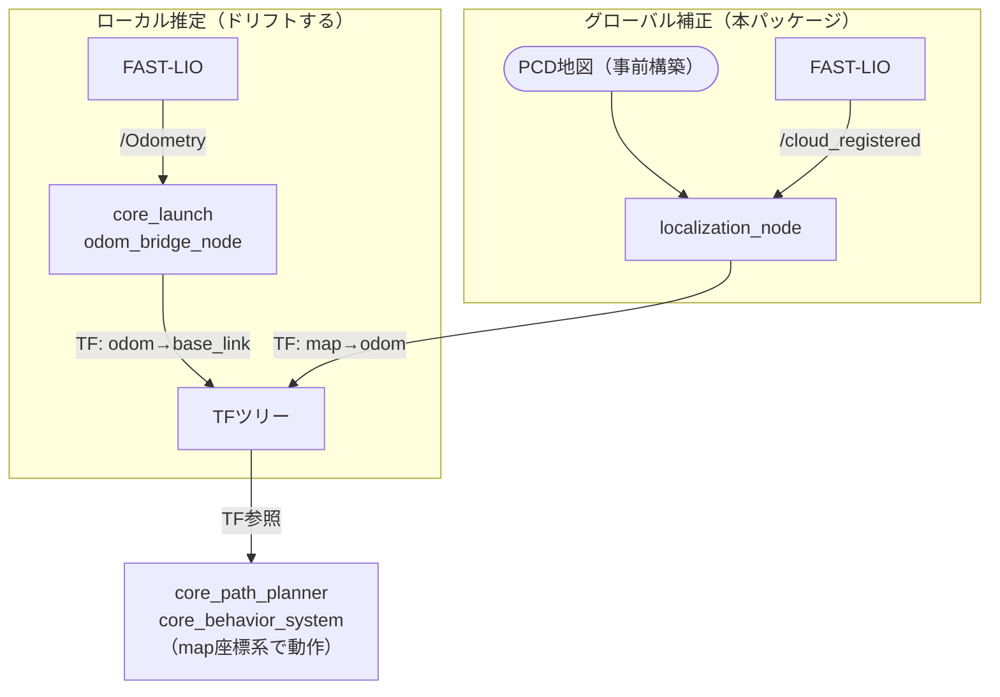
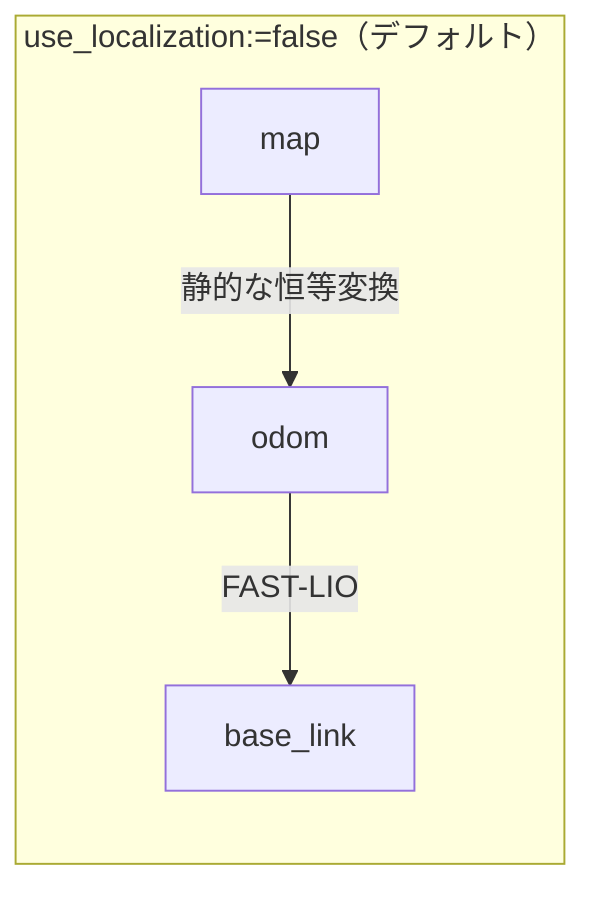
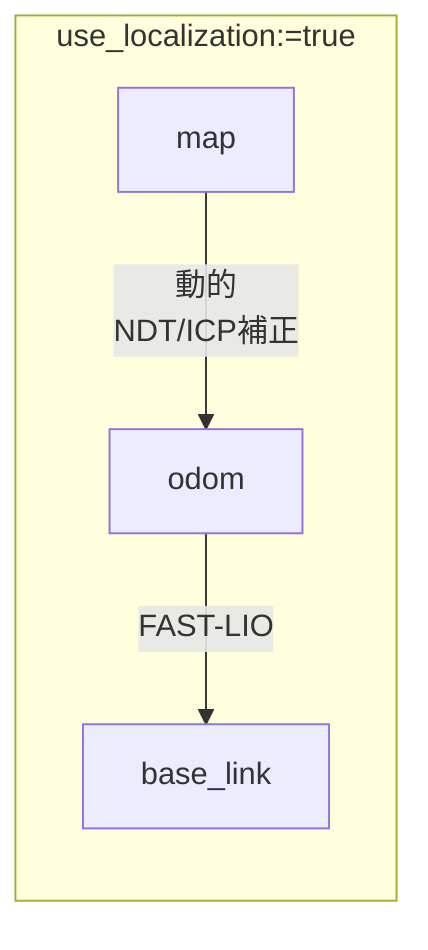
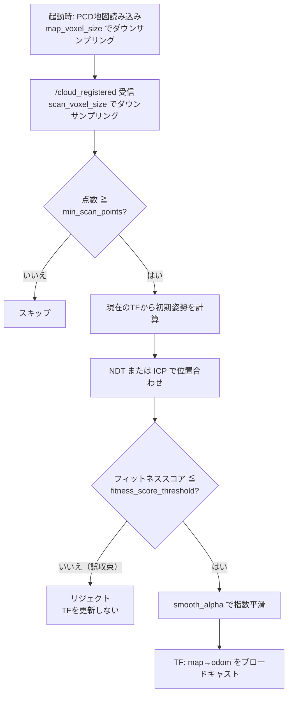

# core_localization

事前構築したPCD点群マップに対してNDT/ICPマッチングを行い、グローバル自己位置推定（`map→odom` の動的補正）を提供するパッケージです。

## 位置づけ

FAST-LIOによるオドメトリは積算誤差でドリフトするため、走行時間が長くなるほどマップ上の位置がずれます。このパッケージはドリフトを吸収する補正層として、TFツリーの `map→odom` を担当します。



## ノード一覧

| ノード | 実行ファイル | 役割 |
|-------|------------|------|
| [`localization_node`](localization_node.md) | `localization_node` | NDT/ICPによる位置合わせと `map→odom` の発行 |

## TFツリーの変化

`use_localization` の値によってTFツリーの構成が変わります。





無効時は `map` と `odom` が一致するため、オドメトリのドリフトがそのままマップ上の位置誤差になります。有効時はこのノードが差分を補正し続けます。

## 処理サイクル



フィットネススコアによるリジェクトと指数平滑の2段構えで、誤ったマッチング結果がTFに反映されるのを防いでいます。

## 関連ガイド

PCD地図の構築・配置方法やフィールドごとの地図選択については[PCD地図構築ガイド](../../guides/pcd-mapping.md)を参照してください。

## 起動

### navigation.launch.py から起動（推奨）

```bash
ros2 launch core_launch navigation.launch.py \
  environment:=real \
  use_localization:=true
```

### 単体起動（テスト・開発用）

```bash
ros2 launch core_localization localization.launch.py \
  global_map_path:=/path/to/field.pcd
```

設定ファイル: `config/localization_params.yaml`、PCD地図: `pcd_maps/`
