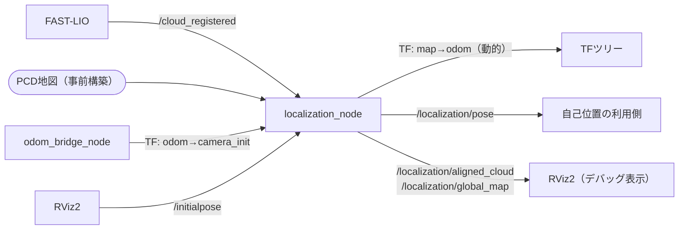

# localization_node

## Purpose

FAST-LIOが提供するオドメトリ（`odom→base_link`）は積算誤差によりドリフトするため、時間経過とともにマップ上の位置がずれていきます。事前構築したPCD点群マップに対してNDT/ICPマッチングを行い、`map→odom` を動的に補正することで、ドリフトが蓄積してもマップ座標系での位置を正しく保ちます。

## Inner-workings / Algorithms

起動時にPCD地図を読み込み `map_voxel_size` でダウンサンプリングして保持します。以後 `relocalize_rate` の周期で以下を実行します。

1. **入力整形**: `/cloud_registered` を `scan_voxel_size` でダウンサンプリング。点数が `min_scan_points` 未満なら当該周期をスキップ
2. **初期姿勢**: 現在の `map→odom` と `odom→camera_init` から、地図座標系でのスキャン初期姿勢を求める
3. **レジストレーション**: `registration_method`（NDTまたはICP）で地図に対して位置合わせ
4. **妥当性判定**: フィットネススコアが `fitness_score_threshold` を超えた結果はリジェクトし、TFを更新しない
5. **平滑化**: 採用した結果を `smooth_alpha` で指数平滑し、`map→odom` としてブロードキャスト

平滑化を挟むのは、マッチング結果が周期ごとに微小変動して `map→odom` が跳ねるのを防ぐためです。



### TFツリーへの影響

`use_localization:=false`（デフォルト）では `map→odom` は静的な恒等変換です。`true` にすると、このノードがNDT/ICPの結果に基づいて動的にTFを更新します。

```
use_localization:=false              use_localization:=true
map --[static identity]--> odom      map --[dynamic NDT]--> odom
```

## Inputs / Outputs

### Input

| トピック | 型 | 説明 |
|---------|------|------|
| `/cloud_registered` | `sensor_msgs/PointCloud2` | FAST-LIOの登録済み点群（camera_initフレーム） |
| `/initialpose` | `geometry_msgs/PoseWithCovarianceStamped` | RVizからの初期位置設定（オプション） |

### Output

| トピック | 型 | 説明 |
|---------|------|------|
| `/localization/pose` | `geometry_msgs/PoseStamped` | mapフレームでのロボット位置 |
| `/localization/aligned_cloud` | `sensor_msgs/PointCloud2` | デバッグ: NDT整列済み点群 |
| `/localization/global_map` | `sensor_msgs/PointCloud2` | デバッグ: ダウンサンプリング済みPCD地図（transient_local） |

### TF

| TF | 種類 | 説明 |
|----|------|------|
| `map → odom` | 動的（発行） | NDT/ICPマッチングによるグローバル補正 |
| `odom → camera_init` | 静的（参照） | odom_bridgeが発行するFAST-LIOフレーム変換 |
| `odom → base_link` | 動的（参照） | odom_bridgeが発行するローカルオドメトリ |

### サービス

| サービス | 型 | 説明 |
|---------|------|------|
| `~/relocalize` | `std_srvs/Trigger` | 即時再局在化をトリガー |

## Parameters

設定ファイル: `config/localization_params.yaml`

### PCD地図

| パラメータ | デフォルト | 説明 |
|-----------|----------|------|
| `global_map_path` | `""` | PCD地図ファイルパス（必須）。`navigation.launch.py` では `map_name` から `pcd_maps/<map_name>.pcd` に自動解決 |
| `map_voxel_size` | `0.4` | 地図ダウンサンプリング [m] |
| `scan_voxel_size` | `0.3` | 入力スキャンダウンサンプリング [m] |

### レジストレーション

| パラメータ | デフォルト | 説明 |
|-----------|----------|------|
| `registration_method` | `"ndt"` | `"ndt"` または `"icp"` |
| `ndt_resolution` | `1.0` | NDTグリッドセルサイズ [m] |
| `ndt_step_size` | `0.1` | NDTニュートンステップサイズ |
| `max_iterations` | `30` | 最大反復回数 |
| `transformation_epsilon` | `0.01` | 収束閾値 |
| `fitness_score_threshold` | `1.0` | フィットネススコア上限（超過時リジェクト） |

### タイミング・その他

| パラメータ | デフォルト | 説明 |
|-----------|----------|------|
| `relocalize_rate` | `1.0` | 再局在化頻度 [Hz] |
| `min_scan_points` | `100` | マッチング試行の最小点数 |
| `smooth_alpha` | `0.3` | 指数平滑係数（0=更新なし, 1=平滑なし） |

## Assumptions / Known limits

- FAST-LIOとodom_bridgeが動作しており、`odom→camera_init` と `odom→base_link` のTFが得られていることが前提です。
- 走行するフィールドと一致するPCD地図が `global_map_path` に用意されている必要があります。地図が違うとマッチングは収束せず、フィットネス閾値で全リジェクトされ続けます。
- 初期姿勢が真値から大きくずれていると、NDT/ICPは局所最適に落ちて誤収束します。起動時は実機の初期位置を合わせるか、RVizの `/initialpose` で与えてください。
- 特徴の乏しい環境（長い直線通路など）では、進行方向にずれた姿勢でもフィットネススコアが低く出るため、誤った補正を採用する可能性があります。
- `relocalize_rate` は既定で1Hzです。高速走行中のドリフト補正には追随しきれません。

## 使い方

### navigation.launch.py から起動（推奨）

```bash
ros2 launch core_launch navigation.launch.py \
  environment:=real \
  use_localization:=true
```

PCD地図の構築・配置方法やフィールドごとの地図選択については[PCD地図構築ガイド](../../guides/pcd-mapping.md)を参照してください。

### 単体起動（テスト・開発用）

```bash
ros2 launch core_localization localization.launch.py \
  global_map_path:=/path/to/field.pcd
```
