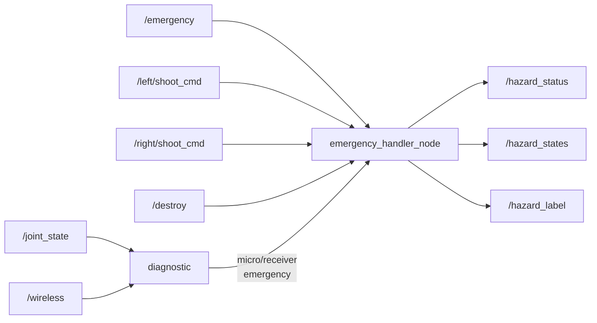

# core_mode

緊急停止とシステムモード管理パッケージです。

## 概要

ハードウェア（スイッチ、受信機、マイコン）とソフトウェアからの緊急信号を集約し、統合的なハザード状態を提供します。



## ノード

### emergency_handler_node

複数ソースからの緊急信号を集約し、統合ハザード状態をパブリッシュします。

### diagnostic

マイコンとワイヤレス受信機のハートビートを監視し、タイムアウト時に緊急信号を発行します。

## 入力

| トピック | 型 | 説明 |
|---------|------|------|
| `emergency_switch` | `std_msgs/Bool` | ハードウェア緊急スイッチ（`/emergency` からリマップ） |
| `emergency_button_on` | `std_msgs/Bool` | ソフトウェア緊急ON（`/left/shoot_cmd` からリマップ） |
| `emergency_button_off` | `std_msgs/Bool` | ソフトウェア緊急OFF（`/right/shoot_cmd` からリマップ） |
| `destroy` | `std_msgs/Bool` | 破壊/中止コマンド |
| `microcontroller_monitor` | `sensor_msgs/JointState` | マイコンハートビート（`/joint_state` からリマップ） |
| `receive_module_monitor` | `std_msgs/UInt8MultiArray` | 受信機ハートビート（`/wireless` からリマップ） |

## 出力

| トピック | 型 | 説明 |
|---------|------|------|
| `hazard_status` | `std_msgs/Bool` | 総合ハザード状態（true=緊急停止中） |
| `hazard_states` | `std_msgs/Int8MultiArray` | 個別ハザード状態 [switch, software, micro, receiver, destroy] |
| `hazard_label` | `std_msgs/String` | 人間可読なハザードラベル |

## パラメータ

設定ファイル: `config/mode.params.yaml`

| パラメータ | デフォルト | 説明 |
|-----------|-----------|------|
| `microcontroller_diagnostic_time` | `2000` | マイコンハートビートタイムアウト [ms] |
| `receiver_diagnostic_time` | `2000` | 受信機ハートビートタイムアウト [ms] |
| `diagnostic_cycle` | `50` | 診断チェック間隔 [ms] |

## 起動

```bash
ros2 launch core_mode mode.launch.py
```

!!! note "名前空間"
    全ノードは `/system/emergency/` 名前空間で起動されます。
