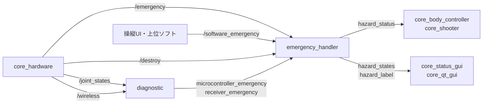

# core_mode

緊急停止とシステムモード管理パッケージです。ハードウェア（スイッチ、受信機、マイコン）とソフトウェアからの緊急信号を集約し、システム全体に統合的なハザード状態を提供します。

## ノード一覧

| ノード | 役割 |
|-------|------|
| [`emergency_handler`](emergency_handler.md) | 複数ソースの緊急信号を集約し、統合ハザード状態を発行 |
| [`diagnostic`](diagnostic.md) | マイコン・受信機のハートビートを監視し、途絶時に緊急信号を発行 |

## データフロー



`diagnostic` は通信途絶という「暗黙の異常」を明示的な緊急信号に変換し、`emergency_handler` がそれを他の緊急源とまとめて最終的なハザード状態を決定します。この2段構成により、緊急源の追加は `emergency_handler` の購読を1つ増やすだけで済みます。

## 出力トピックの利用側

`hazard_status` は全名前空間から `/system/emergency/hazard_status` として参照され、[core_body_controller](../core_body_controller/index.md) や [core_shooter](../core_shooter/index.md) の各ノードがモータ指令を停止する条件に使用します。

## 起動

```bash
ros2 launch core_mode mode.launch.py
```

!!! note "名前空間"
    全ノードは `/system/emergency/` 名前空間で起動されます。したがって `hazard_status` は実際には `/system/emergency/hazard_status` として発行されます。

設定ファイル: `config/mode.params.yaml`
