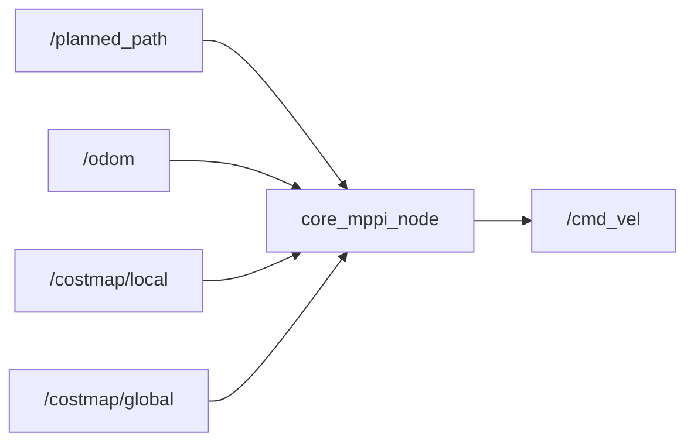

# core_mppi

MPPI（Model Predictive Path Integral）ローカルコントローラパッケージです。

## 概要

経路・オドメトリ・コストマップを入力として、メカナムベースの速度指令 `/cmd_vel` を出力します。



## 入力

| トピック | 型 | 説明 |
|---------|------|------|
| `/planned_path` | `nav_msgs/Path` | path_plannerからの経路 |
| `/odom` | `nav_msgs/Odometry` | 現在のロボット姿勢 |
| `/costmap/local` | `nav_msgs/OccupancyGrid` | ローカルコストマップ |
| `/costmap/global` | `nav_msgs/OccupancyGrid` | グローバルコストマップ |

## 出力

| トピック | 型 | 説明 |
|---------|------|------|
| `/cmd_vel` | `geometry_msgs/Twist` | 速度指令（linear.x, linear.y, angular.z） |

## パラメータ

設定ファイル: `param/default_params.yaml`

### 制御設定

| パラメータ | デフォルト | 説明 |
|-----------|-----------|------|
| `control_rate` | `20.0` | 制御ループ周波数 [Hz] |

### MPPI設定

| パラメータ | デフォルト | 説明 |
|-----------|-----------|------|
| `mppi.samples` | `160` | サンプリング軌道数 |
| `mppi.horizon_steps` | `12` | 予測ホライズンのステップ数 |
| `mppi.dt` | `0.08` | 予測ステップの時間幅 [s] |
| `mppi.temperature` | `1.0` | ソフトマックス温度パラメータ |

### ノイズ設定

| パラメータ | デフォルト | 説明 |
|-----------|-----------|------|
| `mppi.noise_vx` | `0.25` | X方向速度ノイズ [m/s] |
| `mppi.noise_vy` | `0.25` | Y方向速度ノイズ [m/s] |
| `mppi.noise_wz` | `0.8` | 角速度ノイズ [rad/s] |

### 速度制限

| パラメータ | デフォルト | 説明 |
|-----------|-----------|------|
| `mppi.max_vx` | `1.0` | X方向最大速度 [m/s] |
| `mppi.max_vy` | `1.0` | Y方向最大速度 [m/s] |
| `mppi.max_wz` | `3.14` | 最大角速度 [rad/s] |

### コスト重み

| パラメータ | デフォルト | 説明 |
|-----------|-----------|------|
| `mppi.w_path` | `3.0` | 経路追従コスト重み |
| `mppi.w_goal` | `8.0` | ゴール到達コスト重み |
| `mppi.w_obstacle` | `18.0` | 障害物回避コスト重み |
| `mppi.w_control` | `0.3` | 制御入力コスト重み |
| `mppi.w_smooth` | `0.8` | 平滑化コスト重み |
| `mppi.unknown_cost` | `0.5` | 未知セルのコスト |

## 起動

```bash
ros2 launch core_mppi mppi.launch.py
```
