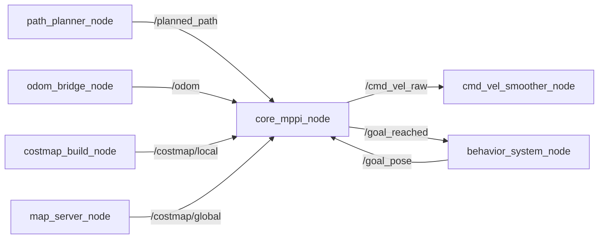

# core_mppi_node

## Purpose

グローバルプランナが生成した経路を、障害物を避けながら実際に走行可能な速度指令へ落とし込むためのローカルコントローラです。A*経路は幾何的な最短経路でしかなく、ロボットの運動特性や動的障害物を考慮していないため、追従の最終段としてMPPI（Model Predictive Path Integral）による最適化を行います。

## Inner-workings / Algorithms

制御周期ごとに、現在の速度指令列にガウスノイズを加えた軌道を `mppi.samples` 本サンプリングし、各軌道のコストを評価して重み付き平均を取ります。

1. **サンプリング**: 直前の制御列を平均として、`noise_vx` / `noise_vy` / `noise_wz` のノイズを加えた `samples` 本の制御列を生成
2. **ロールアウト**: メカナム（全方向移動）の運動モデルで `horizon_steps` × `dt` 秒先まで各軌道を前進積分
3. **コスト評価**: 経路逸脱・ゴール距離・障害物・制御量・平滑性・ヘディングの重み付き和を軌道ごとに算出
4. **重み付き平均**: `exp(-cost / temperature)` をソフトマックス重みとして制御列を統合
5. **出力**: 統合された制御列の先頭ステップを `/cmd_vel_raw` として発行

障害物コストは `/costmap/local` と `/costmap/global` の両方から評価され、未知セルには `unknown_cost` が適用されます。



## Inputs / Outputs

### Input

| トピック | 型 | 説明 |
|---------|------|------|
| `/planned_path` | `nav_msgs/Path` | path_plannerからの経路 |
| `/odom` | `nav_msgs/Odometry` | 現在のロボット姿勢 |
| `/goal_pose` | `geometry_msgs/PoseStamped` | ゴール位置（behavior systemから） |
| `/costmap/local` | `nav_msgs/OccupancyGrid` | ローカルコストマップ |
| `/costmap/global` | `nav_msgs/OccupancyGrid` | グローバルコストマップ |

### Output

| トピック | 型 | 説明 |
|---------|------|------|
| `/cmd_vel_raw` | `geometry_msgs/Twist` | 速度指令（linear.x, linear.y, angular.z）。smoother有効時は `/cmd_vel_raw`、無効時は `/cmd_vel` |
| `/goal_reached` | `std_msgs/Bool` | ゴール到達時に `true` を発行 |

## Parameters

設定ファイル: `param/default_params.yaml`

### 制御設定

| パラメータ | デフォルト | 説明 |
|-----------|-----------|------|
| `control_rate` | `20.0` | 制御ループ周波数 [Hz] |
| `goal_tolerance` | `0.15` | ゴール到達判定距離 [m] |
| `goal_topic` | `/goal_pose` | ゴールポーズトピック名 |

### MPPI設定

| パラメータ | デフォルト | 説明 |
|-----------|-----------|------|
| `mppi.samples` | `160` | サンプリング軌道数 |
| `mppi.horizon_steps` | `12` | 予測ホライズンのステップ数 |
| `mppi.dt` | `0.08` | 予測ステップの時間幅 [s] |
| `mppi.temperature` | `1.0` | ソフトマックス温度パラメータ |

### ノイズ設定

| パラメータ | デフォルト | 説明 |
|-----------|-----------|------|
| `mppi.noise_vx` | `0.25` | X方向速度ノイズ [m/s] |
| `mppi.noise_vy` | `0.25` | Y方向速度ノイズ [m/s] |
| `mppi.noise_wz` | `0.8` | 角速度ノイズ [rad/s] |

### 速度制限

| パラメータ | デフォルト | 説明 |
|-----------|-----------|------|
| `mppi.max_vx` | `1.0` | X方向最大速度 [m/s] |
| `mppi.max_vy` | `1.0` | Y方向最大速度 [m/s] |
| `mppi.max_wz` | `3.14` | 最大角速度 [rad/s] |

### コスト重み

| パラメータ | デフォルト | 説明 |
|-----------|-----------|------|
| `mppi.w_path` | `3.0` | 経路追従コスト重み |
| `mppi.w_goal` | `8.0` | ゴール到達コスト重み |
| `mppi.w_obstacle` | `18.0` | 障害物回避コスト重み |
| `mppi.w_control` | `0.3` | 制御入力コスト重み |
| `mppi.w_smooth` | `0.8` | 平滑化コスト重み |
| `mppi.w_heading` | `1.5` | ヘディング整合コスト重み（進行方向を向くよう誘導） |
| `mppi.unknown_cost` | `0.5` | 未知セルのコスト |
| `mppi.heading_lookahead` | `3` | ヘディング目標に使うパス先読みステップ数 |

コスト重みのチューニング手順は[パラメータチューニングガイド](../../guides/tuning.md#mppi-コントローラ)を参照してください。

## Assumptions / Known limits

- メカナム（全方向移動）の運動モデルを前提としています。差動二輪の車体には `max_vy` を0にしても適合しません。
- サンプリングは確率的なため、同一入力でもフレーム間で指令が振動します。そのまま車体に流さず [core_cmd_vel_smoother](../core_cmd_vel_smoother/index.md) を経由させる前提の設計です。
- `mppi.samples` × `mppi.horizon_steps` が計算負荷に直結します。`control_rate` を満たせないほど大きくすると制御周期が破綻します。
- 経路（`/planned_path`）とコストマップの両方が届いていない間は指令を出しません。

## 起動

```bash
ros2 launch core_mppi mppi.launch.py
```
