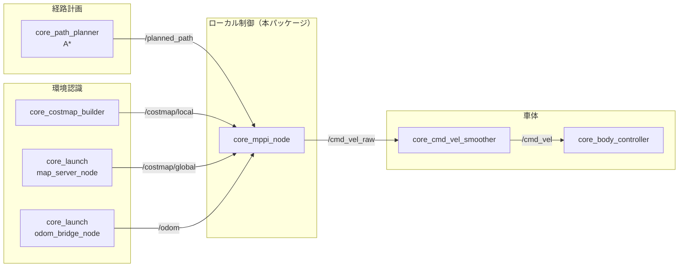
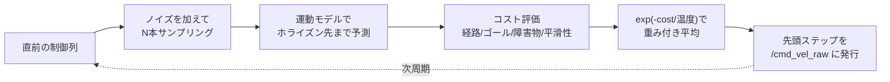

# core_mppi

MPPI（Model Predictive Path Integral）によるローカルコントローラパッケージです。グローバル経路を、障害物を避けながら実際に走行可能な速度指令に変換します。

## 位置づけ

ナビゲーションスタックの「経路をどう走るか」を担う層です。上流のプランナが引いた幾何的な経路を、ロボットの運動特性とリアルタイムの障害物情報を踏まえた速度指令に落とし込みます。



## ノード一覧

| ノード | 実行ファイル | 役割 |
|-------|------------|------|
| [`core_mppi_node`](core_mppi_node.md) | `core_mppi_node` | MPPIによる速度指令の生成 |

## アルゴリズムの流れ

制御周期ごとに、多数の候補軌道をサンプリングしてコストで重み付けし、最適な制御列を求めます。



勾配計算を必要とせず、障害物コストのような不連続な評価関数をそのまま扱えるのがMPPIの利点です。一方で確率的サンプリングのため出力にフレーム間の揺らぎが出るので、[core_cmd_vel_smoother](../core_cmd_vel_smoother/index.md) での平滑化を前提としています。

## 他のコントローラとの使い分け

| コントローラ | 特徴 | 使いどころ |
|------------|------|-----------|
| **core_mppi** | 障害物回避を内包、全方向移動に対応 | `navigation.launch.py` の既定構成 |
| [core_path_follower](../core_path_follower/index.md) | 軽量・決定的、障害物回避なし | 単体テスト、MPPIを使わない構成 |

## 起動

```bash
ros2 launch core_mppi mppi.launch.py
```

設定ファイル: `param/default_params.yaml`

コスト重みのチューニング手順は[パラメータチューニングガイド](../../guides/tuning.md#mppi-コントローラ)を参照してください。
