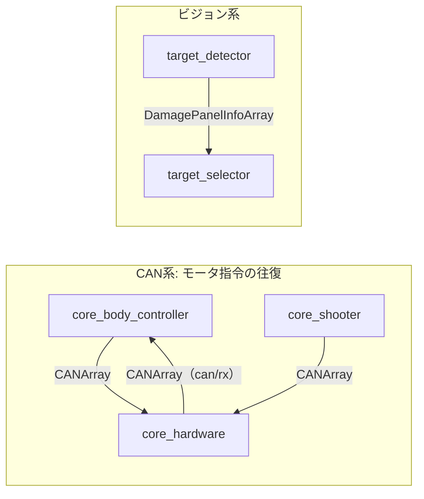

# core_msgs

## Purpose

標準のROS2メッセージだけでは、このプロジェクト固有のデータ（CANフレーム、障害物距離を持つ経路、ダメージパネル情報）を表現できません。それらを定義するカスタムメッセージパッケージです。ノードではないため入出力やパラメータはありません。

## メッセージの使われ方

各メッセージ型がどのパッケージ間のやり取りに使われるかを示します。



| メッセージ | 主な発行元 | 主な購読先 |
|-----------|----------|-----------|
| `CANArray` / `CAN` | core_body_controller、core_shooter | core_hardware |
| `DamagePanelInfoArray` | core_enemy_detection / target_detector | core_enemy_detection / target_selector |
| `Path` / `PoseWithWeight` | （経路生成側） | （経路追従側） |

## メッセージ型

### CAN.msg

```
uint8 id
float32[] data
```

CANフレームの抽象化。モータ制御コマンドの送受信に使用します。`id` がモータID、`data` が指令値です。

### CANArray.msg

```
CAN[] array
```

複数のCANメッセージをまとめて送信するための配列型。1周期分の全モータ指令を1メッセージで送ることで、モータ間の指令タイミングのばらつきを避けます。

[core_body_controller](../core_body_controller/index.md) と [core_shooter](../core_shooter/index.md) の各ノードが `/can/tx` に発行し、[core_hardware](../core_hardware/index.md) が受け取ります。

### Path.msg

```
std_msgs/Header header
PoseWithWeight[] pose
```

重み付き経路メッセージ。標準の `nav_msgs/Path` と異なり、各点が障害物までの距離情報を持ちます。

### PoseWithWeight.msg

```
geometry_msgs/Point position
geometry_msgs/Quaternion orientation
float64 distance_to_obstable
```

障害物までの距離情報を持つ姿勢メッセージ。

!!! note "フィールド名の綴り"
    `distance_to_obstable` は `obstacle` の綴り誤りですが、既存コードとの互換性のためそのまま使用されています。

### DamagePanelInfoArray.msg

[core_enemy_detection](../core_enemy_detection/index.md) の `target_detector` が検出したダメージパネル候補群を表すメッセージです。各候補の画像上の位置と面積を含みます。

## Assumptions / Known limits

- メッセージ定義を変更した場合、依存する全パッケージの再ビルドが必要です。バイナリ互換性はありません。
- `CAN.msg` の `data` は可変長配列ですが、実際に受け付ける長さはモータの種類とファームウェアの実装に依存します。
