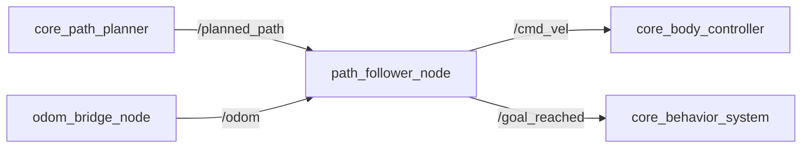
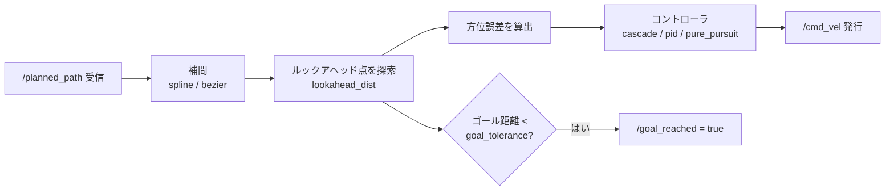
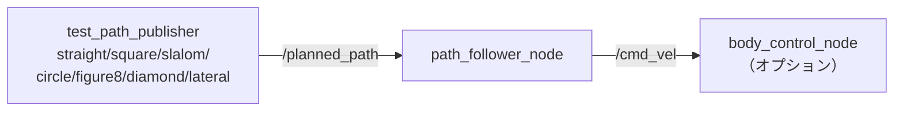

# core_path_follower

経路追従コントローラパッケージです。`nav_msgs/Path` を追従して速度指令を出力します。MPPIより軽量で挙動が決定的なため、単体テストやMPPIを使わない構成で使用します。

## 位置づけ

[core_mppi](../core_mppi/index.md) と同じ「経路をどう走るか」の層に位置する代替コントローラです。障害物回避を持たない代わりに、動作が決定的で挙動を追いやすいという特性があります。



!!! note "MPPIとの使い分け"
    `navigation.launch.py` ではMPPIコントローラが使用されます。path_followerは単体テストやMPPIを使わない構成で利用します。

| コントローラ | 障害物回避 | 挙動 | 使いどころ |
|------------|----------|------|-----------|
| [core_mppi](../core_mppi/index.md) | あり | 確率的 | 本番構成 |
| **core_path_follower** | なし | 決定的 | テスト・デバッグ |

## ノード一覧

| ノード | 実行ファイル | 役割 |
|-------|------------|------|
| [`path_follower_node`](path_follower_node.md) | `core_path_follower_node` | 経路追従による速度指令の生成 |

## 処理の流れ



A*が出力する折れ線経路は角で方向が不連続に変わるため、追従前にスプラインまたはベジエで補間して滑らかにします。

### コントローラの選択肢

| タイプ | アルゴリズム | 特徴 |
|-------|------------|------|
| `cascade`（デフォルト） | 外側PID（方位誤差→ω_ref）＋内側PID（ω誤差→ω_cmd） | 負荷変動に強い |
| `pid` | 単一PID（方位誤差→ω_cmd） | 単純・調整が容易 |
| `pure_pursuit` | 幾何的な追従則＋内側PID | 曲線追従が滑らか |

### 座標フレームモード

| モード | `use_local_frame` | フレーム | 説明 |
|-------|-------------------|---------|------|
| ローカル（デフォルト） | `true` | `chassis_link` | ロボットが原点、odom不要 |
| ワールド | `false` | `map` / `odom` | nav2スタイルのグローバルプランナ用 |

## テスト構成

テスト用のパスパブリッシャが付属し、7種類のプリセット経路で追従性能を確認できます。



```bash
ros2 launch core_path_follower test_path_follower.launch.py path_type:=figure8
```

詳細は[ノードページのテスト節](path_follower_node.md#テスト)を参照してください。

## 起動

```bash
ros2 launch core_path_follower path_follower.launch.py
```

設定ファイル: `param/default_params.yaml`
