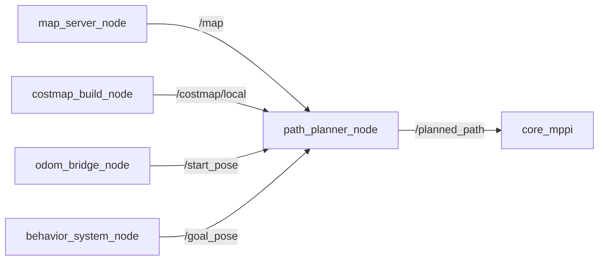

# core_path_planner

A*アルゴリズムによるグローバル経路計画パッケージです。OccupancyGrid上で開始位置からゴールまでの経路を探索し、`nav_msgs/Path` として出力します。

## ノード一覧

| ノード | 役割 |
|-------|------|
| [`path_planner_node`](path_planner_node.md) | A*による経路探索。本パッケージの主ノード |
| [`costmap_publisher_node`](costmap_publisher_node.md) | テスト用の合成コストマップ発行ノード |

## データフロー



静的なフィールド地図（`/map`）と、[core_costmap_builder](../core_costmap_builder/index.md) が生成する動的なローカルコストマップ（`/costmap/local`）の両方を参照して経路を引きます。生成された経路は [core_mppi](../core_mppi/index.md) が追従します。

## 起動

```bash
ros2 run core_path_planner path_planner_node
```

通常は `navigation.launch.py` から他のナビゲーションノードとともに起動されます。
