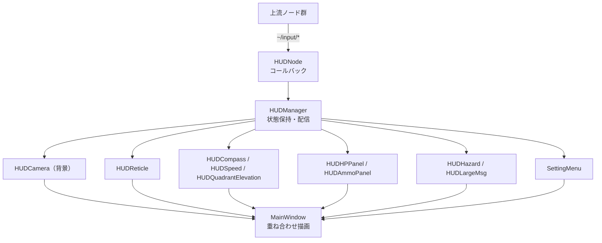

# gui_qt

## Purpose

操縦者はカメラ映像を見ながらロボットを操作しますが、映像だけではHP・残弾・車体の向き・緊急状態といった状況が分かりません。このノードは映像の上にそれらの情報を重畳するHUDを描画し、視線を移さずに機体の状態を把握できるようにします。

## Inner-workings / Algorithms

Qtアプリケーションとして起動し、ROSのコールバックで受け取ったデータを各ウィジェットの状態に反映して再描画します。



各ウィジェットは `IWidgetComponet` インターフェースを実装し、`HUDManager` が一括して状態を配信します。ウィジェットの追加・削除がHUD本体の構造に影響しないようにするための設計です。

### カメラ映像

メイン（`camera`）とサブ（`camera_sub`）の2系統を扱い、`camera_change_1` / `camera_change_2` で表示を切り替えます。圧縮画像（`CompressedImage`）と非圧縮画像（`Image`）の両方に対応しており、現在のランチ設定では非圧縮の `camera_raw` / `camera_sub_raw` が使われています。

映像系のトピックのみ `SensorDataQoS`（best effort）を使用します。フレーム落ちを許容してでも遅延を抑えるためです。

### 緊急状態の表示

`hazard` と `hazard_label` は `transient_local` のQoSで購読します。HUDが [core_mode](../core_mode/index.md) より後に起動しても、現在の緊急状態を取りこぼさずに表示できます。

### 設定メニュー

`SettingMenu` はカーソル操作（`cursor_next` / `cursor_prev` / `value_up` / `value_down` / `cursor_ok` / `cursor_back`）で、照準感度や最大速度などのパラメータを実行中に調整するUIです。変更先のノードは `parameter_set_destination` パラメータで指定します。

## Inputs / Outputs

### Input

すべて `~/input/` 配下のプライベート名で定義され、ランチファイルでリマップされます。

#### 機体状態

| トピック | 型 | 説明 |
|---------|------|------|
| `~/input/hp` | `std_msgs/UInt8` | 現在HP |
| `~/input/max_hp` | `std_msgs/UInt8` | 最大HP |
| `~/input/ammo` | `std_msgs/Int8` | 残弾数 |
| `~/input/max_ammo` | `std_msgs/Int8` | 最大弾数 |
| `~/input/destroy` | `std_msgs/Bool` | 撃破判定 |
| `~/input/compass` | `std_msgs/Float32` | 車体方位 [deg] |
| `~/input/speed` | `std_msgs/Float32` | 走行速度 [m/s] |
| `~/input/qe` | `std_msgs/Float32` | 砲身仰角 [deg] |
| `~/input/ads` | `std_msgs/Bool` | ADSモード |

#### 映像・検出

| トピック | 型 | QoS | 説明 |
|---------|------|-----|------|
| `~/input/camera` | `sensor_msgs/CompressedImage` | SensorData | メイン映像（圧縮） |
| `~/input/camera_raw` | `sensor_msgs/Image` | SensorData | メイン映像（非圧縮） |
| `~/input/camera_sub` | `sensor_msgs/CompressedImage` | SensorData | サブ映像（圧縮） |
| `~/input/camera_sub_raw` | `sensor_msgs/Image` | SensorData | サブ映像（非圧縮） |
| `~/input/enemy_poses` | `geometry_msgs/PoseArray` | reliable(10) | 敵位置のマーカー表示用 |

#### 緊急・ログ

| トピック | 型 | QoS | 説明 |
|---------|------|-----|------|
| `~/input/hazard` | `std_msgs/Bool` | transient_local | 緊急停止状態 |
| `~/input/hazard_label` | `std_msgs/String` | transient_local | 緊急停止の理由ラベル |
| `~/input/log` | `std_msgs/String` | reliable(10) | デバッグログ表示 |

#### UI操作

| トピック | 型 | 説明 |
|---------|------|------|
| `~/input/camera_change_1` | `std_msgs/Bool` | メインカメラ切替 |
| `~/input/camera_change_2` | `std_msgs/Bool` | サブカメラ切替 |
| `~/input/cursor_next` / `cursor_prev` | `std_msgs/Bool` | メニューのカーソル移動 |
| `~/input/value_up` / `value_down` | `std_msgs/Bool` | メニューの値変更 |
| `~/input/cursor_ok` / `cursor_back` | `std_msgs/Bool` | メニューの決定・戻る |

### Output

トピックの発行はありません。設定メニューからの変更は、`parameter_set_destination` で指定した他ノードのパラメータサービス経由で反映されます。

## Parameters

設定ファイル: `config/gui_qt.param.yaml`、`config/global_battle.param.yaml`

| パラメータ | 型 | デフォルト | 説明 |
|-----------|------|-----------|------|
| `range_aim_sensitivity` | double[] | `[0.0, 1.0]` | 照準感度の調整範囲 [min, max] |
| `range_max_velocity` | double[] | `[0.0, 1.0]` | 最大速度の調整範囲 [min, max] |
| `range_max_omega` | double[] | `[0.0, 1.0]` | 最大角速度の調整範囲 [min, max] |
| `range_max_shooter` | double[] | `[0.0, 1.0]` | シューター出力の調整範囲 [min, max] |
| `parameter_set_destination` | string[] | `[""]` | 設定メニューの変更を反映するノード名 |

## Assumptions / Known limits

- Qt が利用可能なGUI環境が必要です。ヘッドレス環境では起動できません。
- 映像トピックが届かない場合、背景は描画されず他のウィジェットのみが表示されます。映像の途絶を検知する表示は特にありません。
- UI操作系のトピック（`cursor_*`、`camera_change_*`）は、ランチファイル上ではリマップがコメントアウトされています。現状これらの操作はゲームパッド入力に接続されていません。
- `~/input/max_hp` のリマップ先が `set/max_hp` という相対名になっており、`gui_qt` ノードの名前空間に依存します。
- HUDのレイアウトは実装にハードコードされており、パラメータで変更できるのは上記の調整範囲のみです。

## 起動

```bash
ros2 launch gui_qt hud.launch.py
```
