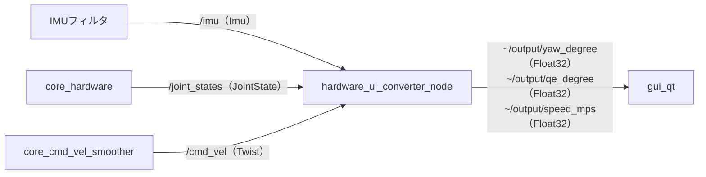

# hardware_ui_converter_node

## Purpose

ROS側のデータは制御に適した形式（クォータニオン、ラジアン、速度ベクトル）で流れていますが、HUDに表示するには「度」や「m/s」といった人間が読める単位のスカラー値が必要です。このノードは両者の間で単位変換を行い、表示専用のトピックを提供します。

## Inner-workings / Algorithms

3つの入力それぞれに対して独立した変換を行い、受信のたびに即座に発行します。状態は保持しません。



| 変換 | 入力 | 処理 | 出力 |
|------|------|------|------|
| 方位 | `imu` の姿勢クォータニオン | `tf2` でRPYに分解し、ヨー角を度に変換 | `yaw_degree` |
| 砲身仰角 | `joint_states` の `position[11]` | ラジアンから度に変換 | `qe_degree` |
| 速度 | `cmd_vel` の `linear.x` / `linear.y` | 平面成分のノルムを計算 | `speed_mps` |

速度は指令値（`cmd_vel`）から算出しており、実測値ではありません。表示の応答性を優先した設計です。

## Inputs / Outputs

### Input

| トピック | 型 | 説明 |
|---------|------|------|
| `~/input/imu` | `sensor_msgs/Imu` | 車体のIMU姿勢（launchで `/imu` にリマップ） |
| `/joint_states` | `sensor_msgs/JointState` | 全モータの関節状態 |
| `/cmd_vel` | `geometry_msgs/Twist` | 車体速度指令 |

### Output

| トピック | 型 | 説明 |
|---------|------|------|
| `~/output/yaw_degree` | `std_msgs/Float32` | 車体方位 [deg]（launchで `/ui/yaw_degree` にリマップ） |
| `~/output/qe_degree` | `std_msgs/Float32` | 砲身仰角 [deg]（launchで `/ui/qe_degree` にリマップ） |
| `~/output/speed_mps` | `std_msgs/Float32` | 走行速度 [m/s]（launchで `/ui/speed_mps` にリマップ） |

## Parameters

パラメータはありません。変換式と参照する関節インデックスは実装に固定されています。

## Assumptions / Known limits

- 砲身仰角は `joint_states` の **インデックス11** を決め打ちで参照します。モータ構成や `joint_states` の並び順が変わると、無関係な関節の角度を表示します。またインデックス11が存在しない長さのメッセージを受け取ると範囲外アクセスになります。
- 速度は `cmd_vel`（指令値）から計算するため、スリップや緊急停止で実際に動いていない場合でも指令どおりの速度が表示されます。
- `/joint_states` と `/cmd_vel` は絶対名で購読しており、リマップなしでは名前空間の影響を受けません。一方 `~/input/imu` はプライベート名です。
- 変換は表示専用です。この出力を制御にフィードバックする用途は想定していません。

## 起動

[gui_qt](gui_qt.md) と併せて `hud.launch.py` から起動されます。

```bash
ros2 launch gui_qt hud.launch.py
```
