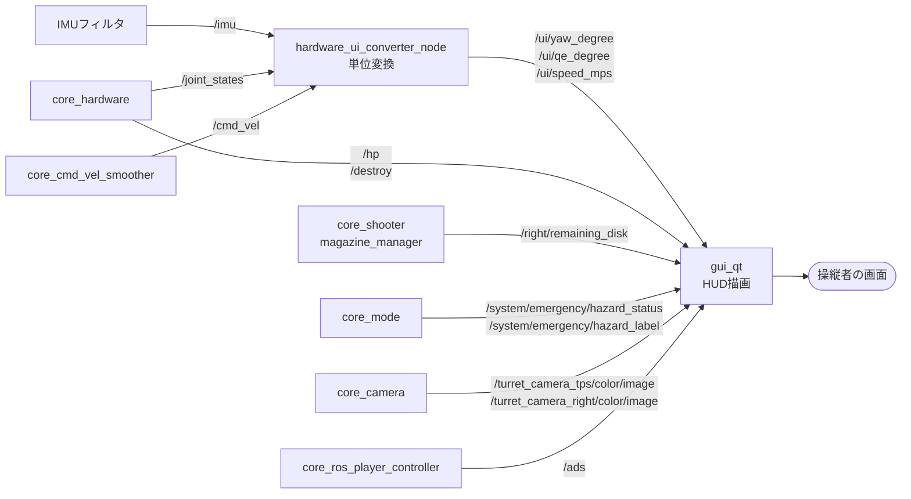
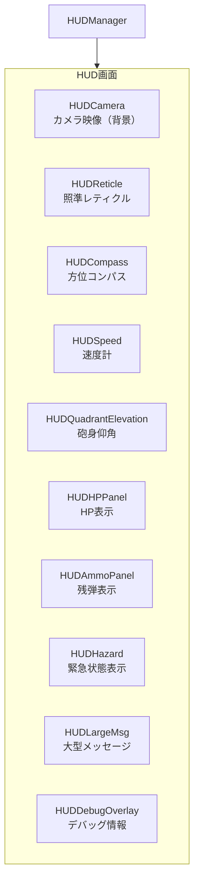

# core_qt_gui

操縦者向けのHUD（ヘッドアップディスプレイ）を提供するパッケージです。カメラ映像に、HP・残弾・方位・速度・緊急状態などの情報を重畳表示します。

!!! warning "パッケージ名とディレクトリ名が異なります"
    ディレクトリ名は `core_qt_gui` ですが、`package.xml` で宣言されているROSパッケージ名は **`gui_qt`** です。`colcon build --packages-select` や `ros2 launch` では `gui_qt` を指定してください。

## 構成

HUDの描画とROSデータの整形を2つのノードに分けています。ROS側の生データ（クォータニオン、関節角度、速度ベクトル）はそのままでは表示に使えないため、変換ノードが表示用の単位（度、m/s）に直してからHUDに渡します。



## ノード一覧

| ノード | 実行ファイル | 役割 |
|-------|------------|------|
| [`gui_qt`](gui_qt.md) | `gui_qt` | Qt製のHUD本体。映像への情報重畳と設定メニューを提供 |
| [`hardware_ui_converter_node`](hardware_ui_converter_node.md) | `hardware_ui_converter_node` | IMU・関節角度・速度指令を表示用の単位に変換 |

## HUDの構成要素

`gui_qt` は複数のウィジェットを重ね合わせて画面を構成します。



| ウィジェット | 表示内容 | 主な入力 |
|------------|---------|---------|
| `HUDCamera` | カメラ映像（メイン／サブ切替可） | `~/input/camera_raw`, `~/input/camera_sub_raw` |
| `HUDReticle` | 照準レティクル。ADS時に表示変化 | `~/input/ads` |
| `HUDCompass` | 車体方位 | `~/input/compass` |
| `HUDSpeed` | 走行速度 | `~/input/speed` |
| `HUDQuadrantElevation` | 砲身の仰角 | `~/input/qe` |
| `HUDHPPanel` | HP／最大HP | `~/input/hp`, `~/input/max_hp` |
| `HUDAmmoPanel` | 残弾／最大弾数 | `~/input/ammo`, `~/input/max_ammo` |
| `HUDHazard` | 緊急停止状態とその理由 | `~/input/hazard`, `~/input/hazard_label` |
| `HUDLargeMsg` | 撃破通知などの大型表示 | `~/input/destroy` |
| `HUDDebugOverlay` | デバッグログ | `~/input/log` |
| `SettingMenu` | 設定メニュー（カーソル操作） | `~/input/cursor_*`, `~/input/value_*` |

## トピック接続の方針

`gui_qt` は全ての購読トピックを `~/input/<用途>` というプライベート名で定義し、実際の接続はランチファイルのリマップで行います。表示内容とデータ源を分離することで、データ源が変わってもノード側の変更が不要になります。

主なリマップ（`launch/hud.launch.py`）:

| HUD側 | 実際のトピック |
|-------|--------------|
| `~/input/hp` | `/hp` |
| `~/input/ammo` | `/right/remaining_disk` |
| `~/input/compass` | `/ui/yaw_degree` |
| `~/input/speed` | `/ui/speed_mps` |
| `~/input/qe` | `/ui/qe_degree` |
| `~/input/camera_raw` | `/turret_camera_tps/color/image` |
| `~/input/camera_sub_raw` | `/turret_camera_right/color/image` |
| `~/input/hazard` | `/system/emergency/hazard_status` |
| `~/input/hazard_label` | `/system/emergency/hazard_label` |
| `~/input/ads` | `/ads` |

## 起動

```bash
ros2 launch gui_qt hud.launch.py
```

| 種別 | パス |
|------|------|
| パラメータ | `config/gui_qt.param.yaml`、`config/global_battle.param.yaml` |
| フォント | `font/Metrophobic-Regular.ttf`、`font/Michroma-Regular.ttf` |

!!! note "終了時の連動"
    ランチファイルは `OnProcessExit` イベントを登録しており、HUDのウィンドウを閉じると同時に起動した他ノードもシャットダウンされます。
