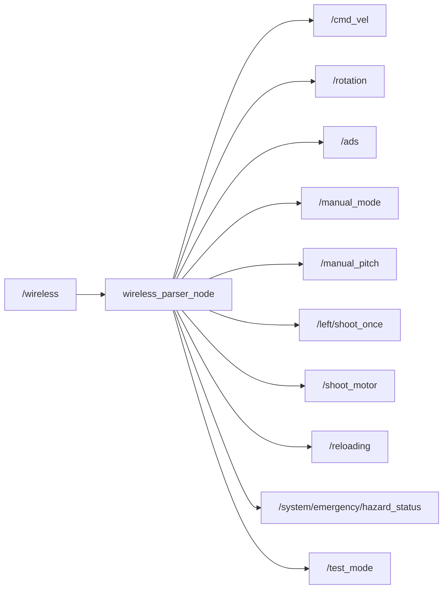

# core_ros_player_controller

ワイヤレスコントローラの入力パーサーパッケージです。

## 概要

ワイヤレスゲームパッド入力（`UInt8MultiArray`）を解析し、車体移動・タレット照準・射撃の制御コマンドに変換します。



## 入力

| トピック | 型 | 説明 |
|---------|------|------|
| `/wireless` | `std_msgs/UInt8MultiArray` | ワイヤレス入力（7バイト以上）。フォーマット: `[flags, mouse_x, mouse_y, ui_flags, flags_2, ...]` |

### flags ビットマップ（byte 0）

| ビット | キー | 説明 |
|--------|------|------|
| 0 | Space | 緊急停止 |
| 1 | W | 前進 |
| 2 | S | 後退 |
| 3 | A | 左移動 |
| 4 | D | 右移動 |
| 5 | Reload | リロード |
| 6 | Click | 射撃トリガー |
| 7 | Roller | シューターモーター |

### flags_2 ビットマップ（byte 4）

| ビット | キー | 説明 |
|--------|------|------|
| 0 | ADS | ADS（照準器を覗く）モード |
| 1 | Rotation | 車体回転モード切替 |

### ui_flags ビットマップ（byte 3）

| ビット | 説明 |
|--------|------|
| 0 | ロックフラグ |
| 1 | 自動フラグ（ON時はcmd_vel等をパブリッシュしない） |

## 出力

UI自動フラグがOFFの場合のみパブリッシュされるトピック（手動操作時）:

| トピック | 型 | 説明 |
|---------|------|------|
| `/cmd_vel` | `geometry_msgs/Twist` | 車体速度指令（linear.x=W/S, linear.y=A/D, angular.z=mouse_x） |
| `/rotation` | `std_msgs/Bool` | 車体回転モード切替 |
| `/ads` | `std_msgs/Bool` | ADSモード |
| `/manual_pitch` | `std_msgs/Float32` | 手動ピッチ入力（mouse_y） |
| `/shoot_motor` | `std_msgs/Bool` | シューターローラーモーター制御 |
| `/left/shoot_once` | `std_msgs/Bool` | 単発射撃トリガー |
| `/reloading` | `std_msgs/Bool` | マガジンリロードトリガー（立ち上がりエッジのみ） |

常にパブリッシュされるトピック:

| トピック | 型 | 説明 |
|---------|------|------|
| `/manual_mode` | `std_msgs/Bool` | シューター手動照準モード（UI自動フラグの反転） |
| `/test_mode` | `std_msgs/Bool` | テストモード（常に `false`） |
| `/system/emergency/hazard_status` | `std_msgs/Bool` | 緊急停止状態 |

## パラメータ

設定ファイル: `config/wireless_parser_params.yaml`

| パラメータ | デフォルト | 説明 |
|-----------|-----------|------|
| `mouse_x_sensitivity` | `1.0` | 水平マウス感度 |
| `mouse_y_sensitivity` | `1.0` | 垂直マウス感度 |
| `mouse_x_inverse` | `false` | 水平マウス方向反転 |
| `mouse_y_inverse` | `false` | 垂直マウス方向反転 |
| `cmd_vel_xy_scale` | `1.0` | WASD速度指令スケール係数 |

## 起動

```bash
ros2 launch core_ros_player_controller wireless_parser_node.launch.py
```
