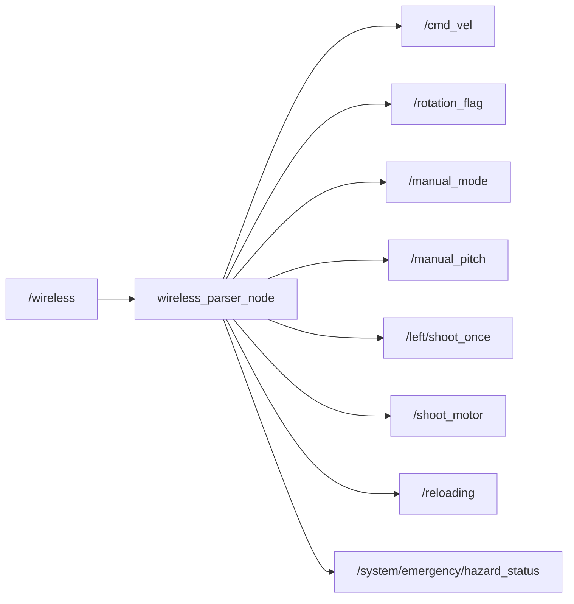

# core_ros_player_controller

ワイヤレスコントローラの入力パーサーパッケージです。

## 概要

ワイヤレスゲームパッド入力（`UInt8MultiArray`）を解析し、車体移動・タレット照準・射撃の制御コマンドに変換します。



## 入力

| トピック | 型 | 説明 |
|---------|------|------|
| `/wireless` | `std_msgs/UInt8MultiArray` | ワイヤレス入力。フォーマット: `[flags, mouse_x, mouse_y, ui_flags, ...]`。flagsビット: [emergency, W, S, A, D, reload, click, roller] |

## 出力

| トピック | 型 | 説明 |
|---------|------|------|
| `/cmd_vel` | `geometry_msgs/Twist` | 車体速度指令（linear.x=W/S, linear.y=A/D, angular.z=mouse_x） |
| `/rotation_flag` | `std_msgs/Bool` | 車体回転追従フラグ（true=手動、false=自動照準） |
| `/manual_mode` | `std_msgs/Bool` | シューター手動照準モード |
| `/manual_pitch` | `std_msgs/Float32` | 手動ピッチ入力 [-1.0〜1.0] |
| `/shoot_motor` | `std_msgs/Bool` | シューターローラーモーター制御 |
| `/left/shoot_once` | `std_msgs/Bool` | 単発射撃トリガー |
| `/reloading` | `std_msgs/Bool` | マガジンリロードトリガー（手動モードのみ立ち上がりエッジ） |
| `/system/emergency/hazard_status` | `std_msgs/Bool` | 緊急停止状態 |

## パラメータ

設定ファイル: `config/wireless_parser_params.yaml`

| パラメータ | デフォルト | 説明 |
|-----------|-----------|------|
| `mouse_x_sensitivity` | `1.0` | 水平マウス感度 |
| `mouse_y_sensitivity` | `1.0` | 垂直マウス感度 |
| `mouse_x_inverse` | `false` | 水平マウス方向反転 |
| `mouse_y_inverse` | `false` | 垂直マウス方向反転 |
| `cmd_vel_xy_scale` | `0.5` | 速度指令スケール係数 |

## 起動

```bash
ros2 launch core_ros_player_controller wireless_parser_node.launch.py
```
