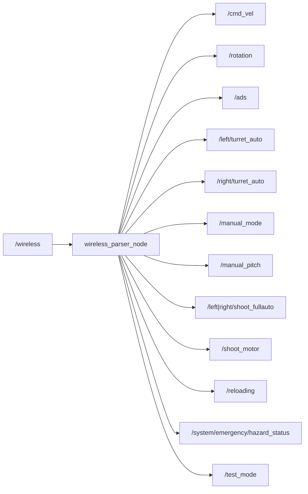

# core_ros_player_controller

7Byteワイヤレスコントローラの入力パーサーパッケージです。

## 概要

ワイヤレスゲームパッド入力（`UInt8MultiArray`）を解析し、車体移動・タレット照準・射撃の制御コマンドに変換します。


```mermaid
graph LR
    Wireless["/wireless"] --> WP["wireless_parser_node"]
    WP --> CmdVel["/cmd_vel"]
    WP --> Rotation["/rotation"]
    WP --> ADS["/ads"]
    WP --> LeftAuto["/left/turret_auto"]
    WP --> RightAuto["/right/turret_auto"]
    WP --> Manual["/manual_mode"]
    WP --> Pitch["/manual_pitch"]
    WP --> Shoot["/left|right/shoot_fullauto"]
    WP --> Motor["/shoot_motor"]
    WP --> Reload["/reloading"]
    WP --> Hazard["/system/emergency/hazard_status"]
    WP --> TestMode["/test_mode"]
```

## 入力

| トピック | 型 | 説明 |
|---------|------|------|
| `/wireless` | `std_msgs/UInt8MultiArray` | ワイヤレス入力（7バイト以上）。7Byteプロトコル |

### byte 0 ビットマップ

| ビット | キー | 説明 |
|--------|------|------|
| 0 | EStop | 緊急停止 |
| 1 | Roller | シューターモーター |
| 2 | Reload | リロード |
| 3 | Shoot | 射撃トリガー |
| 4 | ADS | ADS |
| 5 | LeftTurretAuto | 左タレット自動モード |
| 6 | RightTurretAuto | 右タレット自動モード |

### byte 3 ビットマップ

| ビット | キー | 説明 |
|--------|------|------|
| 0 | W | 前進 |
| 1 | A | 左移動 |
| 2 | S | 後退 |
| 3 | D | 右移動 |
| 4-5 | InfiniteRotate | `00=OFF`, `01=R1`, `10=R2` |

byte 1/2 は符号付き8ビットの `mouseVX` / `mouseVY`、byte 4-6 は予約です。

## 出力

有効な7Byteパケットを受信するたびに、以下のトピックを publish します。

| トピック | 型 | 説明 |
|---------|------|------|
| `/cmd_vel` | `geometry_msgs/Twist` | 車体速度指令（linear.x=W/S, linear.y=A/D, angular.z=mouse_x） |
| `/rotation` | `std_msgs/Int32` | InfiniteRotate（0=OFF, 1=R1, 2=R2） |
| `/ads` | `std_msgs/Bool` | ADSモード |
| `/left/turret_auto`, `/right/turret_auto` | `std_msgs/Bool` | 各砲塔の自動制御フラグ |
| `/manual_pitch` | `std_msgs/Float32` | 手動ピッチ入力（mouse_y） |
| `/shoot_motor` | `std_msgs/Bool` | シューターローラーモーター制御 |
| `/left/shoot_fullauto`, `/right/shoot_fullauto` | `std_msgs/Bool` | 選択側のフルオート射撃トリガー |
| `/reloading` | `std_msgs/Bool` | マガジンリロードトリガー（立ち上がりエッジのみ） |

常にパブリッシュされる補助トピック:

| トピック | 型 | 説明 |
|---------|------|------|
| `/manual_mode` | `std_msgs/Bool` | `manual_mode_target_side` で選択したTurretAutoの反転 |
| `/test_mode` | `std_msgs/Bool` | テストモード（常に `false`） |
| `/system/emergency/hazard_status` | `std_msgs/Bool` | 緊急停止状態 |

## パラメータ

設定ファイル: `config/wireless_parser_params.yaml`

| パラメータ | デフォルト | 説明 |
|-----------|-----------|------|
| `mouse_x_sensitivity` | `1.0` | 水平マウス感度 |
| `mouse_y_sensitivity` | `1.0` | 垂直マウス感度 |
| `mouse_x_inverse` | `false` | 水平マウス方向反転 |
| `mouse_y_inverse` | `false` | 垂直マウス方向反転 |
| `cmd_vel_xy_scale` | `1.0` | WASD速度指令スケール係数 |
| `manual_mode_target_side` | `right` | `manual_mode` 判定対象（`left` または `right`） |

## 起動

```bash
ros2 launch core_ros_player_controller wireless_parser_node.launch.py
```
