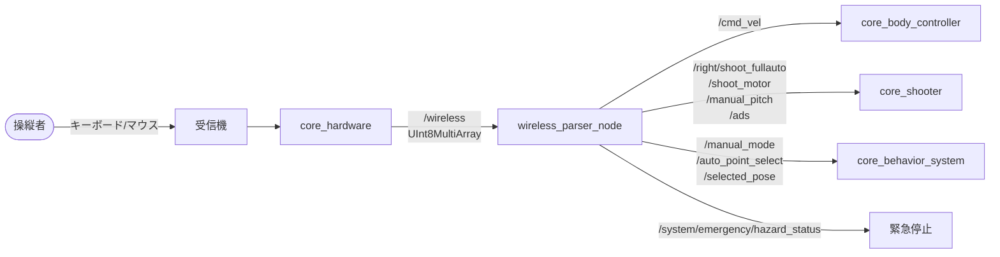
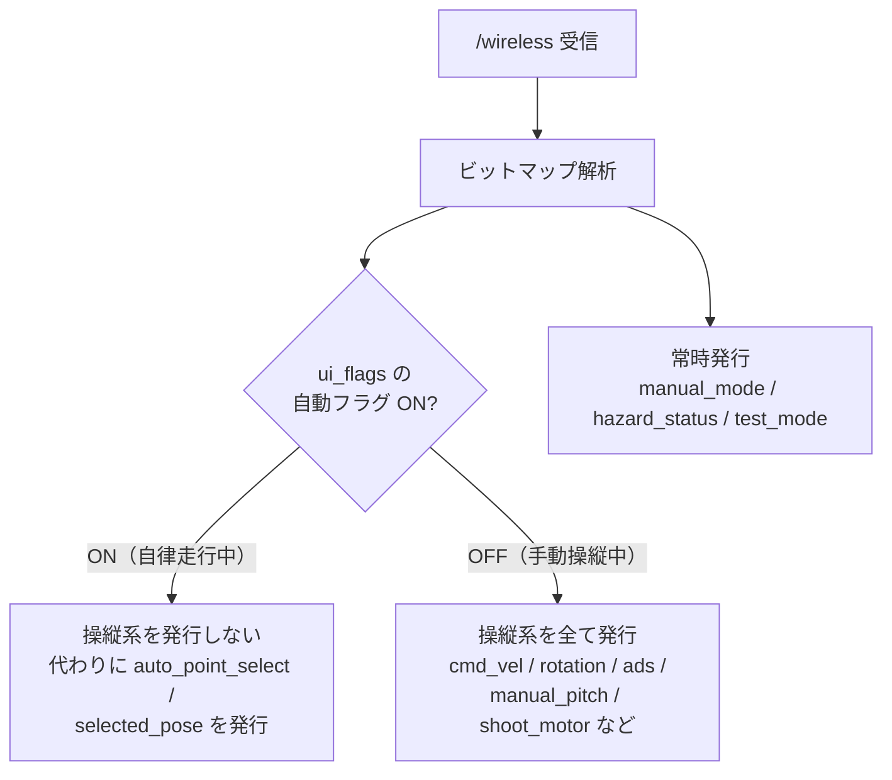

# core_ros_player_controller

ワイヤレスコントローラの生入力を解析し、車体移動・タレット照準・射撃のROSトピックに変換するパッケージです。手動操縦の入口にあたります。

## 位置づけ

ハードウェアから届く生バイト列と、各制御ノードが期待するROSトピックの間を埋める変換層です。



## ノード一覧

| ノード | 実行ファイル | 役割 |
|-------|------------|------|
| [`wireless_parser_node`](wireless_parser_node.md) | `wireless_parser_node` | ワイヤレス入力のビット解析とトピック変換 |

## 自動・手動の切り替え

このパッケージの重要な役割が、自律走行と手動操縦の競合を防ぐゲート機能です。



自動フラグがONの間は `/cmd_vel` などを発行しないため、[core_behavior_system](../core_behavior_system/index.md) が出すゴールに基づく自律走行と操縦入力が同じトピックを奪い合うことがありません。一方 `/manual_mode` と緊急停止は常に発行され、いつでも手動に戻せます。

## 入力フォーマット

`/wireless` は7バイト以上のペイロードを持ち、各バイトがビットマップとして解釈されます。

```
byte:  0        1        2        3         4        ...
      [flags] [mouse_x][mouse_y][ui_flags][flags_2]
       │                          │         │
       │                          │         └─ ADS / Rotation
       │                          └─ ロック / 自動フラグ
       └─ WASD / 射撃 / リロード / ローラー / 緊急停止
```

ビットの詳細な割り当ては[ノードページ](wireless_parser_node.md#入力フォーマット)を参照してください。

## 起動

```bash
ros2 launch core_ros_player_controller wireless_parser_node.launch.py
```

設定ファイル: `config/wireless_parser_params.yaml`
